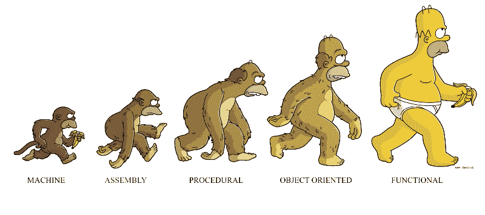
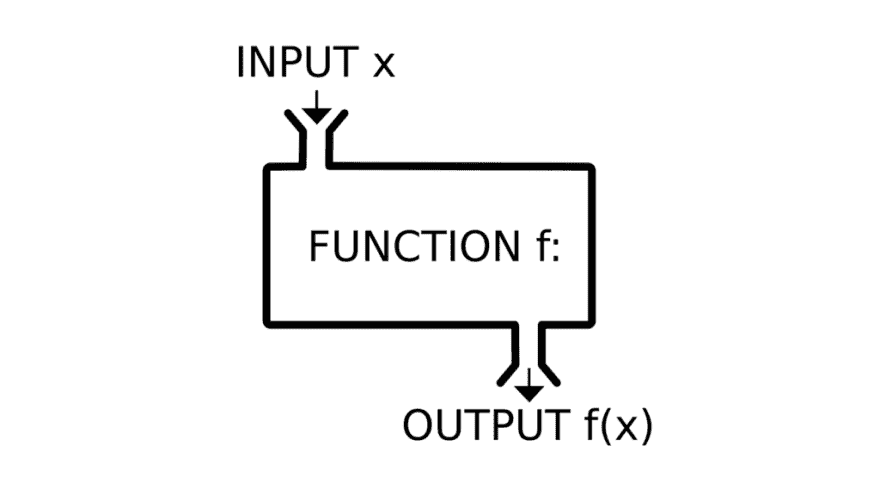
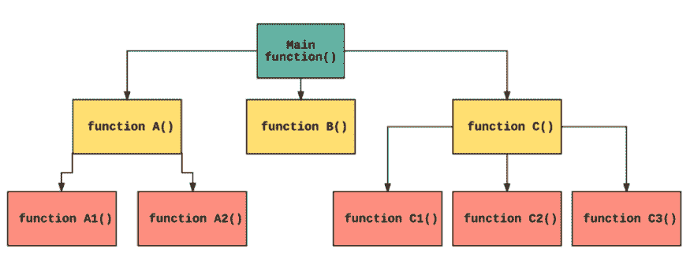

# 为什么函数式编程很重要

> 原文：<https://dev.to/navi/why-functional-programming-matters-2o95>

在 [Pesto](https://pesto.tech) ，我们最近学了两件事:**刻意编程**和**函数式编程**。刻意编程意味着了解我们将要编写的每一点代码。

我们必须做一些功课，帮助我们清楚地理解编程的概念。我们需要阅读一篇来自 PapersWeLove.org 的学术研究论文，然后写一篇关于它的中型文章。

我读的论文是约翰·休斯的《为什么函数式编程很重要》，下面是我从中学到的东西。

<figure>[](https://res.cloudinary.com/practicaldev/image/fetch/s--_dnUiuLQ--/c_limit%2Cf_auto%2Cfl_progressive%2Cq_auto%2Cw_880/https://cdn-images-1.medium.com/max/800/1%2AWednDtXFV10wEWC-AdUUGg.png) 

<figcaption>编程范式的演变</figcaption>

</figure>

函数式编程之所以被称为函数式编程，是因为程序完全由函数组成。甚至主程序也是一个函数，它接收输入作为参数，生成输出作为结果。

[T2】](https://res.cloudinary.com/practicaldev/image/fetch/s--iCkOfD0L--/c_limit%2Cf_auto%2Cfl_progressive%2Cq_auto%2Cw_880/https://cdn-images-1.medium.com/max/1024/1%2A709ugF12LLkYxvb839YNlg.png)

函数式编程的关键概念是**模块化**。程序功能总是根据其他功能来定义，而其他功能又根据更小的功能来进一步定义。

<figure>[](https://res.cloudinary.com/practicaldev/image/fetch/s--JvtqAcNq--/c_limit%2Cf_auto%2Cfl_progressive%2Cq_auto%2Cw_880/https://cdn-images-1.medium.com/max/1024/1%2A-p4k90uesC5rHtjfBOovlQ.png) 

<figcaption>功能流程图</figcaption>

</figure>

函数式程序不包含赋值语句，也不包含副作用。这些函数必须是**纯函数**，也就是说，当给定相同的输入集时，每次都会产生相同的输出。

休斯完美地总结了 FP:

> 函数式程序员听起来很像中世纪的修道士，拒绝享受生活的乐趣，希望这能让他变得高尚。对于那些对物质利益更感兴趣的人来说，这些“优势”完全没有说服力。

#### 函数式编程的优势

*   小模块可以快速简单地编码。
*   通用模块可以重用，这使得下一个程序的开发更快。
*   程序的模块可以独立测试，有助于减少调试时间。
*   函数式程序**在引用上是透明的**，也就是说，如果一个变量在程序中被赋予了某个值，那么这个值就不能再被改变。

> 一个人分解原始问题的方式直接取决于他将解决方案粘合在一起的方式。

这两种胶水是:

1.  高阶函数
2.  懒惰评估

如果一个函数接受一个函数作为参数或者返回一个函数作为结果，那么这个函数就叫做**高阶函数**。简单的功能可以通过*粘合*形成一个复杂的功能。这里有一个例子:

```
add x y = x + y
sum = reduce add 0 
```

这里的 add 是一个函数，它将两个变量 x 和 y 作为参数，并返回它们的和。reduce 是高阶函数，它将 add function 作为其参数，而“0”是作为 add function 的第一个参数传递的。

```
//Brackets are added just to make things clear

sum = reduce(add(0)) 
sum = reduce(add 0)

//Printing sum(5) will print the sum of 5 and 0 i.e. 5
//This is how it happens

\> sum(5) = reduce(add 0) 5
\> sum(5) = reduce(add 0 5)
\> sum(5) = 5 
```

**惰性求值**也被称为按需调用求值策略，它将表达式的求值延迟到需要时，同时也避免了重复求值。

惰性求值也可以在命令式语言中实现，但是会使事情变得相当困难。这只有在我们的程序具有高度模块化时才有用。

> 因为惰性求值的能力取决于程序员放弃对程序各部分执行顺序的任何直接控制，这将使带有副作用的编程变得相当困难，因为预测它们可能以什么顺序发生——甚至是否会发生——需要了解它们所嵌入的上下文。这种全球相互依赖将会破坏函数式语言中懒惰求值旨在增强的模块性。

模块化是成功编程的关键，为了帮助模块化编程，语言必须提供良好的粘合剂。

*如果你想更深入地了解细节，那么你可以自己阅读* [*整篇论文*](https://github.com/papers-we-love/papers-we-love/blob/master/paradigms/functional_programming/why-functional-programming-matters.pdf) *或者查看关于*[*【PapersWeLove.org】*](https://paperswelove.org)*的其他有趣论文。*