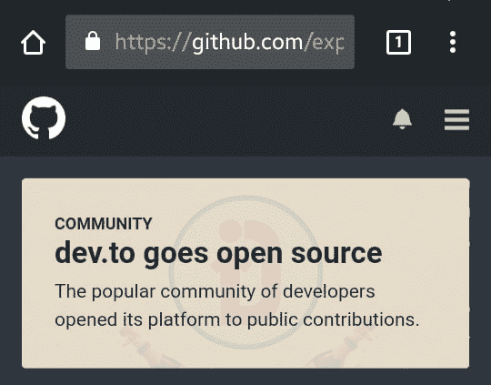
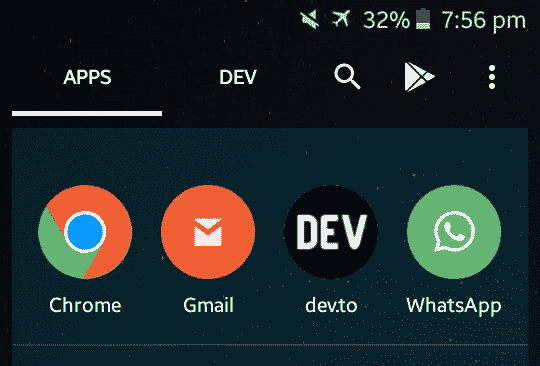

# 为什么我加入 Dev.to 社区，你也应该加入

> 原文：<https://dev.to/bauripalash/why-i-joined-devto-community-and-you-should-too-44bn>

我知道 Dev.to 很久了，甚至我在那里读过一些文章，但我没有在那里注册。直到 8 月 16 日我才被说服加入。

[T2】](https://res.cloudinary.com/practicaldev/image/fetch/s--wqffOeDw--/c_limit%2Cf_auto%2Cfl_progressive%2Cq_auto%2Cw_880/https://palash.tk/asseimg/why-i-joined-dev-to.jpg)

8 月 16 日早上，我正在查看 GitHub 趋势项目，在顶部我发现了这个。

[T2】](https://res.cloudinary.com/practicaldev/image/fetch/s--ws5D8m-B--/c_limit%2Cf_auto%2Cfl_progressive%2Cq_auto%2Cw_880/https://palash.tk/asseimg/devto-is-open.jpg)

Dev.to 变成了开源！**开源**对我来说就像一句情话，我立马直奔 dev.to，报名了。

我开始浏览很多文章，我非常喜欢它们。然后我把我在[帕拉什冒险](https://palash.tk)的一些文章贴在那里，令人惊讶的是我得到了非常好的回应，甚至[帕拉什冒险](https://palash.tk)的日流量也增加了。

你不会相信几天之内**我就有了 200 多名追随者**，现在已经达到 300 名。

#### 我最喜欢的一件事是友好的人们。dev.to 上的人都很友好。

几天之内，我开始非常喜欢使用 dev.to，它就像是我的一个家。这就像是开发商的脸书

我甚至从那里学到了(并且仍在学习)很多东西，比如我在为我的博客写文章时犯的**错误**以及一些新技术、新概念、新编程语言等等。

如果我谈论用户界面，它非常简单但是功能强大。易于使用，避免不必要的部件膨胀。我很喜欢！

另一个好处是你不需要安装一个臃肿的移动应用程序来在 Android 或 iOS 设备上正确使用它，这是非常简单的将它的 PWA 添加到主屏幕上，而不需要安装什么。

从第一天开始，我每天都阅读新的文章，每次都学到新的东西。

你可以看到它在我常用应用的第三个位置。

[T2】](https://res.cloudinary.com/practicaldev/image/fetch/s--AYRitGfI--/c_limit%2Cf_auto%2Cfl_progressive%2Cq_auto%2Cw_880/https://palash.tk/asseimg/freq-app-devto.jpg)

我前面提到的一件事，Dev.to 开源及其源代码在 GitHub 上有。如果您发现有问题，您可以在那里创建问题。如果你非常想要一个特性，你可以通过一个问题让开发者知道。您也可以为代码库做出贡献，使其变得更好。

### 推荐

如果你是一个开发者或者想成为一个开发者，你应该加入 dev to now。
访问 [https://dev.to](https://dev.to) 并立即注册。

#### 我相信，你一定会喜欢的

* * *

### 嘿伙计们我有一个善意的请求，请在推特上关注我 [@bauripalash](https://twitter.com/bauripalash) ，我在那里感到很孤独😢

* * *

朋友们，我们下次再见。在那之前，请在下面的评论中告诉我你的想法、建议和问题👇

* * *

如果你喜欢我的作品(我的文章、故事、软件、研究等等),考虑给我买一杯☕咖啡🤗