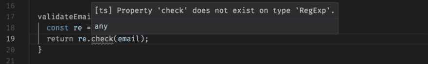

# 我为什么喜欢打字稿

> 原文：<https://dev.to/digitaledawn/why-i-like-typescript-1l4p>

[T2】](https://res.cloudinary.com/practicaldev/image/fetch/s--CSTafENj--/c_limit%2Cf_auto%2Cfl_progressive%2Cq_auto%2Cw_880/https://cdn-images-1.medium.com/max/1024/1%2Au8ka0_nuQthslgUDDgPHgw.png)

我现在写了很多 JavaScript，我已经使用 TypeScript 一年多了，在大大小小的项目中，也在单独和团队中使用。TypeScript 是 JavaScript 的类型化超集，它是开源的，由微软编写。它编译成普通的 JavaScript，所以你不需要担心浏览器的支持。

我将在这里重点介绍为什么这是我默认的首选语言，以及为什么我更喜欢使用 TypeScript 而不是 JavaScript 编写代码。

#### 自记录代码

当在大型团队中工作时(我甚至会独自争论:有人想知道他们 6 个月前写的代码是什么吗？)，文档很重要。我过去一直在使用 JSdoc，在函数上写注释，大多数时候是解释传递的参数是什么，函数返回什么，可能还有函数的描述。

评论很难维持，而且很快就会变成一种痛苦。它们很少更新，当你不得不怀疑它们是否仍然相关时，它们会比其他任何东西都更令人困惑。我在 PRs 中看到关于更新评论的评论，真的，没有人愿意花时间在评论中写这个。