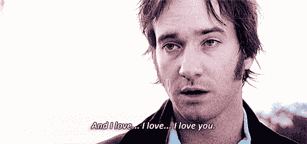

# 为什么我喜欢，讨厌，喜欢学习计算机科学

> 原文：<https://dev.to/themette/why-i-love-hate-love-studying-computer-science--2ach>

大家好，我叫梅特，是哥本哈根大学计算机科学专业的三年级学生。虽然我很喜欢我的主题，但有一件事我真的很讨厌，它让我在这个问题上无法表现得像达西一样。

[T2】](https://res.cloudinary.com/practicaldev/image/fetch/s--ZoMFxqNb--/c_limit%2Cf_auto%2Cfl_progressive%2Cq_66%2Cw_880/https://thepracticaldev.s3.amazonaws.com/i/80f1dus38yzvholpjzw6.gif)

然而，也有很多值得爱的东西。所以让我们深入这三位一体的感觉。

## 我喜欢人们互相帮助

当我与研究法律、经济或医学的人交谈时，我很高兴我不是他们中的一员。丹麦的大学通常试图帮助每个人保持在正确的轨道上，但似乎这些学科的竞争使那些已经有了一个艰难开端的人更加困难。当我开始在哥本哈根大学学习计算机科学(“Datalogi”)时，我的编码经历相当于在 Code Academy 的两次失败尝试。我很害怕在那些可能从他们有了第一台笔记本电脑就开始编程的人中脱颖而出。令人惊讶的是，当我在第一批作业中遇到困难时，是那些家伙以及年长的学生真正帮助了我。与我的第一位编码教授相反，他对缺乏编码技能的人的同情与我的编码技能非常相似。

## 我讨厌别人看不起你

虽然很多学生，尤其是男生，确实帮助了我，但在大学的第二年，事情发生了变化。似乎在暑假期间，一些自我意识已经形成，有时当我抱怨一个困难的科目或作业时，你只会得到一个窃笑，说“你真的那么笨吗？”。从来没有人直接对我说过这句话，但那短暂的笑声常常足以让我自我感觉不好。多年来，我们遇到的许多讲师都持同样的态度。虽然我的学习计划应该是任何人都可以访问的，不管过去的经验如何，但有一个潜在的假设，即每个人都知道关于编程的一切。如果没有，他们最好在没有太多帮助的情况下快速学习。当然，和我一起开始的一些女孩确实有编码经验，而一些男孩没有。但是有一些关于女性程序员向书呆子寻求帮助的刻板印象，真的很难寻求帮助。尤其是如果你知道你可能只会得到一面窃笑。

## 我喜欢女子俱乐部

作为局外人可以很容易地建立关系，这正是我那一年和女孩们发生的事情。事实上，每次我遇到女性程序员，我都会对她们产生某种同情。无论是经验丰富的人，考虑学习 it 的年轻女孩，还是和我处于同一水平的人，我们都有一些相同的疑问，面临相同的困难。我的许多好朋友都是我在大学时认识的女孩，我们定期见面讨论课程、作业和代码。去年夏天，我们中的一些人甚至去挪威进行了一次徒步旅行——我们的许多男同学认为我们不会幸存下来。女孩们是我在大学遇到的最好的事情，没有她们我很难保持动力。我知道我可以随时向我的朋友寻求帮助，他们不会嘲笑我愚蠢的问题。

学习计算机科学可能很难，而且对每个学生和每年来说都是不同的。我刚刚得知有关于歧视和侮辱一年级女生的问题，我很愤怒。然后我想起，在我的第一年，我曾经告诉人们在一个几乎没有女学生的地方学习是多么好。这比我想象的对许多女性的研究更加冷静和随和。所以现在你知道了，我自己也为先说话后思考而感到内疚，这样就强化了性别刻板印象。然而，我希望我们能解决这些问题，让这里成为一个美好的地方，让任何性别、种族和任何其他分裂我们的人都可以享受。如果没有这些额外的烦恼，获得学位已经够难的了。