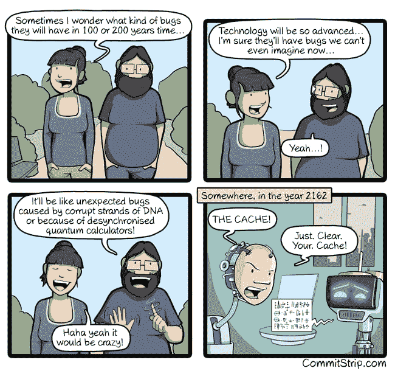
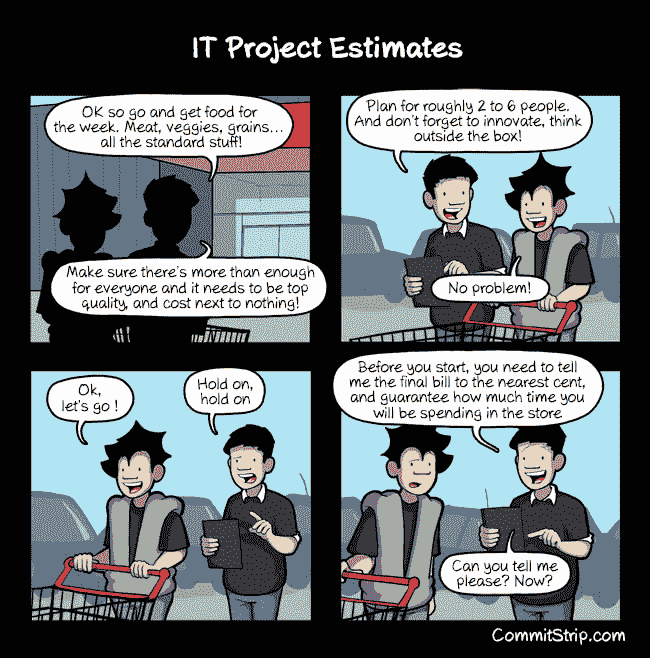
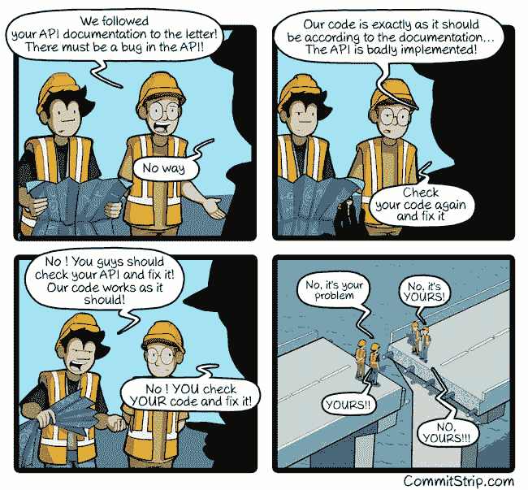
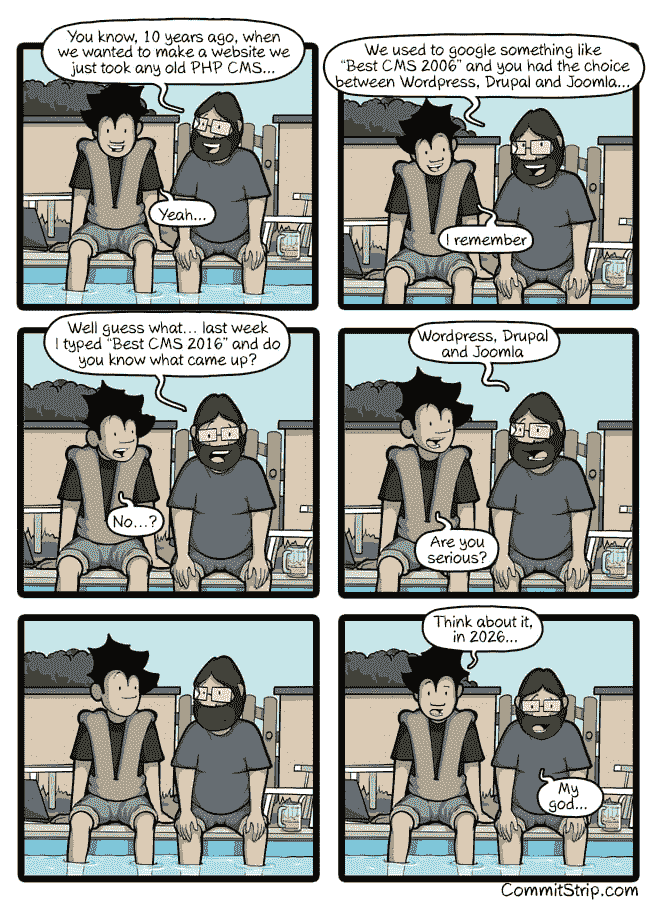

# 为什么要花这么长时间？？！？

> 原文：<https://dev.to/codemouse92/why-is-it-taking-so-long--29j7>

# 前言

如果你运行一个软件项目，尤其是一个*开源*软件项目，你几乎总是会听到这样的事情...

> 我们需要更加努力地争取进步。
> 
> 一周没有承诺？什么鬼东西？
> 
> 软件什么时候做好？
> 
> 为什么还没有测试版？
> 
> 你们到底在干什么？？

如果你是听到这些陈述的人，这可能会令人沮丧。请放心，在大多数情况下，即使是最不耐烦的这些声明也不是出于恶意。是的，一些用户...好的，很多用户...对时间表有非常不合理的期望，但这主要是因为缺乏关于软件开发如何工作的知识。所以深呼吸，记住它们是*误传的*，而不是恶意的。

然后冷静地把它们链接到这篇文章上。

* * *

现在，如果你看到一个项目的开发人员给了你这篇文章，或者如果你曾经说过以上的话，那么你需要明白一些事情:**软件时间线从根本上来说是不可思议的。或者，正如一句古老的行业格言所说...**

> 生一个孩子需要九个月的时间，不管你给多少妇女分配这项工作。

软件开发似乎有自己的想法。不，计算机是没有知觉的，这与我们的设备推翻人类的可怕奇点无关。这一切都与软件本身不同寻常的本性有关。你可以很容易地花上整个职业生涯来研究这个——弗雷德·布鲁克斯基本上就是这么做的——但你们大多数人都没那么多时间。所以，让我来给你分析一下最基本的。考虑这是软件项目管理 101 的版本。

注:如果你想要更长的版本，去读斯科特·罗森伯格的《代码中的 [*做梦。通过讲述命运滑稽的*钱德勒*项目的真实警示故事，它进入了更加生动的细节。*](http://www.dreamingincode.com/)

# 翻译的规律

软件开发需要多长时间就有多长时间，再多的人工干预也无法加快速度，超越这种隐含的、固有的“速度限制”。从来没有人真正计算过如何确定伟大的固有项目进度。我们只能想办法脱身，不让事情变得更糟。

为什么软件需要自己的时间，为什么我们在推动它的过程中完全无能为力，这仍然是一个谜。然而，我认为根本原因可能是我所谓的*翻译法则*...

翻译定律:当双方没有自然的理解共同点时，就没有办法客观地检查知识转移的质量。

为了避免胡言乱语，让我们假设你有两个人。一个母语是西班牙语，一个母语是因纽特语。两个人都不懂对方的语言，他们也完全没有共同的文化经历。除了非语言交流，为了便于类比，我们可以忽略不计，他们只有三种交流方式。

*   说西班牙语的人必须学习因纽特语。
*   因纽特人必须学习西班牙语。
*   他们都必须学习一门共同的语言，比如说世界语。

然而，在这些方法中的任何一种中，他们都无法学习对方的思维方式。如果说因纽特语的人给出建造冰屋的指示，而说西班牙语的人从未见过任何形式的冰或雪，这将是一项非常困难的任务。更困难的是，说因纽特语的人必须能够发现不理解的地方，只有两种方法可以做到:

1.  说西班牙语的人可能*意识到*他不明白，并向说因纽特语的人表达。

2.  说西班牙语的人可能认为他*不*理解，并采取错误的行动，这是说因纽特语的人观察到的。

换句话说，说因纽特语的人实际上无法*知道*说西班牙语的人是否理解这个概念；他要么必须被明确地告知，要么他必须从可观察到的结果中推断出缺乏理解。然后，他必须找到一种方法来帮助说西班牙语的人理解，这很难，因为他实际上不知道到底什么是没有意义的！

这几乎就是用人类语言说话和思考的程序员和用二进制数学和 CPU 指令“说话”和思考的计算机之间的情况。计算机天生无法进行抽象思维、推理和结论，以及许多我们认为理所当然的人脑事物。与此同时，计算机将每个想法分解成简单的加法；我们人类没有。

因此，我们只有三种方式可以交流，因此可以教(编程)计算机。

*   程序员必须学会用二进制 CPU 指令来思考和编写...有些人做到了。

*   计算机必须学会，或者更确切地说是被教会，用人类的语言思考。尽管看起来计算机可以做到这一点，但这实际上是一派胡言。事实上，我们距离打败图灵测试还有很长的路要走(去查吧)。

*   程序员和计算机必须学会用一种共同的语言工作。这些是我们的*编程语言*，这里是 99%的编程发生的地方。

然而，在这样做的时候，我们仍然有和以前一样的问题:**我们没有内在的方法来知道计算机理解我们的程度。我们只能通过同样的两种方式来发现这一点。**

1.  计算机意识到它不理解并告诉程序员。这是一个“编译器错误”。

2.  计算机误解并做了错误的事情，然后我们观察。

然后程序员必须弄清楚计算机不理解什么，这尤其困难。

这就是为什么构建软件不像搭建桥梁的内在原因。当你设计某样东西时，你可以看到并精确测量*出了什么问题*。然而，当你写代码时，你必须克服人类和计算机之间的这种“语言障碍”,才能让*推断出*哪里出了问题。这些就是真正的虫子！

事实是，从一开始，你绝对不知道你的人类思维能多好地翻译给计算机。在我们看来很简单的任务，例如在一个房间里从 20 个人中选出最高的人，实际上对计算机来说是复杂的。

更难的是，你不仅要处理你给计算机的指令，还要处理数百名其他程序员给的指令，包括语言、框架、库、操作系统等等。这些被称为“抽象层”，在这里我们离计算机语言的 1 和 0 更远，离人类语言更近。走进任何给定的抽象“堆栈”,我们不知道是否有其他的误译或“错误”,可能会减慢我们的速度。

简而言之，编写软件的整个过程很容易受到这些翻译错误的影响，一个看似简单的任务很容易变成一个长达数月的指示(编写)、观察(测试)、推断(调试)的长篇故事...洗涤，冲洗，重复。

[T2】](https://res.cloudinary.com/practicaldev/image/fetch/s--m-lm6Q-y--/c_limit%2Cf_auto%2Cfl_progressive%2Cq_auto%2Cw_880/https://www.commitstrip.com/wp-content/uploads/2017/05/Strip-Les-bugs-du-futur-english650-final.jpg)

# 质量三角形

软件开发中有一个叫做**质量三角**的原则，它规定...

> 我可以让它快速，便宜，或质量，选择两个。

对此实际上有多种有效的解释，但与我们的讨论相关的是...

*   我们可以很快完成。

*   我们可以便宜地制造它。

*   我们可以让它相对稳定，没有 bug。

**挑两个。**如果你想要更快，开发人员需要投入更多的时间，这是要花钱的。如果你想让它更稳定，开发人员将不得不花更多的时间测试和调试，而不是仅仅说它“好”，然后继续下一个功能。如果你想便宜点，他们要么放弃质量，要么多花几周时间。

有一些项目试图实现这三个目标的可怕故事。关于开发人员精疲力尽，怨恨他们的职业生涯，软件被延迟和错误所困扰，最后期限错过，费用超支的故事。如果你试图实现这三个目标，你将永远无法实现。软件将会超预算、超期限、不稳定、漏洞百出、缺少关键功能。在大多数情况下，成品甚至永远不会见天日。

然而，即使选择两个，也有一些限制。

首先，你不能仅仅通过砸钱来加速一个项目。开发人员在筋疲力尽之前一周只能工作几个小时，而且我们还要应对布鲁克斯定律(见下一节)。)一个高预算项目*会比一个低预算或无预算项目*完成得更快、质量更高——至少，假设资金投入到开发者和他们的基础设施，而不是管理奖金——但这是有限制的。

第二，有可能将质量目标定得很高，以至于即使给定了无限的预算，实际完成软件也要花费比已知宇宙中存在的更多的时间。几乎所有的软件都有缺陷。有一些罕见的宁静的绿洲实际上没有已知的问题，但这通常是因为严格限制的功能集。唯一真正没有 bug 的软件是没有特性的软件。

或者，正如斯科特·罗森伯格非常恰当地指出的...

> 软件是硬的。

[T2】](https://res.cloudinary.com/practicaldev/image/fetch/s--Q_3dWEPF--/c_limit%2Cf_auto%2Cfl_progressive%2Cq_auto%2Cw_880/https://www.commitstrip.com/wp-content/uploads/2018/02/Strip-Supermarch%25C3%25A9-650-final650-final.jpg)

# 布鲁克斯定律(s)

把人扔在一个项目上来加速它的想法由来已久。尽管我们中的一些人可能会嘲笑这种想法，但在某种程度上,确实适用于更实际的领域:你可以用 20 个人比 10 个人更快地建造一座房子，如果你有 30 个人，建造速度会更快！

IBM 项目经理 Fred Brooks 在 20 世纪 70 年代初首次观察到这在编程世界中不起作用，这促使他写下了他的分水岭著作，*神话中的人月*。在这本书及其续集*中，他对软件开发的本质做了许多重要的观察。也许他最传奇的观察被引用为布鲁克斯定律:*

> 将人力资源添加到一个后期的软件项目中会使它变得更晚。

尽管连布鲁克斯都认为这过于简单化了，但这仍然是一句有用的格言。你在项目中加入的人越多，就有越多的因素会拖慢项目的进度。你必须训练这个人，考虑他们的意见，确保他们理解想法，确保其他人理解他们的想法，等等。

换句话说，如果你有六个说因纽特语的人向一个说西班牙语的人解释如何建造冰屋，你可以想象很容易发生的复合混乱:对说西班牙语的人的冲突和混乱的指示，需要更多的人来理解误解的本质，以及简单的老话“厨房里有太多的厨师”。

现在，有时通过增加人员来加速项目是可能的，但这需要精确的计划、精心组织的协作和有效的实践来促进这一切。将所有这些放在一起需要...你猜怎么着？...**时间到了！**

为了回应这一点，许多善意的项目经理、开发人员和观察者会建议一整套“神奇的”组织技术和方法，这些技术和方法将解决所有问题并使团队和睦相处。谢天谢地，弗雷德·布鲁克斯对此也有话要说...

> 无论是技术还是管理技术，都没有哪一项发展本身能够保证在十年内生产率、可靠性和简单性有一个数量级的[十倍]提高。

每个项目，每个团队都是独一无二的。没有什么对所有人都有效。或者，正如布鲁克斯所观察到的，“没有灵丹妙药”。

换句话说，**绝对不存在，*也不可能存在*来让软件比它“想要”的完成得更快。**你可以向它扔任何能想到的东西，它还是会慢慢来。

(要了解更多信息，请阅读弗雷德·布鲁克斯的《神话人月》和《T2 没有灵丹妙药》。这里面有大量的有用信息！)

[T2】](https://res.cloudinary.com/practicaldev/image/fetch/s--3x8U663s--/c_limit%2Cf_auto%2Cfl_progressive%2Cq_auto%2Cw_880/https://www.commitstrip.com/wp-content/uploads/2017/02/Strip-Communication-de-Chantier-english650-final-v2.jpg)

# 不要小看基础

如果你正在观察一个项目的早期阶段，你还必须考虑一个更关键的，即使是看不见的，项目的一部分:基础！

对于一个有效的编程团队来说，他们必须拥有他们需要的工具、标准和方法论，而这需要大量的时间！举例来说，我花了两年的全职工作为我在 MousePaw Media 的团队敲定了整个开发平台、工作流程和标准...这是在几年的实验之后。在整个 2017 年，我几乎没有时间编写代码，更不用说 2016 年下半年了，因为我已经完成了所有工作。当然，我的团队能够在这段时间内工作(尽管有困难，缺少一些他们需要的工具)，但它仍然拖慢了我们的速度。

不要绝望！没有规定说每个项目都要花两年时间来制定他们的开发平台。然而，这需要时间，就像软件开发本身一样，不可能给它设定一个期限。

简而言之，如果开发人员在开始时拖拖拉拉，他们可能只是在打基础。这是一个漫长、艰巨且很大程度上不可见的过程，但它对项目的成功至关重要！

[T2】](https://res.cloudinary.com/practicaldev/image/fetch/s--PrOxcnYH--/c_limit%2Cf_auto%2Cfl_progressive%2Cq_auto%2Cw_880/https://www.commitstrip.com/wp-content/uploads/2016/06/Strip-10-ans-de-CMS-650-finalenglish-1.jpg)

# 你能帮上什么忙

此时，你可能会想“哦，crud，这个项目永远也不会完成，是吗？？?"

不要害怕！我刚刚描述的适用于每一个软件项目，如果你没有注意到，我们*确实*设法发布功能软件！私有公司和开源组织都设法发布优秀的游戏、应用程序、工具、网站和操作系统。软件*做好了吗...它只是按照自己怪异的、不可预测的时间表来做。*

 *那么你能帮上什么忙呢？这其实很简单。

1.  不要喋喋不休地要求软件更快完成。相反，把你的资源用在你说的地方。给项目增加资金和/或人力会有助于项目的进展。问问你如何能提供最好的帮助！

2.  如果你决定帮忙，请记住，我们是在与布鲁克斯定律作斗争，所以如果你做一堆困难的事情被拒绝，不要感到被侮辱...不是你！你可能最有帮助的只是做琐碎的编码和项目任务，这样开发人员可以专注于困难的事情。

3.  最重要的是，帮助其他人了解这些概念！被用户(更糟的是，旁观者)唠叨是我们开发人员面临的最令人恼火的事情之一。分享你在这里学到的东西，帮助我们减少抱怨和攻击。*