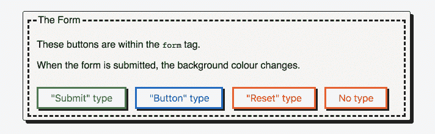

# 为什么给你的 HTML 按钮一个类型很重要

> 原文：<https://dev.to/clairecodes/why-its-important-to-give-your-html-button-a-type-58k9>

## 剧透

一个没有类型属性的按钮充当`type="submit"`，当被点击时将尝试提交表单数据。明确你的意图，并善待未来使用你的代码的开发人员:提供一个类型。通过指定`button`、`submit`或`reset`，代码的目的很清楚，也更容易维护

## 按钮基础知识

如何用 HTML 创建一个按钮元素？我经常看到他们这样写:

```
<button>Press me</button> 
```

Enter fullscreen mode Exit fullscreen mode

这段代码是有效的 HTML，并且通过了 W3C 标记验证服务。然而，我认为按钮应该总是包含`type`属性。如果缺少这个属性，它可能会引入潜在的混乱行为——在 web 开发中已经有足够多的问题需要处理了！

**注意**:我用`<button>`标签代替输入标签，比如在 HTML 中构建按钮的时候用`<input type=“button” />`。我推荐这样做，因为按钮标签和在语义上是正确的，而且它比`input`标签更容易设计。

## 类型属性值

HTML 标签使用键值对或属性来修改它们的功能。例如，一个常用的属性是 class 属性，比如这个 div 元素:`<div class="foobar"></div>`。每个 HTML 元素都有自己的一组有效属性。

按钮允许一个名为“type”的可选属性，用于定义按钮的用途。[类型属性可以取三个值](https://www.w3.org/TR/2011/WD-html5-20110525/the-button-element.html):

1.  使服从
2.  按钮
3.  重置

### 【提交】

```
<button type=“submit”>Press me</button> 
```

Enter fullscreen mode Exit fullscreen mode

此按钮将提交表单数据。提交按钮通常嵌套在一个表单中，即一个`<form>`标签。

### 【按钮】

```
<button type=“button”>Press me</button> 
```

Enter fullscreen mode Exit fullscreen mode

该按钮没有默认行为。JavaScript 必须用来定义当它被点击时会发生什么。

### 【复位】

```
<button type=“reset”>Press me</button> 
```

Enter fullscreen mode Exit fullscreen mode

当嵌套在表单中时，单击此按钮会将表单控件重置为初始值。

### 无类型

```
<button>Press me</button> 
```

Enter fullscreen mode Exit fullscreen mode

看了前面的定义，你觉得一个没有 type 属性的按钮会如何表现？**当 type 属性缺失时，按钮表现为*提交*按钮**。

这肯定不是我所期望的——我认为没有特定类型的按钮在被点击时不会做任何事情。这可能会导致有问题的行为(例如，bug！)在你的代码中，如果像我一样，你不期望它。

## 按钮类型在动作

下面的 gif 展示了一个简单的表格(下面是原 Codepen)。提交表单时，通过监听`onsubmit`事件，使用 JavaScript 更改页面的背景颜色。前面提到的每种按钮类型都包含在表单中，并被贴上标签以显示它们的类型值。请注意单击每个按钮时会发生什么:

[T2】](https://res.cloudinary.com/practicaldev/image/fetch/s--lh6aht4J--/c_limit%2Cf_auto%2Cfl_progressive%2Cq_66%2Cw_880/https://thepracticaldev.s3.amazonaws.com/i/t89nf4sfr3i92hxea6tu.gif)

*   submit-type 按钮改变背景颜色并提交表单。

*   按钮类型的按钮不做任何事情，正如预期的那样。

*   reset 按钮什么也不做，因为在这个例子中没有任何表单输入需要重置。这也在意料之中。

*   没有显式类型值的按钮提交表单并更改背景颜色。在上面讨论过之后，我们预料到了这一点，但与其他按钮类型相比，它仍然感觉不直观。

在此尝试使用 CodePen:

[https://codepen.io/claireparker/embed/JpzwLv?height=600&default-tab=result&embed-version=2](https://codepen.io/claireparker/embed/JpzwLv?height=600&default-tab=result&embed-version=2)

## 为什么要一直声明类型属性？

### 1)明确定义按钮的作用

当一个按钮没有类型属性时，它的用法就不清楚了。在编写代码时，按钮提交表单对您来说可能是显而易见的。但是，作为一名优秀的软件开发人员，一部分工作就是编写易于维护和他人理解的代码。通过添加 type 属性，未来的开发者甚至未来的你都可以快速而轻松地算出这个按钮的用途。

### 2)避免 bug

"为什么当我点击这个不相关的按钮时，表单会提交？"遵循这个建议，你和任何使用你的代码的人都不会再遇到这个错误:

> 对于任何不提交或重置表单数据的按钮，添加一个类型属性`button`。

如果每个编写 HTML 的人都知道按钮在默认情况下充当提交按钮，那么这个建议就没有必要了。不幸的是，并不是每个人都这样做，所以在此期间，请声明一个按钮类型🙂

灵感来自 [wtfhtmlcss](http://wtfhtmlcss.com/#buttons-type) 。