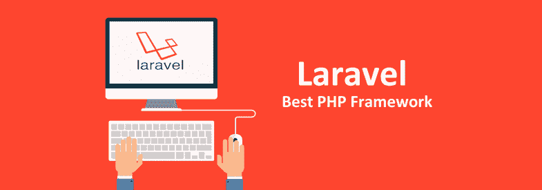

# 为什么 Laravel 比其他框架更受青睐？

> 原文：<https://dev.to/arkasoftwares/why-laravel-is-preferred-as-compared-to-other-frameworks-1onn>

不仅仅是其他语言的框架，Laravel 是 PHP 生态系统中最好的框架。统计数据证明，Laravel 拥有越来越多的开发人员，每天都有越来越多的开发人员。使用这个简单的现代 web 应用程序开发框架，您可以为您的系统添加所需的健壮性，它在文档、单元测试、身份验证、授权、缓存等方面对您有所帮助。但最重要的是，它为您的 web 应用程序开发提供了高端安全性。

[T2】](https://res.cloudinary.com/practicaldev/image/fetch/s--JSFTr60T--/c_limit%2Cf_auto%2Cfl_progressive%2Cq_auto%2Cw_880/https://thepracticaldev.s3.amazonaws.com/i/5g3wc2jm8glbs3qzy9h7.png)

但是为什么它如此受欢迎，是什么让它在开发人员社区中如此受欢迎呢？不是一个，而是 10 个原因使它如此完美，它是快速的，开源的，允许开发人员立即轻松完成他们的工作。Laravel 应用程序开发为您的项目提供了可伸缩性，同时极大地提高了性能。

**1#内置面向对象库**

如果你是一个有抱负的开发人员，并且不熟悉发展中国家，这个特性本身会让你爱上 Laravel。Laravel 是一种提供 20 多个预装库的框架，它的认证库实际上被许多 Laravel 开发公司广泛用于增加安全性，如 CSRF 保护、登录安全、加密等。

**2#文档和 MVC 模式的清晰性**

Laravel 应用程序开发是一门艺术，你看，它在你的工作体验中给你带来了高端的满足感。对于每一个 Laravel 开发人员来说，经验文档是一种特别的福气。它非常容易理解，简洁而有条理。它允许他们开发在各种浏览器上无缝工作的漂亮的 web 应用程序，它有一个内置的 MVC 兼容框架，极大地增强了开发者的 Laravel 应用程序开发体验。它有一个强大的 MVC 模式，使得事情对开发者来说更容易理解。

**3#单元测试**

Laravel 鼓励单元测试，让你测试你的应用程序的功能和特性性能，在 PHP 的帮助下，在 Laravel 上测试应用程序比在其他任何框架上都要容易得多。不仅如此，它还允许您通过设置 PHP 单元来编写测试用例，并在整个开发过程中执行单元测试。XML 文件，使应用程序的定制测试更加容易。

**4#数据库播种**

另一个应用程序测试功能是数据库播种，这是一个用于播种默认数据的自动化过程，默认数据进一步用于应用程序测试的初步应用程序设置。

**5#高端认证授权**

不仅仅是 Laravel，PHP 框架使得 web 应用程序的认证比其他任何 web 开发语言框架都要简单。有了 PHP 的特性，认证就像已经集成到系统中的东西一样简单，有了 Laravel application development，web 开发公司能够防止未经授权的用户访问，并能够授权他们的 web 应用程序的逻辑。

### 相关- [提高 LARAVEL 应用程序速度的技巧](https://www.arkasoftwares.com/blog/tips-to-boost-the-speed-of-a-laravel-application)

**6#缓存**

Laravel 允许您将 web 框架与缓存系统(如 Redis、APC 和 Memcached)集成，这允许您通过将强大的缓存系统集成到 Laravel 开发中来增强 web 应用程序的性能。Laravel 的以下特性使得简单缓存比任何其他框架都更有益。

**7#匠**

Laravel 有一个内置的 Artisan，它允许你更快地编写长的程序行。事实上，它是给 Laravel 开发公司的礼物，因为它允许他们更快更好地编码。使用 Laravel，开发人员可以使用命令行进行交互，并处理 Laravel 环境，它还可以生成结构化代码和数据库，使管理数据库系统变得更加容易。

**8#叶片模板引擎**

刀片模板引擎帮助您在视图中包含 PHP 代码，并将它们编译成 PHP 代码。使用 Laravel Blade 模板引擎，通过将视图编译成 PHP 代码，整个网站的性能得到了极大的优化。此外，它确保了视图变化的缓存，并使 Laravel 开发人员更容易发现显示数据和扩展布局，而不会影响应用程序的性能。

**9#路由中间件**

Laravel 对 HTTP 中间件的支持有助于在 HTTP 路由之间添加额外的层。整个过程帮助 Laravel 开发公司在 Laravel 应用程序中使用路由中间件有效地执行路由，该中间件允许您测试和消除开发中的传统层。因此，这使得您可以更加轻松地增强和丰富应用程序与 web 服务器之间的通信，而无需依赖第三方工具。

**10#路由系统**

最后，当开发达到整个项目的路由时，它使得应用程序控制更加容易和灵活。使用 Laravel 易于使用的路由方法，可以创建一个目录来匹配 URI。

**结束**

为了向您解释 Laravel 的重要性以及在应用程序中使用它的好处，本文添加了一些要点，可以帮助您开发功能强大、响应迅速的 web 应用程序。在期待 web 应用程序的同时，您可以在 ARKA Software 找到端到端的 web 应用程序开发服务，ARKA Software 是一家屡获殊荣的美国 web 开发公司，拥有最优秀的资源库之一 [Laravel developer](https://www.arkasoftwares.com/hire-laravel-developer) 构建令人惊叹的 web 界面，帮助您的业务在全球范围内发展。

## 标签:

laravel 开发公司，laravel 开发人员，laravel 应用程序开发，dev，PHP 框架