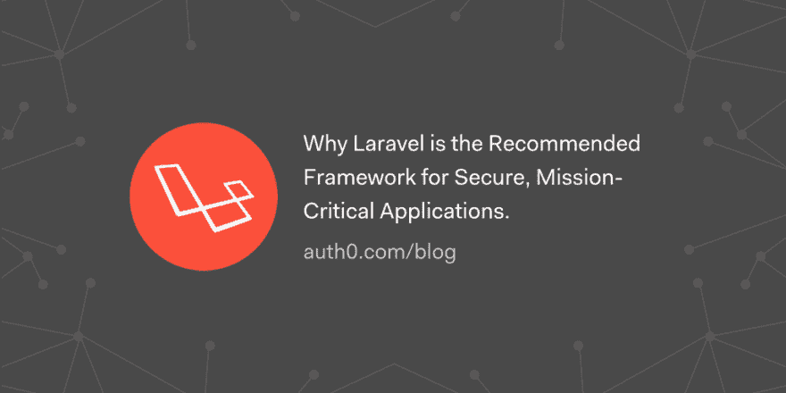

# 为什么 Laravel 是安全的关键任务应用程序的推荐框架

> 原文：<https://dev.to/auth0/why-laravel-is-the-recommended-framework-for-secure-mission-critical-applications-44g2>

默认情况下，Laravel 使您的应用程序更加安全，这使得它成为任务关键型应用程序的推荐 PHP 框架。在本文中，我们将简要介绍 Laravel 如何帮助您创建关键任务、生产就绪的应用程序。

[读读✊](https://auth0.com/blog/why-laravel-is-the-recommended-framework-for-secure-mission-critical-applications/?utm_source=dev&utm_medium=sc&utm_campaign=laravel_apps)

[T2】](https://res.cloudinary.com/practicaldev/image/fetch/s---55qhS9n--/c_limit%2Cf_auto%2Cfl_progressive%2Cq_auto%2Cw_880/https://thepracticaldev.s3.amazonaws.com/i/kv9q5rla1dabjzao1txo.png)