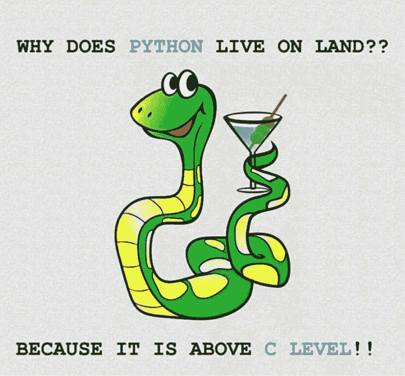
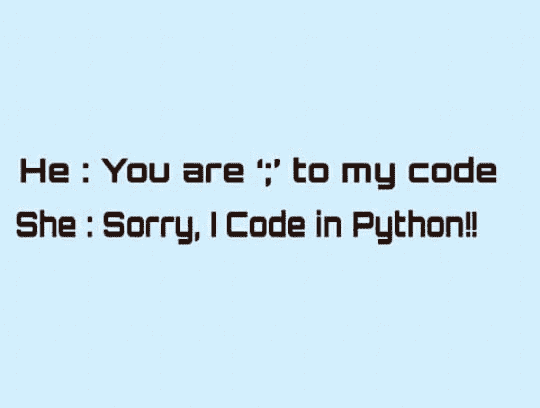

# 为什么是 Python？

> 原文：<https://dev.to/thisisrgaurav/why-python-3o39>

## Python 是什么？

当你读这篇文章的时候，把你当成一个计算机爱好者或者一个以计算机和信息为专业的学生也不错。所以知道 python 是什么是必不可少的？

[T2】](https://res.cloudinary.com/practicaldev/image/fetch/s--wgTIVg_z--/c_limit%2Cf_auto%2Cfl_progressive%2Cq_auto%2Cw_880/https://img.devrant.com/devrant/rant/r_389776_tqMPa.jpg)

Python 是一种高级的、简单易学的、功能强大的编程语言，这当然不会让你感到雷神。但是让我们用几行代码写出精彩的代码，可以执行许多功能强大的任务，比如雷神之锤。你可以在他们的 Python 文档中读到更多

所以现在我来回答为什么是 Python？

与其他语言相比，Python 有许多优势，我将把这些优势分成两部分，一部分是 Python 的特性，另一部分是它的应用领域？所以给你:

## Python 的特性

### 文档

Python 的第一个也是最好的一个特点是它的文档，这是每个人都忘记提到的。这是 Python 3.6.rc1 文档的链接。它不仅介绍了如何入门，而且给出了深入 Python 的简要步骤。初学者可以从本文档的教程部分开始。但如果你是一个中级或高级程序员，你只需要你故事书或参考指南，只需要检查一些健忘的语法，虽然专业很少忘记这一点，所以他们也不需要这个，其他部分也是为专业和中级程序员准备的。

[T2】](https://res.cloudinary.com/practicaldev/image/fetch/s--w56IXJjx--/c_limit%2Cf_auto%2Cfl_progressive%2Cq_auto%2Cw_880/https://img.devrant.com/devrant/rant/r_760661_jYdxe.jpg)

### 英语喜欢的语法

另一个更吸引人的地方是它的语法。这很像你日常生活中使用的人类语言。Python 中的代码类似于你用来表达算法的伪代码。它不需要像 ECMAScript 或 ES6 或任何其他 JavaScript 框架那样的笨拙语法，也不需要大括号或方括号来创建语句块，缩进工作得很好，比任何其他语言都更可读，程序员在他们的 1000 行代码中犯的最可怕的语法错误是终止符(；)也不用于结束语句。

### 数据结构

你不需要导入很多像 Java 或 C 这样的库来利用高级数据结构。它有多种数据结构，如集合、字典、列表、元组。此外，将类型转换为一种或其他数据类型非常容易，您只需要调用一个函数，但是应该记住，您转换为另一种数据类型的数据结构应该可以相互转换。

不同的语言结构用几行代码做更大的事情

它提供了这样的语言结构，让你可以用一两行或三行代码编写多行代码。要创建一个由用户输入的数字方块组成的列表，只需两行代码就可以完成。

```
Python
nums = list(map(int,input().split()))
squares = [item**2 for item in nums] 
```

印象深刻吧？还是不满意，那我们现在就来讨论一下用在哪里？

## 用在哪里？

python 给人印象最深的是，它不拘泥于任何特定的创新技术领域。无论您是 Web 开发人员、数据科学家、软件开发人员、黑客、移动应用程序开发人员，还是 Web Scraper 或任何编码极客，您都可以在任何地方使用 Python。

我将逐一讨论每个主要领域:

### 网页开发

随着 Web 开发的开始，PHP 成为了行业之王。但是随着计算机科学的发展，越来越多的语言开始参与到 Web 开发中。就像 Python 一样。你可以统治 web 开发，学了 Python 之后有很多框架像 Django，Flask，Tornado，Web2py 和最新的 Vibora。Vibora 是最新的一款，它是 Flask 和 Tornado 的混合体。您可以在下面给出的参考链接中找到更多信息。

### 数据科学

数据是我们日常生活中需要分析的最重要的部分，而报告的生成使我们的日常工作变得更加轻松。有一种特殊的语言是为数据分析部分而设计的，比如 R、Julia、SAS。但是学习这么多种语言需要很多年，你会把所有的语言都混在一起，而使用 python，你可以只关注逻辑部分，而不是学习新的语法。SciPy、Numpy、Panda 和 IPython 是流行的 Python 库，可以用于数据科学。软件开发人员

曾经有一段时间，软件建立在 C，C++，Java 之上。对于新来的人来说，这些语言的复杂程度让他或她可能会放弃或者可能会有一个不眠之夜。但是现在，你可以用比其他高级语言更简单的语法更快地完成类似的任务。可以用于软件开发的流行库或框架是 SCons。因为软件开发不仅仅是构建。你需要一些自动化和 Bug 跟踪助手，这两个任务可以通过 BuildBot 和 Roundup 用 python 来完成

### 黑客攻击

黑客是所有关于混合你的网络盐嗅探包，并通过使用脚本的各种散列算法和加密算法访问一些安全内容。虽然市场上有很多脚本语言，你可以用来破解世界，但是 python 比其他语言更好的地方是它丰富的库和简单的语法，而不是用 bash 脚本。Python 和 C，C++的结合会让你变得更好。

还有很多领域我还没有发现，或者像 pyTorch 一样对人工智能知之甚少。如果你喜欢这个领域，你也可以在我们的客座博文页面分享客座博文。请在邮件中附上您的信息。

**参考链接**

额外链接:[在 FreeCodeCamp 免费学习 Python 简介。](https://www.youtube.com/watch?v=hPECpDHHjoI&feature=youtu.be) 

Web 框架: [Python Web 框架](http://www.mindfiresolutions.com/blog/2018/03/python-web-frameworks-2018/)

点击[了解更多信息为什么选择 Python？| Tekraze -钻研技术](https://tekraze.com/2018/07/why-python/)