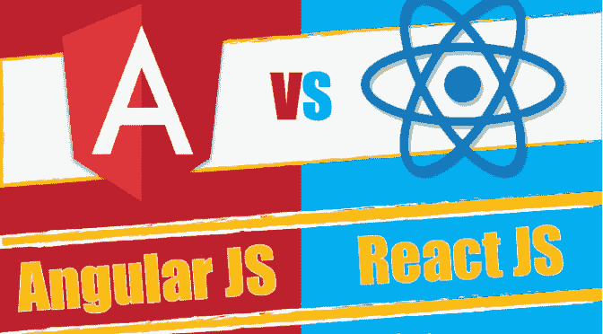

# 为什么用 React.js 而不是 Angularjs？

> 原文：<https://dev.to/sharadtricks/why-reactjs-instead-of-angularjs-4fme>

 
[ReactJS](https://www.onlineinterviewquestions.com/react-js-interview-questions/) 是一个 JavaScript 库，有一个视图，但是缺少模型&控制器组件。React 引入了虚拟 DOM 的概念，这被认为是与 AngularJS 相比 React 最大的优势之一。它依赖于团队的约定来保持以特定风格编写的代码，但是它的简单性可能非常强大和富有表现力。
[AngularJS](https://www.onlineinterviewquestions.com/angular-js-interview-questions/) 是最流行的 javascript 框架；它的语法很重。

**react js 提供的服务如下:**

组件可以很容易地重用

在显示大量组件时，性能会更快。

轻松创建用户界面测试用例

由于特殊的 chrome 扩展，易于调试

搜索引擎友好

**以下是 ReactJS & AngularJS:**

**反应堆**

1.  React 使用单向数据绑定，一个名为 flux 的应用架构通过一个控制点控制数据流向组件。

2.  React 的虚拟 DOM 是最大的优势之一:它创建了一个轻量级的 DOM，用新数据创建了新的虚拟 DOM &与以前的相比。

3.  它不提供模板和指令的划分，模板逻辑应该写在模板本身中。

4.  它帮助我们更新视图，并通过 flux 控制用户的应用程序工作流程。

5.  它提供了自由，但是它花费了额外的时间来设计应用程序的结构。

6.  它没有为依赖注入提供任何内置容器的概念。

7.  React 很好理解，用 React Native 和 next.js 是最好的选择。

8.  建立一个 react 项目需要很长时间，但是之后您就可以开始制作一个应用程序&添加新特性会很容易。

9.  它比 Vue 大，但比 angular 小。

**角型**

1.  Angular 使用双向数据绑定，它帮助您编写更少的样板代码来创建视图和模型组件之间的交互。

2.  Angular 为每个绑定创建一个观察器来跟踪 DOM 中的变化。一旦视图更新，它就将新值与初始值进行比较，并运行$digest 循环

3.  它只能通过指令访问 DOM，而标准的、自己的指令是处理 DOM 的最佳方式&将数据插入模板。

4.  它基于三层 MVC &提供许多标准服务、工厂、控制器和指令。

5.  它将应用程序代码分成几个文件，可以在网站的不同部分重用模板。

6.  它使用了一个叫做依赖注入的基本 OOP 模式，你只能在你的函数中以任意顺序传递依赖作为参数。

7.  这不简单；它的复杂性经常会引起很多混乱。

8.  做简单的事情需要大量多余的语法，这使得 angular 处于末位。

9.  它要大得多，导致移动设备的加载时间和性能问题。

React 比 angular 有更多的优势。最重要的是它的可重用性、相对稳定性和面向高性能的工作。