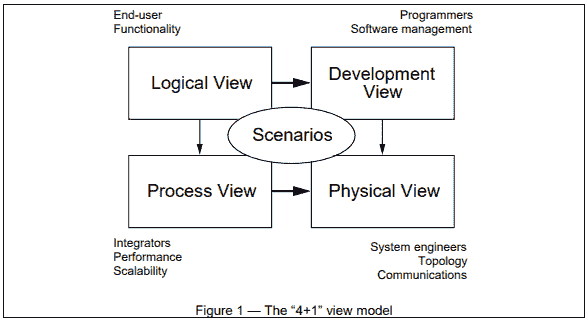

# 为什么这么难过？

> 原文：<https://dev.to/rina/why-so-sad-2144>

**SAD** (软件架构设计)，是弄清楚一个软件是什么、如何以及为什么的决策过程。它对技术、业务和运营要求进行了论证，并以一种有用且易于理解的方式将其呈现出来 [1](https://msdn.microsoft.com/en-us/library/ee658098.aspx) 。

### 何苦伤悲

在深入了解软件架构设计的更多细节之前，我想先指出它为什么重要和有用的几个原因:

首先，在直接开始编码之前设计软件架构的最大原因之一是，它剥夺了你充分考虑软件基础的某些方面的机会。这也会给你一个机会去评估这些选择可能导致的问题，而不是给你一个机会去计划事情变得糟糕时的意外情况。

此外，将软件架构设计到位(无论它是在项目开始时还是之后创建的)将有助于让您的团队清楚地了解他们正在构建什么，他们正在添加的新部分如何适应，以及当对现有代码库进行更改时，某些方面如何相互连接。此外，为为什么在早期做出某些决定列出原因应该有助于使基金会的这一方面的改变更容易和更少灾难。

此外，对产品有更好想法的团队会花更少的时间来解开代码和思考为什么做出某些决定。给你的开发人员一个准确的软件鸟瞰图可以让 bosts 们对他们对软件的理解有信心，并使他们能够设计出更好的代码和更健壮的错误修复。这将导致士气、生产力和开发时间的增加。

最后，它还将帮助新开发人员加入您的团队，而不是让他们边走边学习软件的架构。

* * *

### 悲伤是什么

软件架构设计包括关于 [4](https://msdn.microsoft.com/en-us/library/ee658124.aspx) 的决策:

1.  应用类型
2.  部署策略
3.  合适的技术
4.  质量属性
5.  横切关注点:这包括诸如日志、认证和缓存之类的东西

仔细检查每一项，并在业务和现实生活的约束下做出适合您的软件的选择，这是该过程的第一步，也可能是最关键的一步，但它并没有就此结束。SAD 的过程很少是一件一劳永逸的事情(试图在开始时计划所有事情的团队几乎总是失败或陷入太多的细节中)，它是一个指导软件生产的持续过程。

核心架构设计活动的步骤包括 [5](https://msdn.microsoft.com/en-us/library/ee658084.aspx) :

1.  确定架构目标
2.  列出关键场景(用例)
3.  应用概述
4.  列出已知的和可能的关键决策问题
5.  候选解决方案:构建架构原型，并在关键场景列表中运行，以确保满足所有需求
6.  重复上述步骤，直到需求和涉众都得到满足

#### 悲伤而设计

软件架构设计和软件设计听起来非常相似，但它们并不相似，而且由于名称相似，经常会混淆。这两者的主要区别在于软件架构着眼于大局以及大的部分如何相互连接和交互，而软件设计处理较小的部分以及它们如何实现 [2](https://www.tutorialspoint.com/software_architecture_design/index.htm) 。两者的一个相似之处是，根据你的软件，你可能最终会使用一种风格或者两种或两种以上风格的组合，也就是说，你的软件可能是一个既有客户机/服务器风格又有基于组件的架构风格的网站(更多关于风格的细节见下文)T5 3T7】。

#### 工具

做出关于架构的决策当然很好，但是如果没有适当的文档，这就像养猫一样没用。

*   统一建模语言

    *   这种图形语言可能是这个列表中最广为人知的，它不仅用于 SAD，还用于软件设计和数据库设计。
    *   如果你正在寻找详细的教程，我推荐[教程的要点 UML](https://www.tutorialspoint.com/uml)
    *   为了制作 UML 图，我通常使用的工具是谷歌的 draw.io，微软的 OneNote 也可以使用。另一个我见过无数次的工具是 [MagicDraw](https://www.nomagic.com/products/magicdraw#)
*   ADL(架构描述语言):这似乎是一种特殊的语言，它似乎是介于编程语言和建模语言之间的混合语言。这里有一个不同 ADL 的列表，你可以选择按照一系列要求创建自己的 ADL[8](https://www.tutorialspoint.com/software_architecture_design/architecture_models.htm)。

*   4 + 1 模型 [7](https://www.cs.ubc.ca/~gregor/teaching/papers/4+1view-architecture.pdf) :这种表示悲伤的方法似乎是流传最广的模型，它是由 [Philippe Krutchen](https://en.wikipedia.org/wiki/Philippe_Kruchten) 创造的。正如您在下图中看到的，它由 4 个主要视图组成:逻辑视图、开发视图、过程视图和物理视图；每个视图针对不同的利益相关者。“+ 1”视图或者说第五个视图是场景，这个视图的利益相关者是每个人，它证明了所有其他视图通过验证和测试可以协同工作。

[T2】](https://res.cloudinary.com/practicaldev/image/fetch/s--RrzKSWeA--/c_limit%2Cf_auto%2Cfl_progressive%2Cq_auto%2Cw_880/https://thepracticaldev.s3.amazonaws.com/i/bv81vsyvuvr39gye3f2u.PNG)

最终，在记录 SAD 时，使用哪种语言、工具或模型取决于您和软件。

* * *

### 有些伤感的风格

下面列出了一些我觉得有趣的建筑风格 [3](https://msdn.microsoft.com/en-us/library/ee658117.aspx) :

*   客户端/服务器:
    *   类别:部署架构风格
    *   一种分布式系统，可以通过网络连接一个或多个客户端和一个或多个服务器。
    *   优势 [9](https://clientserverarch.blogspot.ca/2013/03/advantages-and-disadvantages-of-client.html) :改进的数据共享，客户端可以集成 *n* 个服务，由于是分布式系统，维护更容易，由于几乎所有服务器都有授权，因此更安全
    *   缺点:在这些类型的系统中，数据丢失的可能性更高，并且为了更好地覆盖全球，设置适当的服务器备份和地理复制可能会变得昂贵。
    *   示例包括:网站、FTP 客户端和数据工具
*   基于组件的风格:
    *   类别:结构建筑风格
    *   这种风格侧重于将系统的设计分解成更小的、可重用的块
    *   优点:易于部署和开发(可以在不影响系统其余部分的情况下切换组件)，降低成本(开发现有软件花费的资金更少)，可重用，并降低技术复杂性。
    *   示例:[引导程序](https://getbootstrap.com/)
*   面向服务的架构(SOA)风格
    *   类别:通信建筑风格
    *   这种风格提供服务和功能，它有点像基于组件的架构，因为它是模块化的，但它倾向于更复杂的功能。
    *   与基于组件的风格相似的优点
    *   例子:[亚马逊的 Lambda](https://aws.amazon.com/lambda/)

* * *

现在是最后一个问题:谁负责软件的架构？一些公司雇佣软件架构师专门管理产品的这一部分，可能出现的问题是，他们产生不切实际的设计，导致其他开发人员忽略该设计。我相信最好的方法是敏捷的，一个团队成员精通所有的东西，团队的其他成员积极地为架构设计做出贡献。有了整个团队的参与，不仅最终的架构设计会更加健壮，每个人都会感到有责任感，更加见多识广，而且设计被遵循的机会也更高。

* * *

*参考文献*

*   [教程点软件架构&设计教程](https://www.tutorialspoint.com/software_architecture_design/index.htm)
*   [微软应用架构指南](https://msdn.microsoft.com/en-us/library/ff650706.aspx)
*   [软件架构 vs 代码](http://www.codingthearchitecture.com/2014/05/29/software_architecture_vs_code.html)
*   [客户端服务器方法的优缺点](https://clientserverarch.blogspot.ca/2013/03/advantages-and-disadvantages-of-client.html)

* * *

*我希望这篇文章对你有所帮助(这是我的第一篇文章)，我欢迎所有的评论和反馈*