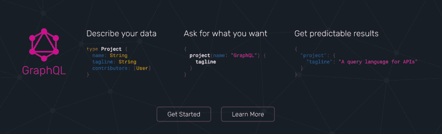

# 为什么要使用 GraphQL？

> 原文：<https://dev.to/iwilsonq/why-use-graphql--6cj>

说实话，我第一次听说 GraphQL 的时候不知道该怎么看待它。我看着网飞的工程师谈论用 Node.js 扩展他们的微服务，其中一个人提到他在 GraphQL 早期在脸书工作过。

[T2】](https://res.cloudinary.com/practicaldev/image/fetch/s--rUcm4zBz--/c_limit%2Cf_auto%2Cfl_progressive%2Cq_auto%2Cw_880/https://thepracticaldev.s3.amazonaws.com/i/f7068p55l27poiinzhsa.png)

被它的名字和整洁的连点标志迷住了，我查看了它的[登陆页面](http://graphql.org)，并被他们在英雄部分简洁的自我描述迷住了。从类型定义和一个类似 json 的声明性查询中，我们得到了我们想要的结果——没有传递多余的数据，也没有任何往返。

这种 REST 替代方案虽然打破了易于理解的以 URL 为中心的惯例，但为其采用者提供了一些优势。

## 为什么要创建 GraphQL 服务器？

GraphQL 解决了一些客户端问题，其中一些问题由于 Redux 的普遍过度使用而暴露无遗，尤其是在 React 应用程序中。也许你听说过人们(包括我自己)几乎在任何事情上都使用 Redux，即使他们的应用程序状态是微不足道的。这个问题基本上是人们用空袭来杀死一只蚊子。甚至 Redux 的作者丹·阿布拉莫夫也对它的广泛过度使用感到恼火。

> 丹阿布拉莫夫[@丹 _ 阿布拉莫夫](https://dev.to/dan_abramov)从不创造任何东西2018 年 2 月 12 日上午 02:40

嗯，好主意，丹！幸运的是，你在脸书的同事们创造了一些东西，通过准确获取客户需要的东西，不多也不少，来帮助缓解国家难题。

### 不再有溢出或往返 API 调用

通过单个端点，服务器为客户端提供呈现特定视图所需的所有数据，大大简化了需要配置的应用程序状态的数量。再加上持久化查询、批处理和订阅等特性，您就有了一个超级高效的 GraphQL 后端。

想象一下，你必须进行 5 次不同的 REST 端点调用，以便收集足够的数据来呈现你的应用程序的首页。你可能不得不过度提取数据——因为你只需要其中一个响应中的一个整数，许多场就像热量一样消失在周围的空气中。来自 60 亿光年之外的恒星的光落在太阳能电池板上，成为通过你的计算机的能量，然后被扔掉。

这种声明性的数据获取也意味着客户端不需要进行太多的往返数据调用，比如刷新页面或在提要中收集更多的条目。他们只会发送一个更小的查询来完成这个任务。

请注意，GraphQL 和 REST 并不相互排斥，您当然可以配置您的服务器来使用这两者。这可以通过添加一个负责响应 *graphql* 请求的端点或者通过[用 graphql 服务器](http://graphql.org/blog/rest-api-graphql-wrapper/)包装你的 REST API 来实现。

### 数据探索

在我看来，数据探索是构建 GraphQL 后端最酷的特性之一。当您设置 GraphQL 服务器时，您可以将其配置为 graph QL 编辑器(注意 *i* )来测试开发中的查询。您甚至可以在生产中公开这种方法，以便让用户能够在自己的应用程序中使用您的数据。这种浏览器内置的 IDE 可以作为一种工具，让新工程师入职，或者让您的团队以一种简单的、声明性的方式探索数据集。不再梳理 MySQL 的惊人工作台或无情地进入卷发。

你可以探索几个开放的 GraphQL APIs，包括 [Github](https://www.graphqlhub.com/playground/github) 、 [Hackernews](https://www.graphqlhub.com/playground/hn2) 和 [Reddit](https://www.graphqlhub.com/playground/reddit) 。在之前的一篇博文中，我使用了 Yelp REST API 来创建一个咖啡地图。原来他们也有一个 GraphQL API 向那些选择测试版的开发者开放。

当然，允许任何人向您的后端发送查询会有一些安全问题。幸运的是，马克斯·斯托伊伯整理了一篇简洁的文章，描述了他如何在 T2 频谱提高 GraphQL API 的安全性。

## 我的想法

在过去的几周里，我一直在钻研 GraphQL 规范和一些有用的库，它们让用它进行开发变得非常有趣。例如， [Apollo 团队](https://www.apollographql.com/)已经创建了几个实用程序和许多博客帖子，对我理解 GraphQL 非常有帮助。

Apollo 提供了客户端库，使得构建 GraphQL 查询变得容易。它们提供了一些工具，使得构建模式变得简单明了。此外，它们还提供了一个引擎，可以对每个查询进行性能跟踪、错误跟踪和缓存。如果你想了解更多关于 GraphQL 的知识，我推荐阅读他们的博客

我写这篇文章是为了收集我对 GraphQL 的想法，看看是否有新的想法从中冒出来。要练习构建自己的 GraphQL 服务器，请查看这篇文章。

如果你想要一个整洁、全面的视频课程，我推荐 Stephen Grider 在 Udemy 上的[graph QL with React:The Complete Developers Guide](https://www.udemy.com/graphql-with-react-course/)。这就是我开始了解它的原因。

下次见，图表打开。