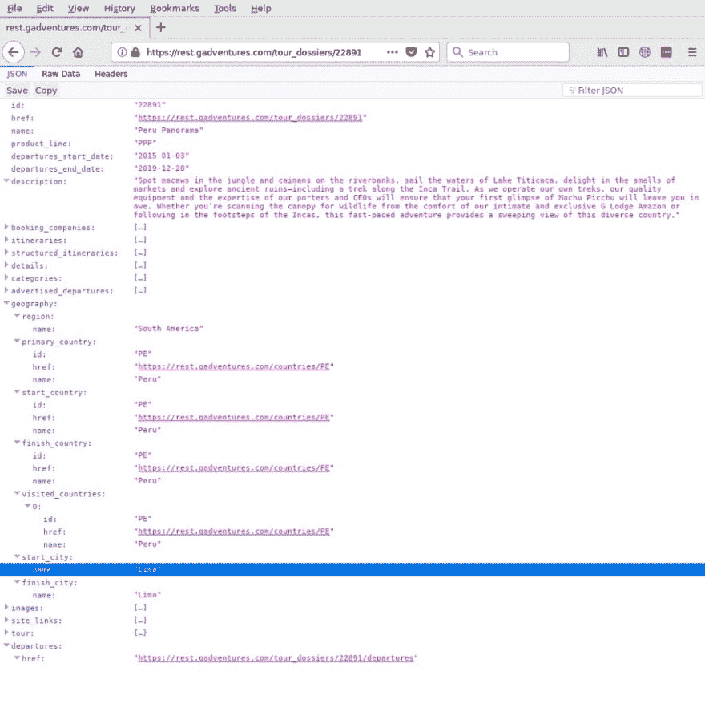

# 为什么我们在 G Adventures 创建了 REST API

> 原文：<https://dev.to/gadventurestech/why-we-created-a-rest-api-at-g-adventures-1imf>

<figure> 

<figcaption>图片由 [Artem Sapegin](https://unsplash.com/photos/b18TRXc8UPQ?utm_source=unsplash&utm_medium=referral&utm_content=creditCopyText) 上 [Unsplash](https://unsplash.com/search/photos/internet?utm_source=unsplash&utm_medium=referral&utm_content=creditCopyText)</figcaption>

</figure>

作为 G Adventures 的高级开发人员，我有很好的机会在这里开发 REST API。这篇文章是第一篇详细描述我们如何走到今天这一步的文章。

我们在 G Adventures 的核心业务是小团体旅游，这是一个社会企业，致力于向我们的旅行者展示世界，并反过来改善我们的旅行者和我们所到目的地的居民的生活。

可以想象，为了确保从第一天开始一切顺利，很多人都在计划一次地球另一边的旅行。随着我们业务的增长，我们的各种系统也在增长。最终，有必要拥有一个公共接口(或一种公共语言)，我们的系统可以用它来相互交流。我们选择 REST API 代表表述性状态转移，API 代表应用程序编程接口。

我们使用这个接口向内部和外部的开发人员公开我们的业务系统。例如

[T2】](https://res.cloudinary.com/practicaldev/image/fetch/s--jS0hIrM1--/c_limit%2Cf_auto%2Cfl_progressive%2Cq_auto%2Cw_880/https://cdn-images-1.medium.com/max/1024/1%2AdHoovjeEG3t9rs4hUc8GoQ.jpeg)

包含关于我们的[秘鲁全景](https://www.gadventures.com/trips/peru-panorama/PPP/)旅游的各种有用的细节，包括旅游路线或具体出发的链接。

这种沟通方式是我们业务增长的一个巨大因素，因为它使我们的合作伙伴能够以更具成本效益的方式与我们整合(过去，与我们一起预订旅游需要使用专门的网站，甚至经常需要打电话)。使用 REST API，只需要几个 HTTP 请求。

在内部，它允许我们集成我们的各种系统并隐藏实现细节，这样应用程序开发人员就不再需要对我们拥有的每一个系统了如指掌。一旦开发人员熟悉了 REST API，他们就可以以统一的方式使用我们的任何系统，无论他们是与我们的库存管理系统或客户管理系统(CRM)交互，还是与我们通过 API 公开的任何其他系统交互。

这种统一接口的存在甚至允许全新的应用程序，这在以前是不可能的。比如我们的自动电子邮件引擎或通用搜索功能。

在我们发布 API 后不久，我们发现也需要知道什么时候会发生变化。例如，如果上述秘鲁全景旅行不再从利马开始，我们需要通知网站、我们的预订引擎、我们所有的 API 客户，他们经常在自己的网站上显示旅行。

一种方法是让每个开发人员在特定的时间间隔检查上述 URL(轮询)。但是这并不是一个很好的策略，因为我们有大约一千个不同的旅行团，其中大多数每 10 天至少出发一次。有很多网址需要查询。

### Webhooks(不要给我们打电话，我们会给你打电话)

Webhooks 可以比作推送通知，是一种在我们的生态系统发生变化时通知 API 用户的简单机制。换句话说，我们的用户不会总是查看上面的 URL 来查看是否有任何变化，我们会让每个订阅的人都知道秘鲁全景之旅是否有变化。

这些 webhooks 实现了一种通用的通知机制，各种业务单位使用这种机制来尽快获得相关信息。副作用包括我们能够保留数据的副本，用于统一搜索和缓存，以提高 API 的功能和响应能力。

我们的外部合作伙伴可以使用 webhooks 来观察我们的库存，观察特殊交易，或者在他们与我们的预订发生任何事情时立即得到通知。

我为我们能够用我们的 API 完成的事情感到骄傲，但是在我的下一篇文章中，我将会得到更多的技术信息，因为 G Adventures 中 REST API 的故事还远远没有结束。

敬请关注。

*继续关注我们的* [*Medium*](https://tech.gadventures.com/) *和*[*Twitter*](https://twitter.com/gadventurestech)*获取更多科技世界片段据 G！*

*想帮助 G 大冒险改变人们的生活，环游世界？* [*查看我们所有的职位，今天申请*](https://gadventures.com/careers) *。*

* * *