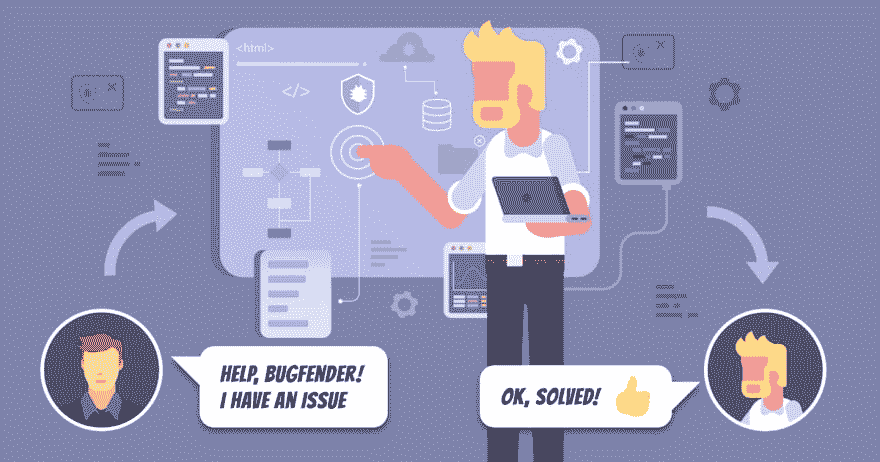

# 为什么 Bugfender 没有客户支持代表

> 原文：<https://dev.to/bugfenderapp/why-we-dont-have-customer-support-representatives-at-bugfender--43gn>

*这篇文章最初发表在我们的[博客](https://bugfender.com/blog/why-we-dont-have-customer-support-representatives-at-bugfender/)上。*

[T2】](https://res.cloudinary.com/practicaldev/image/fetch/s--tFfTKkaV--/c_limit%2Cf_auto%2Cfl_progressive%2Cq_auto%2Cw_880/https://bugfender.com/wp-content/uploads/2018/02/Customer-support.jpg)

我们经常问自己:向我们的用户提供客户支持的最自然的方式是什么？

作为开发人员，我们一直在努力改善用户体验，客户支持是 UX 至关重要的一部分。虽然我们想在 Bugfender 的客户支持方面出类拔萃是显而易见的，但我们应该如何为我们的用户提供关键支持却不太清楚。我们讨论过培训一组客户支持代表。我们可以外包。或者我们可以提供数字化的帮助手册。

然而，因为我们打造了一款简化客户支持的产品，**卓越的客户服务是我们 Bugfender** 精神的一部分。

鉴于我们产品的性质，不迅速彻底地回应用户的问题是愚蠢的。因此，我们知道我们需要找到一个不仅适合我们业务，而且适合您的选择。

## 有时...客户支持出了大问题

每个人都曾遭受过糟糕的客户服务。想象一下，你需要给你的公用事业公司打电话——比如你的电信或能源供应商。

人们期望你会花上几个小时试图解决哪怕是最小的问题，筛选那些写得很差而且经常过时的网站，这些网站可能甚至不会回答你的问题。

如果你有幸接触到一个真实的人，他们通常缺乏理解和有意义地解决你的问题的训练。

 
*巴塞罗那的 Bugfender 工程师*

## 与一个真正的帮助制造产品的工程师或设计师交谈

在 Bugfender，从一开始就很清楚这不是我们希望用户拥有的体验。我们希望 Bugfender 用户可以自由提问并提出改进建议。我们认为，所有用户都应该在合理的时间范围内收到深思熟虑的答案。总而言之，我们希望鼓励用户与我们进行有意义的对话。

从一开始，我们就有意识地决定不雇佣任何一个完全面向客户的职位。我们决定由工程师和设计师——创造和维护我们产品的人——来回答客户的问题。

## 我们非常清楚用户如何联系到我们

Bugfender 的用户可以通过电子邮件发送到[【support@bugfender.com】](mailto:support@bugfender.com)或者点击[对讲机](#)，网站右下角的小图标允许用户直接与我们的工程师和设计师聊天。Intercom 很棒，因为它对所有用户都是可访问的，无论他们是潜在的客户还是回归的开发人员。当您登录并查看您的应用程序日志和问题时，您可以与我们聊天。

这有几个优点:

当你在工作时间问我们问题时，另一边会有一个真正的人完全理解这个问题，并能提供及时、有意义的回答。你得到的是真正的人，而不是 IVR 或从手册上复制/粘贴答案的机器人。如果你在下班后通过对讲机联系，我们的机器人会为你提供有用的文章，帮助你解决问题，但请放心，Bugfender 的真人会在第二天给你回复。

通过开通沟通渠道，我们可以随时向您提出后续问题。感觉很自然，对吧？

## 接受直接反馈是完善我们产品的重要部分

这个过程帮助我们识别重复出现的痛点，分析我们的常见问题，并了解客户在使用 Bugfender 时遇到的未知情况。每次您联系我们，我们都会回复您，回答您的所有问题。您的交流有助于我们为大家改进产品！

## 以这种方式提供客户支持是否高效？

花时间与客户直接交谈的机会成本意味着我们花在其他事情上的时间更少，比如构建新功能。值得吗？我们最初根据直觉建立了我们的客户服务，但几周之后，我们意识到，让工程师直接与我们的客户交谈，对于创新和质量来说，比我们坐在办公桌前构建的任何功能都更有价值。

拥有一个直观的产品，为我们的客户做一些特别的事情，比拥有一个有很多花里胡哨却没人知道如何使用的产品重要得多。

这并不意味着我们永远不会雇佣任何客户支持代表。也许在某个时候，雇佣一个客户支持团队来回答问题是有利的。但在公司目前的阶段，有几千个客户，提供我们的工程师作为客户的资源的优势是显而易见的。我们从中获得的价值是巨大的！

因此，目前我们是 Bugfender 的客户支持。除非事情在不久的将来发生很大的变化，否则我们认为这是一条长期的正确道路。

我们为重视为用户提供出色客户支持的开发人员创建了 Bugfender。我们的工具直接从用户的设备上无缝地收集日志，无论他们在世界的哪个角落。

Bugfender 为您提供了一个可搜索数据库中每个用户的日志。您可以搜索任何用户的设备，查看他们在设备上做了什么，哪里出错了，最重要的是，如何回应客户来解决问题。

它改变了游戏规则。

* * *

这篇文章由 Sarabeth Flowers Lewis 编辑，她是一名自由作家，也是 Lewis 商业写作的联合创始人，专门从事 SEO 和直接回应内容创作。她目前和她的姜黄色丈夫一起远程工作，为科技、非营利组织和房地产写作。点击这里查看更多她的作品。

*这篇文章最初发表在我们的[博客](https://bugfender.com/blog/why-we-dont-have-customer-support-representatives-at-bugfender/)上。*