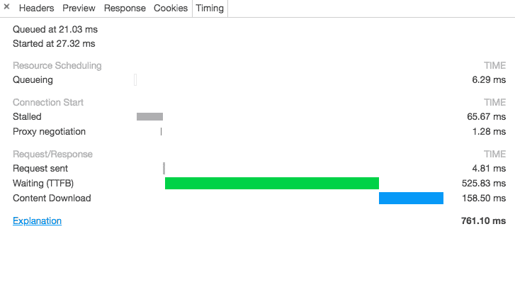

# 如何提高网页性能🤘🤘🚩🔜

> 原文：<https://dev.to/sait/why-web-performance-is-really-matters-2ogb>

什么是 web 性能？为什么没有人关心 Web 性能？

如何让网站加载更快？

网页表现是任何网站盈利或亏损的主要因素。任何需要更多时间来加载的网站都会失去流量，即使“谷歌”把它们踢出去，也不会推荐给该网站显示在第一页。

我见过许多网站，他们有很好的设计和干净的代码，但性能非常低。

无论你选择何种语言/技术来创建网站。
浏览器不在乎。因为我们最后只提供 Html、CSS 和 JavaScript 文件。

你见过网络选项卡
 中的接受报头吗

## 当我们点击标签上的一个 URL 时，会发生什么

[T2】](https://res.cloudinary.com/practicaldev/image/fetch/s--mS4IuBLu--/c_limit%2Cf_auto%2Cfl_progressive%2Cq_auto%2Cw_880/https://thepracticaldev.s3.amazonaws.com/i/vnpi2xvyqjv8x5lrm89l.png)

第一个浏览器查找 URL 的 DNS 查找。它将 URL 转换为 IP 地址，在发送请求之前，三次握手需要 56 毫秒才能得到确认。如果我们进行重定向，这将花费更多的浏览器需要找到新的 IP 地址，这将需要额外的时间。

### 三路握手

这意味着服务器和客户端可以就传输数据的顺序达成一致

一旦收到确认，浏览器向服务器发送请求，服务器返回响应。这就是我们通常所说的客户机-服务器计算。

首先，我们从服务器获取 HTML 文档，然后浏览器开始解析 HTML 文件并创建 Dom(文档对象模型)。一旦解析器到达链接标签，也就是我们的 CSS，浏览器就会发送另一个请求
来获取 CSS。浏览器只允许每个主机 6 个请求。

当我们发出第 7 个请求时，浏览器将其放入队列中。在 Http/2 中允许多路复用，我们可以发送 6 个以上。

## 图像

当在网站中使用图片时，谷歌不推荐 png 格式，使用 webp/jpeg。目前，chrome 支持 webp，其他浏览器不支持。

需要时使用图像在将图像发送到生产环境之前压缩图像。将图像裁剪到所需的宽度/高度
检查 chrome dev 工具，它显示所需的宽度/高度。

## Html/CSS

如果可能的话，缩小 Html 和 CSS 文件，删除代码中的注释，因为浏览器不关心你在代码中写的注释。

注释增加了文件中的额外位数。

在 Css 中使用速记规则，例如:使用“margin”而不是 margin-top/left/right/bottom。

使用 Chrome 审计标签来衡量网络性能，它清楚地显示了哪些资源需要更多的时间来获取信息。

**“如果你的网站看起来很好/感觉很好并不能让你有更多的流量，网站
需要快速加载”。**

如果你有时间，看看 Pinterest 如何提高网络性能
[案例研究](https://medium.com/dev-channel/a-pinterest-progressive-web-app-%20 %0A%20performance-case-study-3bd6ed2e6154)

[如何使用 Chrome 开发工具](https://dev.to/saigowthamr/how-to-use-%20 %0A%20%20chrome-dev-tools-2gjk)