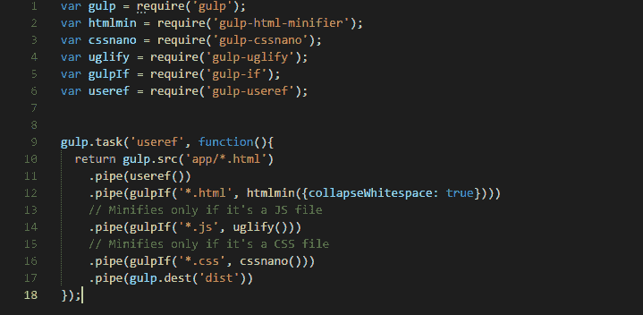
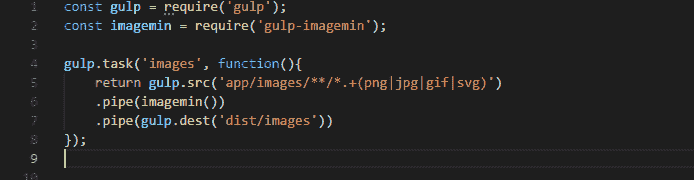
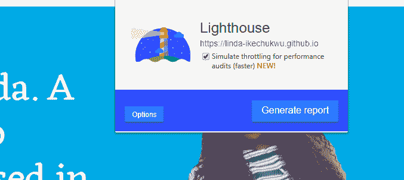
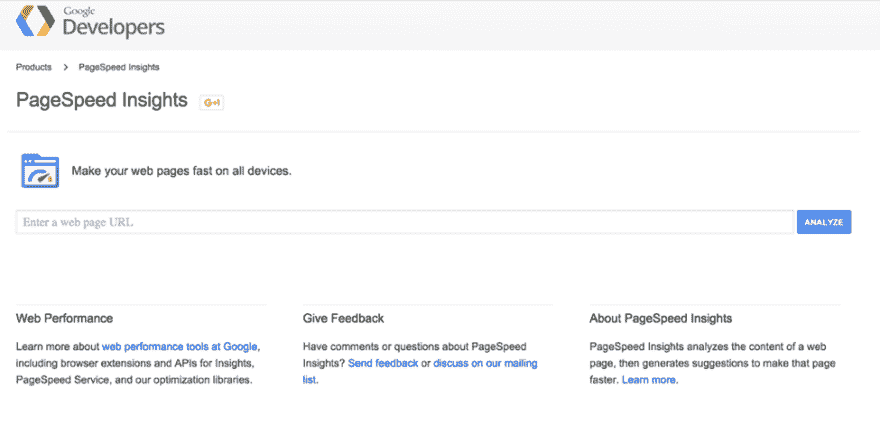

# 为什么 Web 性能优化很重要，你能做什么

> 原文：<https://dev.to/linda_ikechukwu/why-web-performance-optimization-matters-and-what-you-can-do-1bff>

Web 性能指的是下载网页并在浏览器中显示给用户的速度/速率。

另一方面，网页性能优化指的是分析网页性能并确定改进方法的过程。

你可能会问，所以呢？？我是个坏蛋戴夫。web 应用程序所需的所有功能都已实现，并且运行良好。这有什么关系？

<figure> 

<figcaption>有什么关系。</figcaption>

</figure>

我有消息告诉你。这很重要。

### 为什么网络性能很重要

#### 留住用户&提升用户体验:

研究表明，加载时间超过 5 秒的网页很容易被用户放弃，他们可能会回来，也可能永远不会回来。

#### **增加收入:**

如果你经营网上业务，那么主要目标是提高收入/转换率。嗯，性能是关键。研究还表明，如果用户在处理订单和加入购物车时经历了大于 5 秒的延迟，那么他们一定会放弃它。

#### **推广 SEO :**

谷歌用更高的排名奖励更好的用户体验，并降级糟糕的用户体验。这导致更快的页面在搜索结果中排名更高。

### 你能做什么

有很多不同的方法和步骤可以用来优化 web 性能。我会看看基本的和必须做的。

#### 1。先想想:

对于开发者来说，依赖外部 CSS/JS 库和框架是一种常态。在把它们放进你的文件之前，问问你自己它们是否真的有必要。大多数时候，你需要的功能没有它们也能实现。这样做的目的是减少浏览器呈现页面所需的 http 请求数量。更多的 http 请求(即获取内部和外部文件)意味着更多的页面加载时间。因此，请求应该只在必要的时候提出，并且应该在可能的情况下合并。如果你必须使用框架，尽量选择最简的。

这条规则也应该适用于图片，换句话说，只保留绝对必要的网页内容。

#### 2。缩小文本资源(HTML/ CSS/ JS):

缩小是在不改变代码功能的情况下，从代码中删除所有不必要字符的过程。这些不必要的字符通常包括空格、换行符和注释，它们用于增加代码的可读性，但并不是代码执行所必需的。

缩小所有文本资产会减小它们的文件大小，从而减少浏览器为呈现页面而必须下载的内容的数量。这导致更快的响应和加载时间。

有许多工具可用于缩小不同的文本资源，例如:

HTML : [HTML 缩小器](https://github.com/kangax/html-minifier)

CSS : [CSSNano](https://cssnano.co/) ， [CSSO](https://github.com/css/csso)

JAVASCRIPT : [UglifyJS](https://github.com/mishoo/UglifyJS)

为了自动化这个过程，可以使用一个构建工具，比如 Gulp。

<figure> 

<figcaption>运行 gulp useref 任务会最小化 html、css 和 js 文件，并将缩小的版本存储在 dist 文件夹</figcaption>

</figure>

如果你不熟悉 gulp，读一读这篇关于它的伟大文章。

#### 3。优化图像:

图像优化包括以尽可能小的尺寸提供图像，同时仍然保持适当的质量、尺寸、分辨率和格式。

在现代网页中，图片至少占网页总重量的 30%,因此优化图片可以极大地提高网站的性能。

有几种工具(免费的和基于订阅的)可用于优化图像。我最喜欢的一些是:

1.  [ImageOptim](https://imageoptim.com/)
2.  [图像套件](https://imagekit.io/)
3.  [文件优化器](https://sourceforge.net/projects/nikkhokkho/)
4.  [ImageMagick](https://www.imagemagick.org/) 的缩写
5.  [Imagemin](https://github.com/imagemin/imagemin-app)

这个过程也可以使用 gulp-imagemin 插件自动完成。作为依赖项安装，然后快速编写一些代码。

<figure> 

<figcaption>使用 gulp 缩小 png、jpg、svg 和 gif 文件。</figcaption>

</figure>

同样，如果你不熟悉 gulp，读一读这篇关于它的伟大文章。

#### 4。HTTP 缓存:

在这个上下文中，缓存指的是浏览器存储数据(比如图像、css、js)，以便将来对该数据的请求可以直接得到服务，而不必重新下载或从服务器获取。更少的下载意味着更快的网站。

HTTP 缓存可以用指定浏览器缓存策略的[缓存控制头](https://varvy.com/pagespeed/cache-control.html#file-types)以及其他可用的 [HTTP 缓存头](https://www.keycdn.com/blog/http-cache-headers/)来实现。

可以缓存几种文件类型，包括 html、CSS、JavaScript、字体、图像和图标。代码可以放在. htaccess 文件或 Apache httpd.conf 文件中。

如需进一步阅读，请查看这篇关于使用 HTTP 缓存优化页面的文章。

### 接下来是什么？

如果你成功地实现了上面的建议，那么你应该犒劳自己一杯奶油拿铁😉。先别放松，还有一件事要做。

#### 检测&分析:

下一步是对你的网站进行审核，以了解哪些做得好，哪些做得不好，以及可能的改进途径。

有很多工具(从在线应用程序、浏览器扩展到系统工具)可以用来审计网站。让我们来看看几个和他们的能力。

Lighthouse: 这是一个 chrome 工具，可以作为 Chrome 扩展从 Chrome 开发工具运行，也可以从命令行运行。

[T2】](https://res.cloudinary.com/practicaldev/image/fetch/s--qPpG7y4P--/c_limit%2Cf_auto%2Cfl_progressive%2Cq_auto%2Cw_880/https://cdn-images-1.medium.com/max/677/1%2A4Vt6DWwWQ8KmXKfiibkoew.png)

PageSpeed Insights : 这是一项谷歌网络服务，它分析网页的内容，并提出建议，使你的页面加载更快。只需在提供的空白处键入您的网址，点击分析，它就会为您的网站生成一份报告。

[T2】](https://res.cloudinary.com/practicaldev/image/fetch/s--m-pQw_zX--/c_limit%2Cf_auto%2Cfl_progressive%2Cq_auto%2Cw_880/https://cdn-images-1.medium.com/max/975/1%2AQiapAcofyHz8dRy1kwazrg.png)

这是一个在线工具，使用真实的浏览器(IE 和 Chrome)并以真实的消费者连接速度在全球多个地方运行网站速度测试。

SiteSpeed.io : Sitespeed.io 是一套开源工具，它使用真实的浏览器测试网站，模拟真实用户的连接，并收集重要的以用户为中心的指标，如速度指数和第一视觉渲染。

需要注意的一点是，web 性能优化是一门艺术，而不是一门科学。没有一个规划好的实施路径。所以继续吧，开始优化你的网站，并从中获得乐趣(如果可以的话💁。)