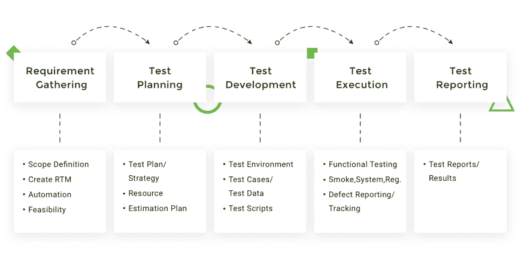
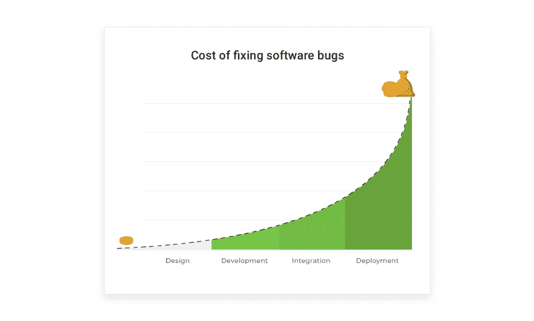
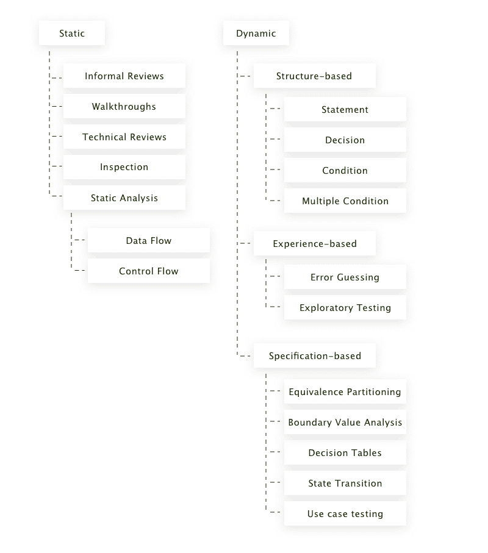
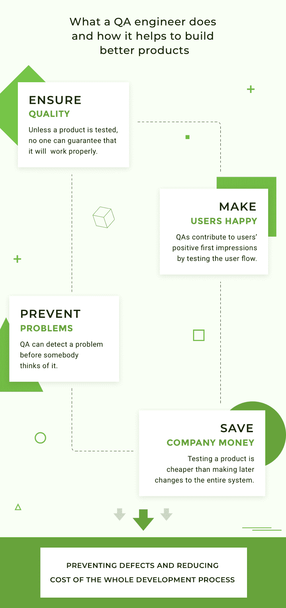

# 为什么质量保证对您的产品至关重要，它如何能节省您的资金

> 原文：<https://dev.to/django_stars/why-you-need-qa-and-how-it-can-save-your-money-2151>

所以，我们应该首先决定我们在谈论什么:我们不是在谈论 QA 工程师如何做他们的工作。我们正在讨论为什么质量保证是软件开发的一个重要部分，以及我们在 Django Stars 的运作方式。

先说一些定义。

质量保证工程师旨在帮助创造优质产品。不是找 bug，不是简单的测试。QA 工程师的主要职能是防止缺陷，从而确保开发过程及其结果的质量。这是一个宽泛的陈述，因此在本文中，我将尝试涵盖一些细节，以帮助您理解 QA 的商业价值。

缺陷又名 **bug** 是一段有缺陷的代码，导致系统无法执行其所需的功能。这并不总是意味着某些东西不起作用。它可能只是工作不正常。

**那么 QA 工程师是做什么的呢？他们:**

*   在所有项目阶段识别产品中的弱点和不一致性；
*   帮助定义项目需求；
*   提供关于产品质量水平的全面信息；
*   在软件开发生命周期(SDLC)的所有阶段测试产品。

值得注意的是，QAs 对任何产品的用户友好感兴趣，无论是功能还是设计。为此，QAs 与所有团队成员密切沟通，并不断参考给定的要求。

现在，让我们研究一下 QAs 参与的所有阶段，他们在这些阶段的角色，以及他们的工作带来的商业价值。

### 什么时候需要 QA？

在这一部分中，我将描述 QAs 做什么以及何时做。我将要描述的阶段是软件测试生命周期(STLC)中常见的(和通用的)部分。

[T2】](https://res.cloudinary.com/practicaldev/image/fetch/s--62mof5Jz--/c_limit%2Cf_auto%2Cfl_progressive%2Cq_auto%2Cw_880/https://djangostars.com/blog/conteimg/2018/07/qa1.png)

#### 第一阶段——需求收集

[T2】](https://res.cloudinary.com/practicaldev/image/fetch/s--8oQOi3e_--/c_limit%2Cf_auto%2Cfl_progressive%2Cq_auto%2Cw_880/https://djangostars.com/blog/conteimg/2018/07/qa2.png)

在我看来，这是最重要的阶段。在第一次见面时，客户大致描述他们想要什么。他们概述了所需应用程序或服务的功能，以及它应该包括哪些功能，但很少提到他们希望它包括的技术。

在许多公司中，功能需求的检查是业务分析师(BAs)的工作。然而，他们不能保证技术组件的兼容性。这也是 BAs 与包括 QAs 在内的其他专家分享这个舞台的原因。后者的任务包括:(1)分析和决定需求是否可以集成到一个单一的系统中；(2)哪些方案行得通，哪些行不通；(3)计划所需的测试技术(下面将详细介绍)。

**验证**是在开发开始之前评估产品的过程，以确定产品是否符合用户的期望，以及这个想法是否值得投入精力。

在这个阶段，QAs 与 BAs 合作研究软件产品满足用户需求的程度。基本上，他们检查产品对用户和市场是否有意义。从用户那里收集反馈是非常重要的，这样可以发现缺少了什么或者可以改进什么(设计、功能等)。)来提供更好的用户体验。

除非进行这种验证，否则产品可能永远不会到达它的受众，即使从技术角度来看它可能很棒。这一阶段还确保产品将为客户带来利润。否则，为什么一开始就这么麻烦呢？

#### 第二阶段–测试计划

[T2】](https://res.cloudinary.com/practicaldev/image/fetch/s--AHBm-dzk--/c_limit%2Cf_auto%2Cfl_progressive%2Cq_auto%2Cw_880/https://djangostars.com/blog/conteimg/2018/07/qa3.png)

在这个阶段，QAs 定义测试策略。通过定义策略，我的意思是对整个项目(=软件产品)进行时间和精力的估计。在需求分析之后，QAs 创建一个称为测试计划的文档。它包括项目的可交付成果、范围和目标、负责的角色，并定义了测试环境。

如果没有这个阶段，测试过程将充满意想不到的障碍和意外事件。为了确保后续阶段遵循严格的行动顺序，QA 的工作是制定并记录行动计划。否则，这个过程本身可能会很笨拙。

#### 第三阶段——测试开发

[T2】](https://res.cloudinary.com/practicaldev/image/fetch/s--5noeKzsI--/c_limit%2Cf_auto%2Cfl_progressive%2Cq_auto%2Cw_880/https://djangostars.com/blog/conteimg/2018/07/qa4.png)

现在我们有了一个测试计划，我们建立一个测试环境并创建测试用例。测试用例是我们需要采取的一组步骤，以验证软件产品是否没有错误，是否按照指定的需求工作。在这之后，我们考虑验收标准——也就是说，一个软件产品要被认为是成功的，应该满足的技术标准。

#### 阶段 4–测试执行

[T2】](https://res.cloudinary.com/practicaldev/image/fetch/s--MGDPQuxi--/c_limit%2Cf_auto%2Cfl_progressive%2Cq_auto%2Cw_880/https://djangostars.com/blog/conteimg/2018/07/qa5.png)

这是许多人认为 QA 唯一的工作——根据计划执行所有测试用例的阶段。如果系统的某个部分运行良好，我们将其标记为通过。这样，我们可以确保我们没有遗漏任何细节，产品是高质量的。

如果一个测试用例失败了，这意味着代码中存在缺陷，QAs 会向开发人员发回一份报告，这样他们就可以检查发生了什么。

#### 第 5 阶段–测试报告

[T2】](https://res.cloudinary.com/practicaldev/image/fetch/s--0KaMD4Jx--/c_limit%2Cf_auto%2Cfl_progressive%2Cq_auto%2Cw_880/https://djangostars.com/blog/conteimg/2018/07/qa6.png)

在产品测试之后，是时候讨论什么是好的，什么是错的，以改进进一步的测试周期。为了确保快速修复 bug 而不被开发人员误解，每个检测到的问题都必须被很好地记录下来。稍后我会告诉你 QAs 从不同角度测试产品最常用的技术。

什么是测试周期？这是我们进行这五个测试阶段的频率——也就是每个冲刺阶段。

### QA 工作的细节

包括 Django Stars 在内的大多数软件公司都是在 **sprints** 中工作的——两周内完成一系列任务。在每个冲刺阶段，我们实现产品需求的一些部分，并完成所有五个测试阶段。重要的是你要明白测试不仅仅是尝试每一种可能的方法来使用产品。当然，也是这样，但通常你对一个系统只能做这么多。

除非 QA 参与到开发过程中，否则以后开发团队可能会做出一些有用的东西，而且非常有用，但不是最初想要的。它还有助于减少设计新测试用例所需的时间，因为我们越早了解我们要检查什么以及如何检查，就越容易进行这样的测试。开发和 QA 团队合作是至关重要的，否则可能会变成一场谁能找到更多 bug 的战斗。这很少导致高质量的结果。

既然我已经告诉了你软件测试生命周期，我想总结一下为什么每个团队都需要 QA:

*   **安全交易。**你有一个支付系统，而且运行良好。用户为服务付费并得到它。然而，你没有检查某些情况下，钱不去你，但一个随机的银行账户。这是件大事，也是致命的，尤其是如果我们谈论的是数千美元。
*   **存钱。**下图清楚地显示了生命周期阶段和成本之间的关系。修复一个漏洞比预防它更昂贵。修复一个错误可能会产生另一个错误，所以问题会迅速升级。

[T2】](https://res.cloudinary.com/practicaldev/image/fetch/s--fSQQGygo--/c_limit%2Cf_auto%2Cfl_progressive%2Cq_auto%2Cw_880/https://djangostars.com/blog/conteimg/2018/07/Img-2.png)

*   保护你的名誉。如果你发布了一个有问题的产品，而用户对它有不好的体验，那么很难说服他们问题已经解决了，他们可以再次使用这个产品。经验法则:第一印象很难改变。
*   **保证产品质量。**如果没有从里到外进行测试，产品可能无法正常工作或根本无法工作。测试需要理论知识，所以如果你不是专业人士，很难保证质量。
*   **监控流程。**除非开发过程受到控制以符合规定的要求，否则最终产品可能与计划的不同。

你会注意到我经常使用测试这个词。这是因为有一门独立的学科叫做**质量控制** (QC)。在下一部分，我称之为**QA 的工作**，我将告诉你 QA 和 QC 的区别，SDLC 和 STLC 的关联，并详细描述 QA 工程师使用的一些测试技术。

### QA

**质量保证和质量控制**

质量控制包括确保产品质量良好并符合特定要求的所有活动。质量控制工程师专注于在产品发布前识别产品中的缺陷。我们可以说质量保证包括质量控制。

有些情况下，产品不需要 QA，只需要 QC。例如，如果一个团队得到了一个别人开发的产品，并被要求检查代码是否满足需求，我们有一个只需要 QC 的情况。

在一些开发团队中，QA 和 QC 与其他工程角色结合在一起。有时，开发人员试图验证他们自己的代码。然而，就质量而言，这并不好，因为在你自己的代码中找到 bug 比在别人的代码中找到 bug 要困难得多。

**软件开发和测试生命周期**

我想传达的是一个简单的信息: ***开发和测试必须总是同步的。*** 在 Django Stars，我们不会在不考虑开发人员当时在做什么的情况下划分测试阶段。团队作为一个单独的单元，对产品负责。除非开发和测试同时进行，否则会有延迟和不一致，从而导致低质量的产品。

我希望我已经成功地让你相信了两个过程——SDLC 和 STLC——一起进行的重要性。现在我们将继续讨论一些 QA 工程师用来保证软件产品质量的流行测试设计技术。

**测试设计技术**

测试用例是一种逐步测试软件产品功能的方法。基本上，就是 ***我们要考什么，怎么考。***

**测试设计技术**是一个选择测试的过程，该过程将在软件产品发布之前验证软件产品是否符合规范。

有各种各样的测试设计技术，每一种都可以识别某种类型的缺陷。这就是为什么所需技术的选择取决于(1)产品的类型，(2)产品的状态，以及(3)需求。

下图显示了最常见的测试设计技术。

[T2】](https://res.cloudinary.com/practicaldev/image/fetch/s--KWKb7w15--/c_limit%2Cf_auto%2Cfl_progressive%2Cq_auto%2Cw_880/https://djangostars.com/blog/conteimg/2018/07/qa8.png)

让我们仔细看看我们需要的每一种技术和案例。

*   **静。**该技术在代码执行(上线)之前测试源代码、功能和需求规格。这种技术可以识别结构缺陷。这不是一次性的事情，所以我们试图在开发过程的早期阶段就开始实施。

*   **以结构为基础。**当我们可以完全访问代码时，我们使用基于结构的技术。简单地说，这些技术处理代码的内部逻辑和结构。这些测试有助于识别代码中错误或缺失的逻辑和错别字。

*   **基于规范。**也称为黑盒测试，这是一种测试技术，在不研究代码的情况下检查软件产品的功能。基于需求，我们选择合适的测试设计技术来帮助我们获得测试用例。

*   **经验为本。**这更多的是一种辅助技术，允许 QAs 根据他们以前使用类似系统的经验来测试软件。

我相信您现在已经了解了进行质量测试所必须具备的理论基础。所需硬技能的数量使得非 QA 人员几乎不可能保证软件产品的质量。

### 底线

不管一个产品看起来有多简单，在高质量的软件背后都有大量的工作要做。正如唐·诺曼指出的，“好的设计实际上比糟糕的设计更难被注意到。”在大多数情况下，QA 工程师通过检查是否一切正常，让人们享受好产品成为可能。

质量保证包括许多活动，从测试到审查结果。大多数软件产品都需要 QA 工程师来(1)设定一个成熟的开发流程，(2)保证发布软件的质量，(3)在用户发现之前防止系统出现错误。QAs 使用各种技术来检查一个系统是否满足所有规定的要求，并按“应该”的方式运行。

没有特殊技能，测试一个系统是不容易的，即使是有经验的开发人员也不太可能成功。这就是为什么最好的团队让 QA 和开发者一起工作；他们可以在追求高质量软件的过程中结合他们的技能。

[T2】](https://res.cloudinary.com/practicaldev/image/fetch/s--ypGZmcaG--/c_limit%2Cf_auto%2Cfl_progressive%2Cq_auto%2Cw_880/https://djangostars.com/blog/conteimg/2018/07/qa7.png)

这篇文章是由伊琳娜·梅舍金娜写的。关于[质量保证](https://djangostars.com/blog/why-you-need-qa/)的文章最初发表在 Django Stars 博客上。
您还可以访问我们的内容平台[产品部落](https://producttribe.com/)，它是由专业人士为那些参与产品开发和成长过程的人创建的。

我们随时欢迎您提出问题，分享您想阅读的话题！