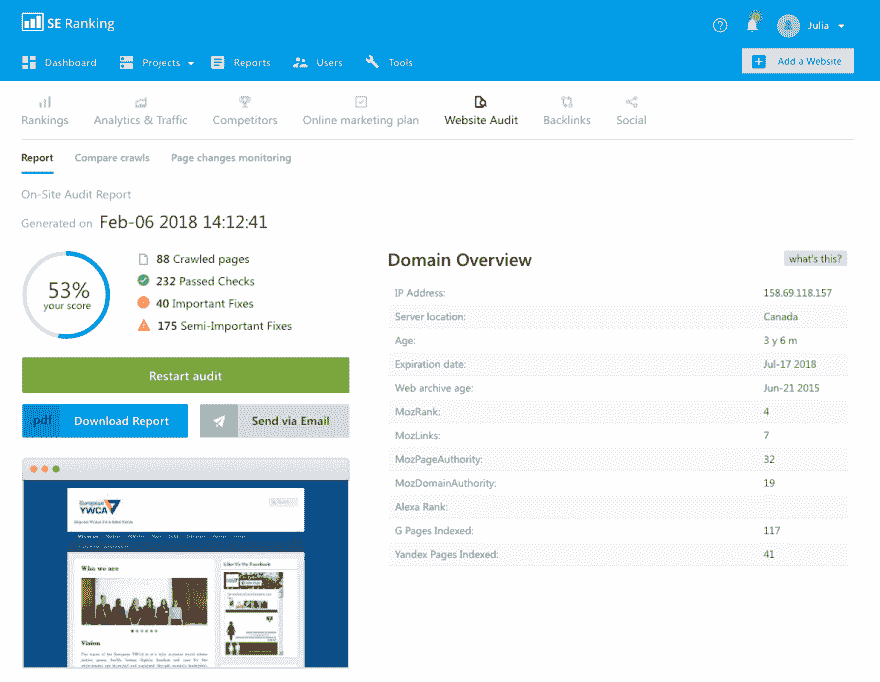
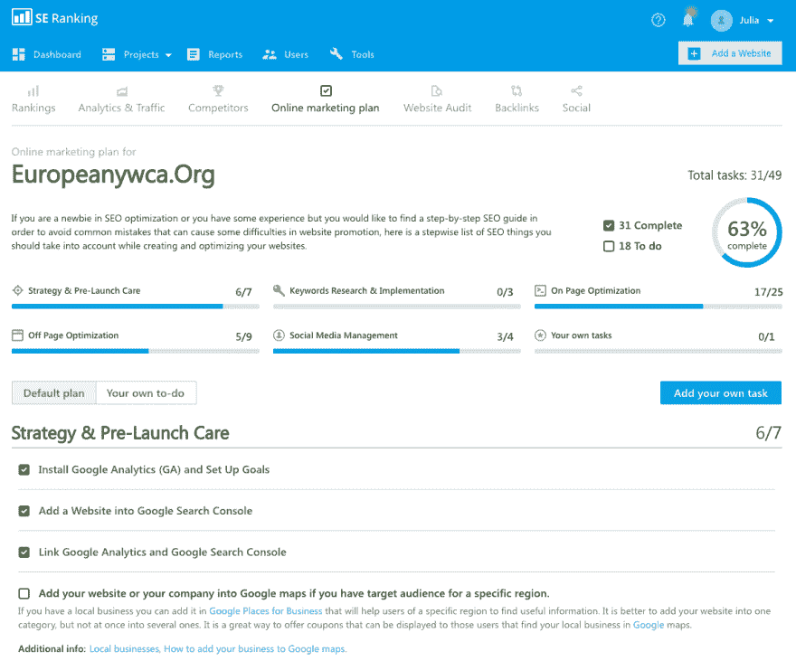
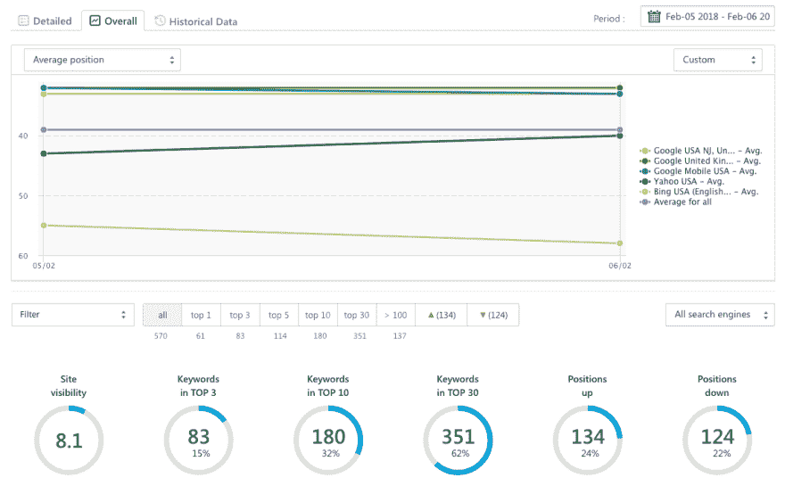

# 为什么你需要自己做搜索引擎优化

> 原文：<https://dev.to/diana__ford/why-you-need-to-do-seo-on-your-own--504d>

中小企业正在积极占领市场。如果你没有一个深思熟虑的战略和有效的工具，准备好放弃你在顶端的位置，支持你坚持不懈的竞争对手。

如果你还没准备好放弃，现在是时候开始从事 SEO 工作了，或者至少评估一下你的 SEO 承包商——专家或代理的有效性。要应付这两项任务，你不需要几十个工具和丰富的经验，你只需要这本终极指南。

## 第一阶段

**审核您的网站设置诊断**

像 SE 排名、尖叫青蛙或者 MySiteAuditor 这样的平台推荐从审核你的网站开始 SEO 过程。这意味着，首先你必须在系统中创建自己的项目，并连接谷歌分析。然后，您将能够运行一个健康检查您的域名，并找到错误，阻止您的网站被高度评价。

来自 SE 排名 的 [网站审计工具会根据您的需要检查尽可能多的页面，并在每一步提供有价值的提示。](https://seranking.com/website-audit.html)

[T2】](https://res.cloudinary.com/practicaldev/image/fetch/s--7W_IPgBJ--/c_limit%2Cf_auto%2Cfl_progressive%2Cq_auto%2Cw_880/https://thepracticaldev.s3.amazonaws.com/i/dwcllypckaj55cmb6jm7.png)

该工具将检查您网站的 70 多个参数，并给出建议以消除所有检测到的错误——与技术、内容和可用性相关。您可以从中的综合报告中获得关于如何提高网站性能的所有信息。pdf 格式。

## 第二阶段

**监视你的竞争对手**

要分析你的主要竞争对手，先得到以下问题的答案:“ *你的主要竞争对手是谁？* ”和 *它们是怎样付诸行动的* ？”。然后想办法赶上并超过他们。

你有两种方法获得你需要的信息——自己了解所有细节，或者使用一些强大的工具，如 Moz、SEMRush 或 SE Ranking。它将为你提供关于竞争对手的有机和付费流量的有价值的信息。

借助这些工具，您可以:

*   监控竞争对手的排名:了解他们的有机和付费流量、预算、流量和点击量。
*   发现他们的广告，并确定哪些是最有效和最受欢迎的。根据这些数据，你就能明白如何改进你的内容策略。
*   收集一份最受欢迎的关键词列表，从中挑选最适合你的。

## 第三阶段

**使用营销计划启动 SEO 流程**

你有没有想过为什么长期规划能帮助你更快实现目标？底线是，当目的地确定后，你知道去哪里，并且有时间思考如何到达那里。所以，在这个阶段你真正需要的是一个确切的指导，帮助你一步一步实现你的目标。网上有许多待办事项清单和计划，这里是最有价值的简短清单:

[营销计划出自 SE 排名](https://seranking.com/marketing-plan.html)

[HubSpot 营销计划生成器](https://www.hubspot.com/marketing-plan-template-generator)

[营销计划模板由 Business.com](https://www.business.com/articles/sample-marketing-plan-outline-and-template/)

此外，您还可以:

*   通过添加您自己需要完成的任务来定制营销计划。
*   将任务分配给其他用户，无需登录您的 CRM 或使用任何其他工具。

[T2】](https://res.cloudinary.com/practicaldev/image/fetch/s--WT7umqjG--/c_limit%2Cf_auto%2Cfl_progressive%2Cq_auto%2Cw_880/https://thepracticaldev.s3.amazonaws.com/i/6nbtlkj719a9glsh5qxo.png)

例如，SE 排名营销计划包括基于您的网站分析的有价值的建议:

*   战略和上市前护理。
*   关键词:研究与实施。
*   页面优化。
*   离页优化。
*   SMM。
*   你自己的任务。

该计划还包含许多有用资源的链接，如带提示的文章或 Bing 网站管理员工具。

## 第四阶段

**定期检查排名以快速调整**

只有一种方法可以控制你的排名——定期跟踪它们，因为它们可能会随着搜索引擎的更新而迅速变化。感谢排名跟踪工具，无论算法如何变化，您都可以获得 100%准确的数据。

*表现如何:*

[T2】](https://res.cloudinary.com/practicaldev/image/fetch/s--6rgPqxLx--/c_limit%2Cf_auto%2Cfl_progressive%2Cq_auto%2Cw_880/https://thepracticaldev.s3.amazonaws.com/i/uajg1ygsnj4m6u4plhbs.png)

*   你可以为你的每一个关键词设置一个目标 URL，如果它不符合 SERP 中的那个，你会得到一个通知。
*   你可以追踪当地的排名，直到邮政编码。例如，如果你在芝加哥有一家花店，你可以检查你在某个特定地区的排名，并利用这些数据。
*   移动搜索的趋势每年都在增长，到 2020 年将超过来自 PC 的搜索([移动搜索用户数量](https://www.statista.com/statistics/368746/us-mobile-search-users/) 预计到 2021 年 将增加到 2.21 亿用户)。这就是为什么跟踪移动设备的评级并使用这些数据来制作成功的广告如此重要。
*   你可以在谷歌地图和 YouTube 上查看你的排名。
*   一些工具具有用户友好的直观界面，带有许多图表和数据过滤器，有助于对最相关和最重要的信息进行优先排序。

## 第五阶段

**在社交媒体上变得可见**

如果你想从社交网络中获得最大的流量，你需要在网上保持活跃，对用户有吸引力。Hootsuit、TweetDeck 或 Sprout Social 将帮助您在一个平台上获得社交网络分析并管理您的社交交流以及 SEO 项目。因此，你不必切换到其他平台或支付额外的工具。

如果你想让你的生意变得有利可图，你就不能忽视 SEO。设定目标，用强大的工具武装自己。市场上有许多选择——尝试你认为有用的工具，并遵循上述步骤，为成功的 SEO 打下坚实的基础。