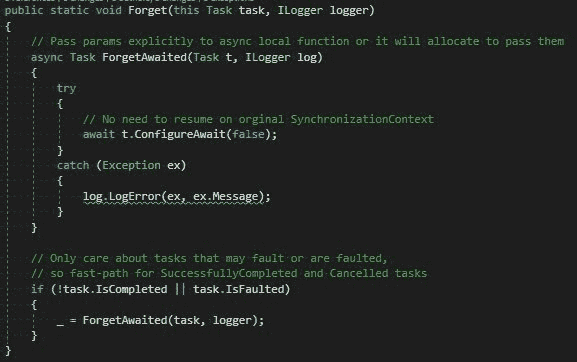

# 为什么不应该在异步代码中使用“ContinueWith”

> 原文：<https://dev.to/joni2nja/why-you-should-not-use-continuewith-in-your-async-code-338n>

这篇文章最初出现在[媒体](https://medium.com/@joni2nja/why-you-should-not-use-continuewith-in-your-async-code-c9eaf6087e64)上

#### 你在异步代码中使用 ContinueWith 了吗？

为了我将来的参考，这篇文章是 ASP.NET 核心建筑师大卫·福勒推文的快速总结:

> 大卫·福勒@大卫·福勒你是否在你的异步代码中使用了 ContinueWith？如果是？为什么？[# dotnetcore](https://twitter.com/hashtag/dotnetcore)[# aspnetcore](https://twitter.com/hashtag/aspnetcore)07:12am-26 Sep 2018[](https://twitter.com/intent/tweet?in_reply_to=1044847039929028608)[](https://twitter.com/intent/retweet?tweet_id=1044847039929028608)24[](https://twitter.com/intent/like?tweet_id=1044847039929028608)85

所以，我们开始吧。

*   异步状态机虽然有创建开销，但更容易调试。它们可以并且将在未来进一步优化(在运行时方面)。
*   如果任务已经完成，它们会同步执行，除非你指定正确的标志集，否则`ContinueWith`不会这样做。
*   调用`ContinueWith`为每个操作分配另一个任务(它将您的委托包装在一个任务对象中),而不是重用状态机实例作为延续。所以你的静态回调被包装在一个 ContinuationTask 对象中。然后，它也被包装在另一个 continuation 对象中，并附加到任务延续列表中。任务本身也针对异步/等待进行了优化。

例如:

```
if (!task.IsCompleted)
{
  return FinishAsync(task);
}

private async Task FinishAsync(Task task)
{
  try
  {
    await task;
  }
  catch (Exception ex)
  {
    Log(.....)
  }
} 
```

*   `ContinueWith`分配多于使用异步 await。事实上，在。NET Core Task 针对异步 await 代码路径进行了优化，分配的资源少于`ContinueWith`。
*   当您同步完成而不是异步完成时，状态机的开销是一个问题。
*   如果你考虑到*整个“成本”，包括状态机生成*，async/await 仍然比在这种情况下只使用`ContinueWith`要*轻*。至少在。它是网络核心。
*   `ContinueWith`需要捕获执行上下文。这意味着至少有一个对象同时具有你的回调 ***和*** 选项。
*   在异步 await 的情况下，状态机开始时是一个`struct`，一旦你进入异步状态，它就被**装箱**到一个对象中，这个装箱分配基本上被 ***所有的*** 重用。

最后但同样重要的是，也值得检查 tweet 线程:

> 本·亚当斯@本 _ a _ 亚当斯[@大卫·福尔](https://twitter.com/davidfowl)[@ 0omari 0](https://twitter.com/0omari0)[@ ThrowATwit](https://twitter.com/ThrowATwit)[@ jbogard](https://twitter.com/jbogard)[@ danielsilv 9](https://twitter.com/DanielSilv9)[@ moi trades](https://twitter.com/MoiTrades)[@ Marc _ data](https://twitter.com/marc_data)[顶部带有本地函数的为](https://twitter.com/marc_data)[@ jbogard](https://twitter.com/jbogard)s . editor config23:41PM-26 Sep 2018[](https://twitter.com/intent/tweet?in_reply_to=1045096041266249728)[](https://twitter.com/intent/retweet?tweet_id=1045096041266249728)1[](https://twitter.com/intent/like?tweet_id=1045096041266249728)15

看看大卫·福勒·✨的异步指导

### 总结

使用异步/等待。