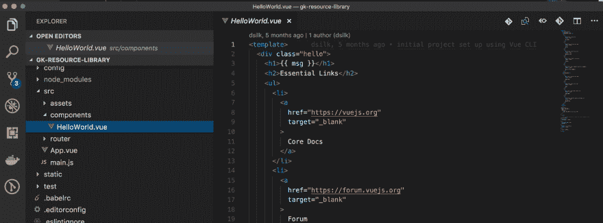

# 为什么应该使用 Web 框架

> 原文：<https://dev.to/silkster/why-you-should-use-a-framework--1ga2>

[T2】](https://res.cloudinary.com/practicaldev/image/fetch/s--TpwmrauK--/c_limit%2Cf_auto%2Cfl_progressive%2Cq_auto%2Cw_880/https://thepracticaldev.s3.amazonaws.com/i/obihcgs4wkecxupcnm1q.png)

每当我看到这样的评论:“[框架让你们都变成了糟糕的开发人员](https://dev.to/gypsydave5/why-you-shouldnt-use-a-web-framework-3g24)”，我想作者只是采访了一个不能回答基本问题的人，或者是参加了一个会议，会上一个初级开发人员建议对一个页面作出反应。

## 什么是框架？

我认为适用于我们网络开发者的定义是这样的:

> 框架:一个系统或概念的基本结构。

框架是网站的基础。它提供了大多数网站需要的所有基本功能。

## 初学者使用框架是否更容易？

框架通常对代码组织、编程概念、语言、结构、工具等方面非常固执己见。这不是一件坏事，因为你为此选择了一个框架。你想要一个符合你的 web 开发理念的框架。

如果你是初学者，你还没有什么想法，所以这个框架可能是为你选择的。当你进入其中，你会发现自己在说，“哦，这就是为什么他们这样做！”或者“他们为什么不这样做？”这很好，因为这意味着你在学习！

## 没有框架真的很难吗？

建立网站不是火箭科学，所以从零开始真的没有那么难，但是框架的存在是因为，除了时间和金钱，很容易出错。如果你自己动手做，我保证你会忘记一些最终会让你难堪的事情。

[T2】](https://res.cloudinary.com/practicaldev/image/fetch/s--XQtmupgP--/c_limit%2Cf_auto%2Cfl_progressive%2Cq_auto%2Cw_880/https://thepracticaldev.s3.amazonaws.com/i/wznro5umovdkmtna3sl0.jpg)

如果有人说不要使用新的框架，我会同意。为原型等测试驱动新的框架，但是为你的真实世界项目使用稳定、可靠和经过测试的框架。

## 我不应该学基础的，而不是某个人的抽象吗？

简单的回答是可以，请学基础。但是...

...好的框架执行，并且在某些情况下，引入最佳实践。

...好的框架有很多社区支持。你几乎可以把参与构建框架的所有人都看作是你的开发团队的一部分。

...好的框架是模块化的，所以你不需要加载大量不必要的代码，只需要获得运行你的站点所需的最少代码。很多人在谈论为什么不应该使用框架时会提到 Bootstrap，但是 Bootstrap 是相当模块化的，所以你真的不需要加载所有的东西来使你的网站看起来很棒并且运行良好。你只需要学会如何使用它。

## 每个人都有自己的看法

至于我上面链接的那篇文章，作者说的我 1000%同意的一点是这样的:

> 不要学怎么用 JQuery 用 Bootstrap 用 Redux 构建 React，学 HTML，CSS，JavaScript。大卫·威克斯

我采访过很多前端开发人员，每次他们中有人将 jQuery 与 JavaScript 互换使用时，我都会感到害怕。不要那样做！尤其是在面试的时候。

[T2】](https://res.cloudinary.com/practicaldev/image/fetch/s--Yq72T_B2--/c_limit%2Cf_auto%2Cfl_progressive%2Cq_auto%2Cw_880/https://thepracticaldev.s3.amazonaws.com/i/qy7pb3ywr603vcqy1c99.jpg)

当有人说“不要做这个”或“做那个”时，不要全信。除非是你的老板，而你又没有好的反驳理由。

学习。

形成自己的观点。

但是，最重要的是，在规定的时间内，以你所知道的最好的方式做好你的工作，并且在你需要的时候总是寻求帮助。

> 这里表达的观点无意冒犯或伤害任何人。这只是我的 2 美分。