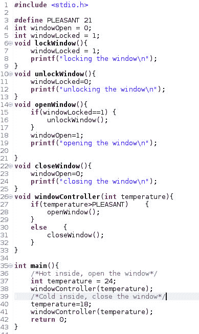

# 为什么您应该使用代码覆盖工具

> 原文：<https://dev.to/diedoman/why-you-should-use-code-coverage-tools-1go>

*最初发布于[Linkedin](https://www.linkedin.com/pulse/why-you-should-use-code-coverage-tools-diederik-loos/)T3】*

有时候编写安全的软件是相当困难的。你必须考虑每一个可能的执行路径，你应该考虑每一个可能的输入。即使您已经编写了涵盖几乎所有可能情况的代码，您仍然需要测试所有场景。通过使用代码覆盖工具，您可以看到哪些代码行被执行了，以及这些代码行被执行了多少次。通过将单元测试与代码覆盖率相结合，您可以确保每个功能至少执行一次。

给定以下场景:

你正在编写一个程序，当你的房间温度过高时，它会自动打开你的窗户。您定义了一个打开窗口的函数和一个关闭窗口的函数。窗户上还有一把锁，可以防止窃贼进入。程序看起来如下:

编译并运行代码后，一切看起来都很好，但是有一个问题您可能已经发现了:

[T2】](https://res.cloudinary.com/practicaldev/image/fetch/s--cWZ2utpz--/c_limit%2Cf_auto%2Cfl_progressive%2Cq_auto%2Cw_880/https://thepracticaldev.s3.amazonaws.com/i/orjlx6ydpah85hn2b7zz.jpeg)

该程序从不锁定你的窗口！在这种情况下，不执行必要的功能。代码覆盖率可以帮助您找到不执行但应该执行的功能，或者您尚未测试的功能(因为它们从未执行过)。您可以使用代码覆盖率报告来进一步加强您的单元测试，并确认您的应用程序正常工作(在每种可能的情况下)。

大约两年前我写了这篇文章，从那以后我获得了更多的测试经验。您对某个主题有任何疑问吗，或者您希望我写一篇关于某个主题的文章(例如，使用 selenium 进行功能测试)？如果有，那么请在下面留下评论。也非常欢迎反馈；)