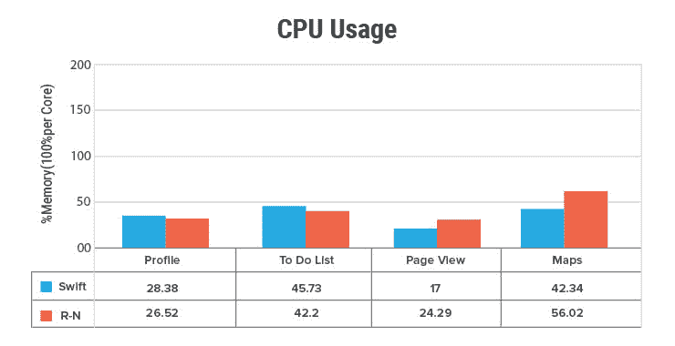
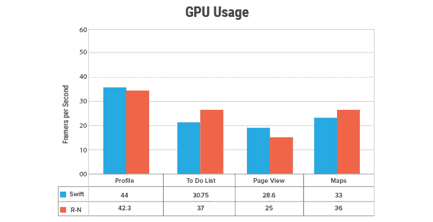
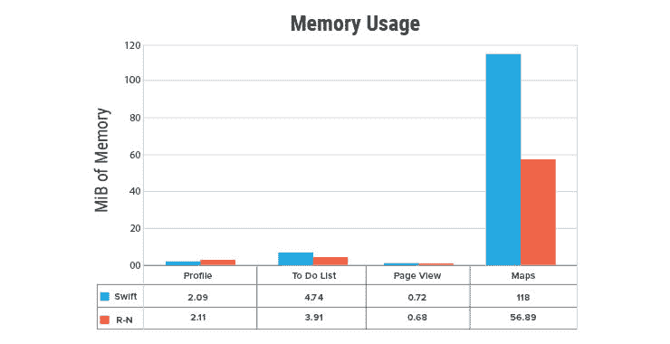
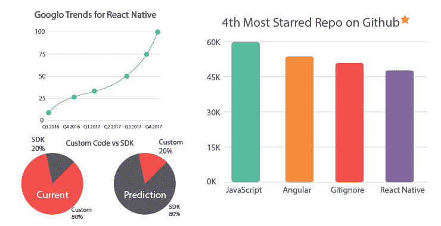
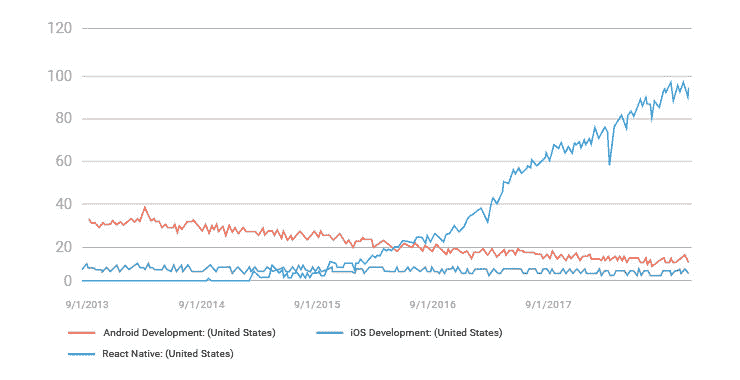
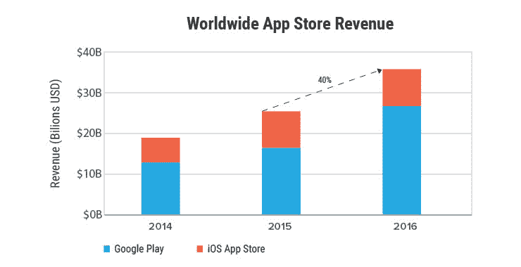

# React Native 会标志着原生 App 开发的消亡吗？

> 原文：<https://dev.to/topsinfosol/will-react-native-mark-the-demise-of-native-app-development-534d>

[T2】](https://res.cloudinary.com/practicaldev/image/fetch/s--3zyDZRcx--/c_limit%2Cf_auto%2Cfl_progressive%2Cq_auto%2Cw_880/https://www.topsinfosolutions.com/wp-content/uploads/2018/08/React-Native-Main-Image.jpg)

你可以使用你现有的网络开发技能，并利用这些技能开发出原生的 iOS 和 Android 应用。完全有可能利用你的 HTML、CSS 和 JavaScript 技能来开发原生 Android 和 iOS 应用。

我说的不是混合应用或只是围绕移动网站的应用包装，而是真正的原生应用——你在 iOS 中使用 Swift 或在 Android 中使用 Java 或 Kotlin 设计的纯原生应用。多亏了 React Native，原生应用现在也可以用普通的 web 技术开发:HTML、CSS 和 JavaScript。

如果你仍然不相信我，这些应用程序真的很棒。拿出你的手机，看看这些应用中的一个:脸书、信使、Instagram、Skype 和 Airbnb。它们是在 React Native 中开发的。

[T2】](https://res.cloudinary.com/practicaldev/image/fetch/s--B-HQItZN--/c_limit%2Cf_auto%2Cfl_progressive%2Cq_auto%2Cw_880/http://www.topsinfosolutions.com/wp-content/uploads/2018/08/1-Companies-using-react-native.jpg)

**什么是 React Native？**

脸书面临着许多关于重新设计他们的应用程序和一切的问题。问题是处理许多用户和推出新功能。脸书需要一些更强大的东西，可以处理大量的流量，可以设计得非常快。脸书的优秀团队开始开发一个 JavaScript 库，后来被称为 React。

最好的部分是 React 采用了更快的虚拟 DOM。虽然 React 是一个库，但是轻量级组件可以在任何地方注入。你可以在 PHP、MySQL、Firebase、MongoDB 或者你选择的任何数据库系统上使用 react。

你一定想知道 React 不是用来设计 web 应用程序的吗？考虑将 React Native 作为 ReactJS 在移动应用程序开发方面的继任者。你在 React 中学到的所有东西，比如组件、道具、状态、冗余、模态等等。也是 React Native 的一部分。

您在 React 中学到的东西可以在相同的工作流中应用于 React Native。组件、道具和状态都在 react native 中使用，因此你得到了你的原生应用。

**React Native 的双重优势**

与原生 Java 和 Swift 代码不同，在 React Native 中，你不需要编译你的应用。你只需重新加载它，就像你在网络浏览器中浏览网站一样。

此外，您不必为您应用程序维护两个单独的代码库。例如，假设你是一家企业，我是一家应用程序开发公司，你外包了一个移动应用程序项目。

当然，除了 web 之外，您还想要一个适用于 Android 和 iOS 的应用程序。它需要两个团队，每个团队负责一个移动平台:一个团队负责 Android 应用程序，另一个团队负责 iOS 应用程序。你可能没有意识到，在 iOS 和 Android 应用中实现完全相同的功能需要这些团队之间进行大量的交流:应用功能、截止日期、交付、客户期望和要求等。

**性能与本机代码**

React 原生应用的性能或多或少类似于用原生 iOS 代码编写的应用。一个中型用户运行了一些测试，将其性能与原生代码进行比较，发现性能与 Swift 中的一个等效应用相当，有时甚至更好。[中型文章](https://medium.com/the-react-native-log/comparing-the-performance-between-native-ios-swift-and-react-native-7b5490d363e2)在三个方面测量了性能:运行时的 CPU、GPU 和内存利用率。

在 CPU 使用方面，性能是相似的，尽管地图在 Swift 中表现更好。

[T2】](https://res.cloudinary.com/practicaldev/image/fetch/s--Kjddyw8u--/c_limit%2Cf_auto%2Cfl_progressive%2Cq_auto%2Cw_880/http://www.topsinfosolutions.com/wp-content/uploads/2018/08/2-CPU-Usage.jpg)

为了计算 GPU 性能，Native 与 React Native，作者计算了 GPU 负载下应用程序的每秒帧数(FPS)。令人惊讶的是，尽管差距很小，React Native 每秒钟比 Swift code 多 6.25 帧。

[T2】](https://res.cloudinary.com/practicaldev/image/fetch/s--yDvFkxXa--/c_limit%2Cf_auto%2Cfl_progressive%2Cq_auto%2Cw_880/http://www.topsinfosolutions.com/wp-content/uploads/2018/08/3-GPU-Usage.jpg)

对于内存测试，作者专注于地图，因为其他功能的内存足迹可以忽略不计，以找出一个对比。显然，在最高性能时，React Native 使用的内存比 Swift 少 61.11 MiB。在执行任务和记录测量结果时，他发现内存使用量出现了峰值，此时他按下了“地图”选项卡，这促使 MapView 找到我的当前位置，并用蓝色脉动点突出显示。

[T2】](https://res.cloudinary.com/practicaldev/image/fetch/s--QzpuVxaw--/c_limit%2Cf_auto%2Cfl_progressive%2Cq_auto%2Cw_880/http://www.topsinfosolutions.com/wp-content/uploads/2018/08/4-Memory-Usage.jpg)

**React Native 是开发移动应用最聪明的方式**

在 React Native 中，你只需要维护一个代码库，这个代码就会生成原生的 Android 应用和 iOS 应用。React Native 现在得到了很多关注，人们很喜欢 React Native 的发展和社区的成长。你一定在沙发上跳来跳去。最后，你可以使用更便宜的 web 开发者来设计原生的 Android 和 iOS 应用。你不再需要雇佣程序员或者用 Java、Kotlin 或 Swift 培训他们。

**这是原生 App 开发的终结吗？**

不，技术总是并存的。一些企业更喜欢 React Native，而其他企业则更喜欢 Kotlin 或 Swift 中的本机代码。有多种移动技术可供选择总是好的。桌面应用程序开发人员总是有许多编程语言和技术可供选择，其中大部分仍在使用，而且越来越强大。

例如，仍然有一些应用程序是用 Ruby on Rails、Django、PHP 以及 node.js 开发的。

React Native 最大的好处是现在有了比以往更多的选择。开发者可以使用 Java 或者 Kotlin 进行 Android 开发。同样，他们可以使用 Swift 进行 iOS 开发。有了 React Native，他们在原生开发方面又多了一个选择。更不用说，现在日常的 web 开发者也可以成为 native app 开发党的一员。

**巨大的增长和未来**

然而，React Native 正在以惊人的速度增长，如果这种增长持续下去，我们很快就会发现 React Native 的开发者比 Swift 或 Kotlin 的开发者更多。移动生态系统的这种发展将标志着传统移动开发形式的巨大转变。该领域将不断发展，将 React 本地开发或任何类似的新兴或即将到来的技术纳入移动应用开发。

[T2】](https://res.cloudinary.com/practicaldev/image/fetch/s--x0Pq1nzY--/c_limit%2Cf_auto%2Cfl_progressive%2Cq_auto%2Cw_880/http://www.topsinfosolutions.com/wp-content/uploads/2018/08/5-React-Native-Trends.jpg)

谷歌趋势是一个流行的工具，用来了解人们对一个搜索词的兴趣。当用于预测人们对技术或移动开发技术的兴趣时，它可以告诉他们哪些在增长，哪些在下降。

[T2】](https://res.cloudinary.com/practicaldev/image/fetch/s--8VT9baI_--/c_limit%2Cf_auto%2Cfl_progressive%2Cq_auto%2Cw_880/http://www.topsinfosolutions.com/wp-content/uploads/2018/08/6-React-native-Google-trends.jpg)

*来源:* [*谷歌趋势*](https://trends.google.com/trends/explore?geo=US&q=android%20development,iOS%20development,React%20Native)

显然，正如我所说的，尽管 React Native 已经呈指数级增长，而 iOS 开发保持不变，但 Android 开发却出现了大幅下滑。这让我思考。React 的增长是以牺牲 Android 开发为代价的吗？现在说还为时过早，但有一点是肯定的:iOS 的发展将会持续，而 Android 的未来因为 React Native 而处于混乱之中。

Android 开发者有一个一致的抱怨。他们挣得没有 iOS 同行多，投资回报率也很难获得。在一些人口统计中，收入差距几乎是两倍。

[T2】](https://res.cloudinary.com/practicaldev/image/fetch/s--Kuoi5pNn--/c_limit%2Cf_auto%2Cfl_progressive%2Cq_auto%2Cw_880/http://www.topsinfosolutions.com/wp-content/uploads/2018/08/7-World-wide-app-store-revenue.jpg)

*来源:App Annie*

或许，应用平台认为 React Native 是他们 Android 开发誓言的答案。

**模糊 Android、iOS 和 Web 开发之间的界限**

React Native 和类似的 JavaScript 框架的流行正在模糊 web 和移动应用程序开发者之间的界限。这是移动开发历史上的第一次，一个开发人员可以说我不想学 Java 或 Objective C，但仍然可以开发一个移动应用程序。

对于寻求开发移动应用的企业来说，React Native 带来了大量的机会。他们可以以很低的成本瞄准这两个移动平台。由于我提到的原因，企业更喜欢 iOS 而不是 Android，React Native 将为 Android 开发带来新的生机。

[T2】](http://www.topsinfosolutions.com/inquiry/)

帖子[会不会反应原生标志着原生应用开发的消亡？](https://www.topsinfosolutions.com/blog/react-native-vs-native-app-development/)最初发表于 [TOPS Infosolutions](http://www.topsinfosolutions.com)