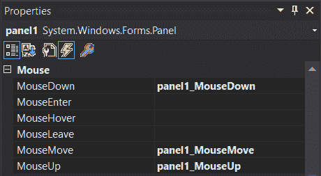

# Windows 窗体绘画效果(C++)

> 原文：<https://dev.to/jansonsa/windows-forms-paint-effect-c--j27>

### **鼠标按下时模拟循环功能**

##### 微软画种风格:

这个函数的作用是——它让你的函数每隔`10ms`运行一次，比如在使用 Windows 窗体的时候。因为这样的事件不直接存在于 Windows 窗体中，所以我们可以一起使用几个不同的事件来获得相同的结果。

[T2】](https://res.cloudinary.com/practicaldev/image/fetch/s--GtzX1BxR--/c_limit%2Cf_auto%2Cfl_progressive%2Cq_auto%2Cw_880/https://thepracticaldev.s3.amazonaws.com/i/8y9rtet77l1w0s06nr9h.PNG)

**有两种情况:**

*   要么用常规的`MouseEventHandler(this, &project::panel1_MouseClick);`一次点击一个像素在网格上画画(我知道在如此巨大的像素上看起来并不糟糕)；
*   或者，单击并拖动任意长的时间，以获得连续的线条(让我演示给你看)。

为此，我们需要 3 个事件，尽管最后一个是可选的:

```
 this->panel1->MouseDown += gcnew System::Windows::Forms::MouseEventHandler(this, &frmAdventrureMap::panel1_MouseDown);
this->panel1->MouseUp += gcnew System::Windows::Forms::MouseEventHandler(this, &frmAdventrureMap::panel1_MouseUp);
this->panel1->MouseMove += gcnew System::Windows::Forms::MouseEventHandler(this, &frmAdventrureMap::panel1_MouseMove); 
```

还有一个定时器:

```
private: System::Windows::Forms::Timer^  timerMouseDrag;
this->timerMouseDrag = (gcnew System::Windows::Forms::Timer(this->components));
//Let's add a tick event
this->timerMouseDrag->Tick += gcnew System::EventHandler(this, &frmAdventrureMap::timerMouseDrag_Tick);
//And specify the interval
this->timerMouseDrag->Interval = 10; 
```

对于任何刚刚使用 Visual Studio 设计视图的人来说，这不会变得更容易:
[](https://res.cloudinary.com/practicaldev/image/fetch/s--p4wzerTr--/c_limit%2Cf_auto%2Cfl_progressive%2Cq_auto%2Cw_880/https://thepracticaldev.s3.amazonaws.com/i/dlydfegf82f6os6s6cxk.PNG)

* * *

### **现在到了好玩的部分**

你们中的一些人可能已经明白我的意思了，因为剩下的只有两行代码:

```
private: System::Void panel1_MouseDown(System::Object^  sender, System::Windows::Forms::MouseEventArgs^  e) 
{
//Mouse pressed - Start the timer
    timerMouseDrag->Start();
}

private: System::Void panel1_MouseUp(System::Object^  sender, System::Windows::Forms::MouseEventArgs^  e) 
{
//Mouse released - Stop the timer
    timerMouseDrag->Stop();
} 
```

最后:

```
private: System::Void timerMouseDrag_Tick(System::Object^  sender, System::EventArgs^  e) 
{
    //Your code here (This is where I make the drawing happen)
} 
```

就是这样！简单是最高级的复杂(达芬奇)

##### 但是让我们更进一步

还记得我们之前初始化的鼠标移动事件吗？
我们用它来将鼠标位置传递给我们的定时器事件或我们可能调用的任何其他函数。
简单地创建一个`MouseEventArgs^`的私有属性或者只是分配鼠标的 x 和 y 位置:

```
private:
    System::Windows::Forms::MouseEventArgs^ mouse;
    //or
    int x, y; 
```

并在每次`MouseMove`发生时更新它们:

```
private: System::Void panel1_MouseMove(System::Object^  sender, System::Windows::Forms::MouseEventArgs^  e) 
    {
    mouse = e;
    //Or
    x = e->X;
    y = e->Y;
    } 
```

对于任何认为没有计时器但在`MouseMove`事件- *中也可以做到这一点的人来说，你完全正确*，但你缺少的是选择你喜欢的间隔的简单选项，此外`MouseMove`一直在发生，而我们的计时器只有在按下鼠标时才工作。

归根结底，每个项目都有自己最适合的方法。

希望这对某人有所帮助或者提出了一些新的想法，如果有，欢迎在下面评论。