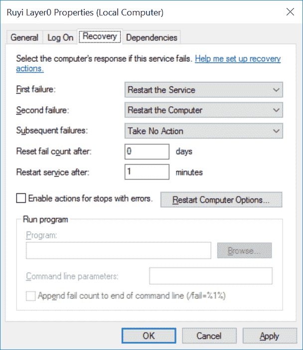

# C#中的 Windows 服务

> 原文：<https://dev.to/jeikabu/windows-service-in-c-1m79>

我们的客户端有一部分作为 Windows 服务运行，原因如下:

*   它会在 Windows 10 启动时自动启动
*   如果失败，操作系统可以重新启动它
*   即使没有用户登录，它也会运行
*   需要时，它具有提升的权限

除了需要提升特权的操作之外，所有这些原因只存在于生产环境中。在开发过程中，我们希望方便地从 Visual Studio 启动/调试，并且容易查看 stdout/stderr，所以我们还希望它能作为一个控制台应用程序。

在我们的代码库和文档中，这个程序被称为“第 0 层”。

这个和其他 Windows 编程大量使用了 [PInvoke](https://docs.microsoft.com/en-us/cpp/dotnet/how-to-call-native-dlls-from-managed-code-using-pinvoke) 。http://pinvoke.net/是不可或缺的[。](http://pinvoke.net/)

## 服务

用 C#创建 Windows 服务的关键是从[系统继承。ServiceProcess.ServiceBase](https://msdn.microsoft.com/en-us/library/system.serviceprocess.servicebase(v=vs.110).aspx) 。

```
class Layer0Service : System.ServiceProcess.ServiceBase
{
    protected override void OnStart(string[] args)
    {
        base.OnStart(args);
        StartLayer0();
    }

    protected override void OnStop()
    {
        base.OnStop();
        StopLayer0();
    }
} 
```

Enter fullscreen mode Exit fullscreen mode

`StartLayer0()`和`StopLayer0()`是负责启动和关闭的例程，由服务和控制台应用程序共享。

## 主()

我们的节目切入点:

```
static public int Main(string[] args)
{
    // Parse args

    if (install)
    {
        return Layer0Service.InstallService();
    }
    else if (service)
    {
        // Start as Windows service when run with --service
        var service = new Layer0Service();
        System.ServiceProcess.ServiceBase.Run(service);
        return 0;
    }

    // Running as a console program
    DoStartup();

    //... 
```

Enter fullscreen mode Exit fullscreen mode

可执行文件有 3 种模式:

*   `layer0.exe --install`安装服务
*   `layer0.exe --service`作为服务执行
*   `layer0.exe`作为普通的控制台应用程序执行

## 服务安装

`--install`选项用于安装服务:

```
public static int InstallService()
{
    IntPtr hSC = IntPtr.Zero;
    IntPtr hService = IntPtr.Zero;
    try
    {
        string fullPathFilename = null;
        using (var currentProc = Process.GetCurrentProcess())
        {
            fullPathFilename = currentProc.MainModule.FileName;
        }

        hSC = OpenSCManager(null, null, SCM_ACCESS.SC_MANAGER_ALL_ACCESS);

        hService = CreateService(hSC, ShortServiceName, DisplayName,
            SERVICE_ACCESS.SERVICE_ALL_ACCESS, SERVICE_TYPE.SERVICE_WIN32_OWN_PROCESS, SERVICE_START.SERVICE_AUTO_START, SERVICE_ERROR.SERVICE_ERROR_NORMAL,
            // Start layer0 exe with --service arg
            fullPathFilename + " --service",
            null, null, null, null, null
            );

        setPermissions();

        return 0;
    }
    catch (Exception ex)
    {
        // Error handling
        return -1;
    }
    finally
    {
        if (hService != IntPtr.Zero)
            CloseServiceHandle(hService);
        if (hSC != IntPtr.Zero)
            CloseServiceHandle(hSC);
    }
} 
```

Enter fullscreen mode Exit fullscreen mode

我们首先获取当前可执行文件(layer0.exe)的路径和名称。

[CreateService()](https://docs.microsoft.com/en-us/windows/desktop/api/winsvc/nf-winsvc-createservicea) 是创建服务的主调用。`SERVICE_AUTO_START`表示服务将自动启动。应用程序通过`--service`命令行参数指定自己。

这将它放在 services.msc 中，其中**开始**执行`layer0.exe --service` :

[](https://res.cloudinary.com/practicaldev/image/fetch/s--L0FIcOdf--/c_limit%2Cf_auto%2Cfl_progressive%2Cq_auto%2Cw_880/https://rendered-obsolete.github.io/assets/services_layer0.png)

## setPermissions()

我们的平台对系统来说并不重要，普通用户应该能够启动/停止它。

参考这些堆栈溢出问题:

*   [https://stack overflow . com/questions/15771998/how-to-give-a-user-permission-to-start-and-stop-a-special-service-using-c-sha](https://stackoverflow.com/questions/15771998/how-to-give-a-user-permission-to-start-and-stop-a-particular-service-using-c-sha)
*   [https://stack overflow . com/questions/8379697/start-windows-service-from-application-without-admin-right c](https://stackoverflow.com/questions/8379697/start-windows-service-from-application-without-admin-rightc)

```
var serviceControl = new ServiceController(ShortServiceName);
var psd = new byte[0];
uint bufSizeNeeded;
bool ok = QueryServiceObjectSecurity(serviceControl.ServiceHandle, System.Security.AccessControl.SecurityInfos.DiscretionaryAcl, psd, 0, out bufSizeNeeded);
if (!ok)
{
    int err = Marshal.GetLastWin32Error();
    if (err == 0 || err == (int)ErrorCode.ERROR_INSUFFICIENT_BUFFER)
    {
        // Resize buffer and try again
        psd = new byte[bufSizeNeeded];
        ok = QueryServiceObjectSecurity(serviceControl.ServiceHandle, System.Security.AccessControl.SecurityInfos.DiscretionaryAcl, psd, bufSizeNeeded, out bufSizeNeeded);
    }
}
if (!ok)
{
    Log("Failed to GET service permissions", Logging.LogLevel.Warn);
}

// Give permission to control service to "interactive user" (anyone logged-in to desktop)
var rsd = new RawSecurityDescriptor(psd, 0);
var dacl = new DiscretionaryAcl(false, false, rsd.DiscretionaryAcl);
//var sid = new SecurityIdentifier("D:(A;;RP;;;IU)");
var sid = new SecurityIdentifier(WellKnownSidType.InteractiveSid, null);
dacl.AddAccess(AccessControlType.Allow, sid, (int)SERVICE_ACCESS.SERVICE_ALL_ACCESS, InheritanceFlags.None, PropagationFlags.None);

// Convert discretionary ACL to raw form
var rawDacl = new byte[dacl.BinaryLength];
dacl.GetBinaryForm(rawDacl, 0);
rsd.DiscretionaryAcl = new RawAcl(rawDacl, 0);
var rawSd = new byte[rsd.BinaryLength];
rsd.GetBinaryForm(rawSd, 0);

// Set raw security descriptor on service
ok = SetServiceObjectSecurity(serviceControl.ServiceHandle, SecurityInfos.DiscretionaryAcl, rawSd);
if (!ok)
{
    Log("Failed to SET service permissions", Logging.LogLevel.Warn);
} 
```

Enter fullscreen mode Exit fullscreen mode

## 失败动作

失败操作指定当服务失败时会发生什么。这可以从 services.msc 访问，方法是右键单击服务，然后单击**属性- >恢复** :

[](https://res.cloudinary.com/practicaldev/image/fetch/s--NW9eAyTp--/c_limit%2Cf_auto%2Cfl_progressive%2Cq_auto%2Cw_880/https://rendered-obsolete.github.io/assets/services_recovery.png)

这是一个特别讨厌的 pinvoke 位。责任完全落在更改服务配置参数的函数上， [ChangeServiceConfig2()](https://docs.microsoft.com/en-us/windows/desktop/api/winsvc/nf-winsvc-changeserviceconfig2a) ，因为它的第二个参数指定了第三个参数是指向。

我们大量参考并汇集了以下资料:

*   【ChangeServiceConfig2()的 pinvoke.net 条目
*   [这个老 MSDN 博客](https://blogs.msdn.microsoft.com/anlynes/2006/07/30/using-net-code-to-set-a-windows-service-to-automatically-restart-on-failure/)
*   [这个 MSDN 代码](https://code.msdn.microsoft.com/windowsdesktop/CSWindowsServiceRecoveryPro-2147e7ac)，具体来说:
    *   [servicerecoveryproperty . cs](https://code.msdn.microsoft.com/windowsdesktop/CSWindowsServiceRecoveryPro-2147e7ac/sourcecode?fileId=21765&pathId=1975102639)
    *   [Win32.cs](https://code.msdn.microsoft.com/windowsdesktop/CSWindowsServiceRecoveryPro-2147e7ac/sourcecode?fileId=21765&pathId=1037126777)

```
public static void SetServiceRecoveryActions(IntPtr hService, params SC_ACTION[] actions)
{
    // RebootComputer requires SE_SHUTDOWN_NAME privilege
    bool needsShutdownPrivileges = actions.Any(action => action.Type == SC_ACTION_TYPE.RebootComputer);
    if (needsShutdownPrivileges)
    {
        GrantShutdownPrivilege();
    }

    var sizeofSC_ACTION = Marshal.SizeOf(typeof(SC_ACTION));
    IntPtr lpsaActions = IntPtr.Zero;
    IntPtr lpInfo = IntPtr.Zero;
    try
    {
        // Setup array of actions
        lpsaActions = Marshal.AllocHGlobal(sizeofSC_ACTION * actions.Length);
        var ptr = lpsaActions.ToInt64();
        foreach (var action in actions)
        {
            Marshal.StructureToPtr(action, (IntPtr)ptr, false);
            ptr += sizeofSC_ACTION;
        }

        // Configuration parameters
        var serviceFailureActions = new SERVICE_FAILURE_ACTIONS
        {
            dwResetPeriod = (int)TimeSpan.FromDays(1).TotalSeconds,
            lpRebootMsg = null,
            lpCommand = null,
            cActions = actions.Length,
            lpsaActions = lpsaActions,
        };
        lpInfo = Marshal.AllocHGlobal(Marshal.SizeOf(serviceFailureActions));
        Marshal.StructureToPtr(serviceFailureActions, lpInfo, false);

        if (!ChangeServiceConfig2(hService, InfoLevel.SERVICE_CONFIG_FAILURE_ACTIONS, lpInfo))
        {
            throw new Win32Exception(Marshal.GetLastWin32Error());
        }
    }
    finally
    {
        if (lpsaActions != IntPtr.Zero)
            Marshal.FreeHGlobal(lpsaActions);
        if (lpInfo != IntPtr.Zero)
            Marshal.FreeHGlobal(lpInfo);
    }
} 
```

Enter fullscreen mode Exit fullscreen mode

这主要是为对`ChangeServiceConfig2()`的调用建立一个 [`SERVICE_FAILURE_ACTIONS`](https://docs.microsoft.com/en-us/windows/desktop/api/winsvc/ns-winsvc-_service_failure_actionsa) 。正如文档中提到的，如果服务控制器处理`SC_ACTION_TYPE.RebootComputer`，那么调用者必须拥有`SE_SHUTDOWN_NAME`特权。这是由`GrantShutdownPrivilege()`实现的。

使用此功能，我们可以编程设置故障动作:

```
SetServiceRecoveryActions(hService,
    new SC_ACTION { Type = SC_ACTION_TYPE.RestartService, Delay = oneMinuteInMs },
    new SC_ACTION { Type = SC_ACTION_TYPE.RebootComputer, Delay = oneMinuteInMs },
    new SC_ACTION { Type = SC_ACTION_TYPE.None, Delay = 0 }
    ); 
```

Enter fullscreen mode Exit fullscreen mode

`GrantShutdownPrivilege()`几乎一字不差地取自 [MSDN 电码](https://code.msdn.microsoft.com/windowsdesktop/CSWindowsServiceRecoveryPro-2147e7ac/sourcecode?fileId=21765&pathId=1975102639) :

```
static void GrantShutdownPrivilege()
{
    IntPtr hToken = IntPtr.Zero;
    try
    {
        // Open the access token associated with the current process.
        var desiredAccess = System.Security.Principal.TokenAccessLevels.AdjustPrivileges | System.Security.Principal.TokenAccessLevels.Query;
        if (!OpenProcessToken(System.Diagnostics.Process.GetCurrentProcess().Handle, (uint)desiredAccess, out hToken))
        {
            throw new Win32Exception(Marshal.GetLastWin32Error());
        }
        // Retrieve the locally unique identifier (LUID) for the specified privilege.
        var luid = new LUID();
        if (!LookupPrivilegeValue(null, SE_SHUTDOWN_NAME, ref luid))
        {
            throw new Win32Exception(Marshal.GetLastWin32Error());
        }

        TOKEN_PRIVILEGE tokenPrivilege;
        tokenPrivilege.PrivilegeCount = 1;
        tokenPrivilege.Privileges.Luid = luid;
        tokenPrivilege.Privileges.Attributes = SE_PRIVILEGE_ENABLED;

        // Enable privilege in specified access token.
        if (!AdjustTokenPrivilege(hToken, false, ref tokenPrivilege))
        {
            throw new Win32Exception(Marshal.GetLastWin32Error());
        }
    }
    finally
    {
        if (hToken != IntPtr.Zero)
            CloseHandle(hToken);
    }
} 
```

Enter fullscreen mode Exit fullscreen mode

作为 pinvoke 噩梦的替代方案，这也可以用[sc.exe](https://support.microsoft.com/en-us/help/251192/how-to-create-a-windows-service-by-using-sc-exe):
来完成

```
sc.exe failure Layer0 actions= restart/60000/restart/60000/""/60000 reset= 86400 
```

Enter fullscreen mode Exit fullscreen mode

## 接下来

我们已经运行了 Windows 服务。现在我们需要让它做一些有用的事情。