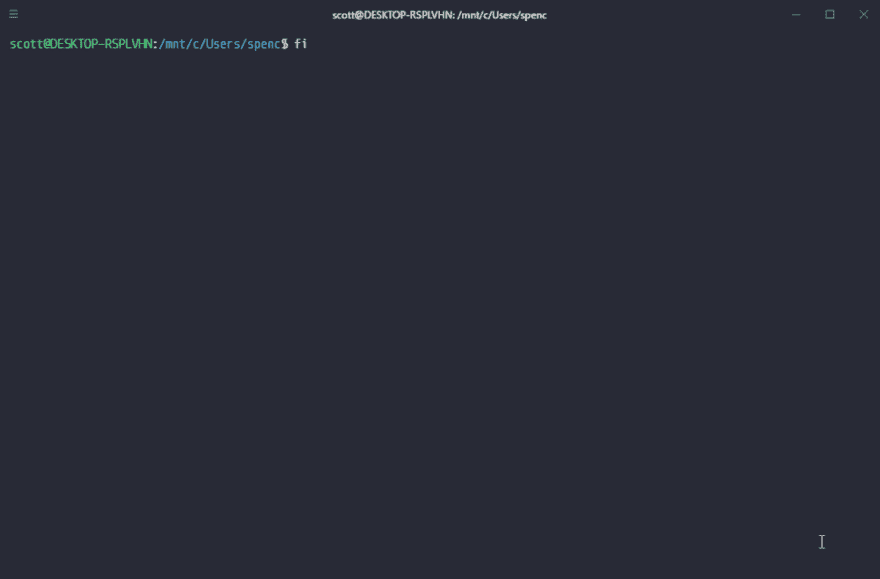
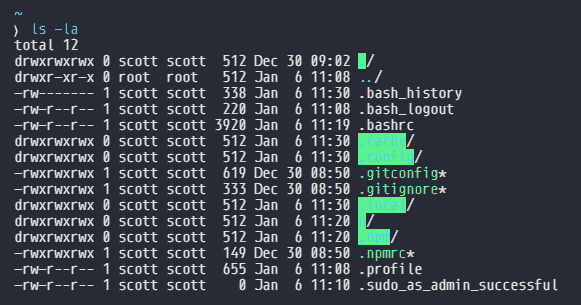
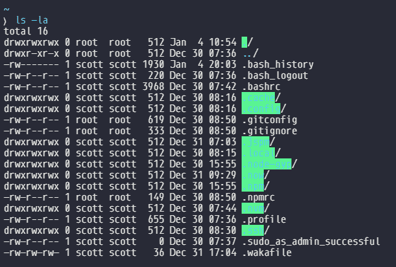

# Windows 子系统 Linux 安装程序

> 原文：<https://dev.to/spences10/windows-subsystem-linux-setup-1gb5>

我是 Windows 用户，也是 Linux 用户，但我发现 Windows 对我来说没那么重要，两者各有利弊。对我来说，Windows 的一个大缺点是当我开始学习 web 开发时。

直到 Windows 子系统 Linux 出现🙏

我喜欢它，你可以在 Windows 中有一个 bash shell，并通过它运行所有的节点应用程序，随着 Windows 10 秋季创建者更新，WSL 的设置非常简单。

快速回顾一下我为什么要发这个帖子:前几天我在 Windows 上用 bash 时遇到问题，就把我的笔记本电脑清空了。部分原因是因为在 WSL 中使用了 nvm，并且对我的电脑的表现感到沮丧。我现在意识到我反应过度了。

因此，我不得不从头开始重新设置我的开发环境，幸运的是，我将所有的设置和配置信息保存在 GitHub [repo](https://github.com/spences10/settings) 中，以备我获得一台新计算机或从灾难性事件中恢复(比如一台被核化的计算机)。

下面是我如何为我的开发环境设置我的 Windows 子系统 Linux 的。

这是我对 WSL 的具体设置和使用的看法，也是我下一次在 Windows 上从头开始构建开发环境的逐步指南。

所以，在从微软商店安装了 [WSL](https://www.microsoft.com/store/productId/9NBLGGH4MSV6) 并添加了你的默认用户后，第一件事就是更新和升级所有的东西。

```
sudo apt update
sudo apt -y upgrade 
```

如果您在升级声明中的`-y`之前没有使用过任何 Linux 发行版，那么对于终端中显示的任何提示，默认回答是 yes。你可能不想这样做，因为可能有一些程序你不想更新，但我想。

[T2】](https://res.cloudinary.com/practicaldev/image/fetch/s--Z3m55rvb--/c_limit%2Cf_auto%2Cfl_progressive%2Cq_auto%2Cw_880/https://thepracticaldev.s3.amazonaws.com/i/hieqb0gy17oziysie1s4.png)

你不会收到这些信息👆

### 构建工具

为了从 npm 编译和安装本地插件，你可能还需要安装构建工具，我需要这个工具用于 Gatsby images，它使用`sharp`，而 T0 又使用`node-gyp` :

```
sudo apt install -y build-essential 
```

### 安装节点

通过 nodejs.org 网站上给出的说明安装 node 并没有给我正确的权限，所以当我试图`npm install`任何我得到的错误时，我发现使用[使用`n`](https://github.com/Microsoft/WSL/issues/776#issuecomment-266112578) 会有帮助:

### 用`n`安装节点

因为这是全新安装，所以我们可以继续使用 [n-install](https://github.com/mklement0/n-install) 和

```
curl -L https://git.io/n-install | bash 
```

这将安装 node 的最新稳定版本👍

一旦脚本完成，使用:
重启 bash

```
. /home/my_user_name/.bashrc # the n prompt displays this for you to copy pasta 
```

检查您的节点和 npm 版本:

```
node -v && npm -v 
```

### 装鱼🐟

Fish 现在是我的外壳，纯粹是为了自动完成/智能感知👌也有一些不错的主题，你也可以得到它。

```
sudo apt -y install fish
sudo apt -y upgrade && sudo apt -y autoremove 
```

### 安装哦我的鱼| OMF

哦，我的鱼就像一个鱼的包管理器，可以安装包和主题。

```
curl -L https://get.oh-my.fish | fish 
```

### 安装 OMF 主题

```
omf install clearance 
```

看看鱼壳在行动:
[](https://res.cloudinary.com/practicaldev/image/fetch/s--cYxREij4--/c_limit%2Cf_auto%2Cfl_progressive%2Cq_66%2Cw_880/https://thepracticaldev.s3.amazonaws.com/i/b0mgenxzri1cwomfikxv.gif)

### 开始的开始

好了，这是 WSL 的基本设置，你现在可能想要设置 Git，我已经在 WSL 上通过 HTTPS 使用 SSH 有一段时间了。

> 在我写这篇文章的时候，WSL Git 与 VSCode 的集成不工作，所以我在我的 windows 机器上添加了一个 Git 安装，你可以>忽略它，通过终端使用完整的 Git，但是我真的很喜欢> VSCode git 集成。

要在您的机器上设置 SSH，请看一下这个[方便的 SSH 设置](https://github.com/spences10/cheat-sheets/blob/master/git.md#how-to-authenticate-with-github-using-ssh)。我说宋承宪而不是 HTTPS 1。因为我在 Git 凭证管理器和密匙环管理器上有各种各样的问题，所以最终创建一个 SSH 密钥并用 GitHub 进行认证实际上更快——我链接的指南会带您完成它。

### 移动您的点文件

如果你已经在 GitHub repo 中备份了所有的[点文件](https://github.com/spences10/dotfiles)，那么现在是将它们添加到你的 WSL 文件夹的好时机，上次我这样做时，我在移动每个文件后手动设置了权限，但后来发现 [`rsync`](https://www.tecmint.com/rsync-local-remote-file-synchronization-commands/) 移动了所有文件。

```
rsync -avzh /mnt/c/Users/dotfiles/ ~/ 
```

这将把我的`dotfiles`文件夹的内容复制到 WSL 中的`~/` (home)目录，你可以用
来检查它们

```
ls -la ~/ 
```

[T2】](https://res.cloudinary.com/practicaldev/image/fetch/s--GAp3B8vd--/c_limit%2Cf_auto%2Cfl_progressive%2Cq_auto%2Cw_880/https://thepracticaldev.s3.amazonaws.com/i/0p094du96f3tz5bsxviv.png)

我复制了我的`.gitconfig`、`.gitignore`和`.npmrc`点文件，你可以看到权限与`.bashrc`文件不一致。

所以，我知道的唯一改变文件权限的方法是用`chmod`来获得一个相似文件的序号，使用`stat` :

```
stat -c "%a %n" ~/.* 
```

这将列出所有以`.`开头的东西，这是我的:

```
777 /home/scott/.
755 /home/scott/..
600 /home/scott/.bash_history
644 /home/scott/.bash_logout
644 /home/scott/.bashrc
777 /home/scott/.cache
777 /home/scott/.config
777 /home/scott/.gitconfig
777 /home/scott/.gitignore
777 /home/scott/.local
777 /home/scott/.npm
777 /home/scott/.npmrc
644 /home/scott/.profile
644 /home/scott/.sudo_as_admin_successful 
```

我只想改变这里的`.gitconfig`、`.gitignore`和`.npmrc`，所以我要这样做:

```
chmod 644 .gitconfig .gitignore .npmrc 
```

现在我的文件是这样的。👍

[T2】](https://res.cloudinary.com/practicaldev/image/fetch/s--qzhaGTiF--/c_limit%2Cf_auto%2Cfl_progressive%2Cq_auto%2Cw_880/https://thepracticaldev.s3.amazonaws.com/i/lbn5bpj4fvne5zaa7sxz.png)

好了，现在我们已经安装并运行了最新的 Ubuntu，节点和 fish 终端。当然，现在仍然有安装所有你想要开发的全局 npm 包的情况。

### 感谢阅读🙏

如果我错过了什么，或者如果你有更好的方法，请告诉我。

在 Twitter 上找到我或者在 GitHub 上问我任何问题。

这篇文章最初发布在我的博客上。