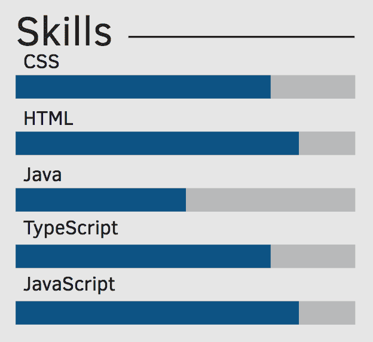
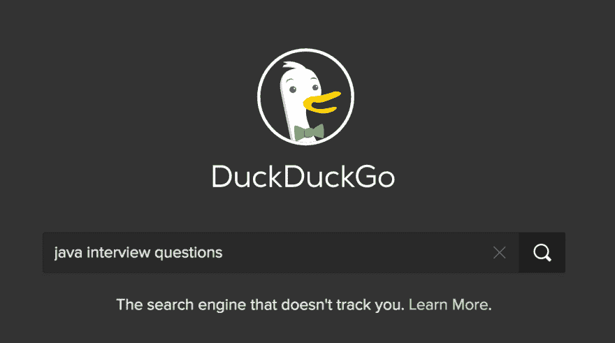

# 有了这些建议，你将在每一次技术性工作面试中脱颖而出

> 原文：<https://dev.to/mokkapps/with-these-tips-you-will-rock-every-technical-job-interview-4d26>

在我之前的公司，我有机会成为 20 名所谓的“候选面试官”之一。这意味着我参加了技术面试；这是公司申请程序的重要部分。我参加了大约 30 次面试，在此期间学到了很多东西，我想与你分享我的经验。在我看来，要想在技术面试中取得成功，有一些规则需要遵守。

## 目录

*   拥有一份“好”的简历和履历表
*   [准备好自己](#prepare-yourself)
*   申请你感兴趣的一切，不要害怕失败
*   [为你的代码感到骄傲](#be-proud-of-your-code)
*   [谈论自己，不要谈论别人](#talk-about-yourself-and-not-about-others)
*   [学会在人前手写代码](#learn-to-hand-write-code-in-front-of-people)
*   [成为某一领域的专家](#be-a-specialist-in-a-certain-topic)
*   [能够绘制项目架构](#be-able-to-draw-project-architectures)
*   [充满激情](#be-passionate)
*   [结论](#conclusion)

[T2】](https://res.cloudinary.com/practicaldev/image/fetch/s--L-7WITfv--/c_limit%2Cf_auto%2Cfl_progressive%2Cq_auto%2Cw_880/https://cdn-images-1.medium.com/max/1600/0%2AAMFCRjhsLkoqFmoz.)

## 拥有一份“好”的简历和履历

这些是你的面试官首先要看的文件。我主要检查文档寻找这些标记:

#### 是否结构良好？

我的建议是:使用一个 [LaTeX 模板](https://www.latextemplates.com/cat/curricula-vitae)和背面的来编写和发布 LaTeX 文件。

#### 有没有拼写错误？

在把你的文件发送给人力资源部之前，对其进行拼写检查。我经常问自己，为什么人们不使用拼写检查这样的技术帮助来避免申请过程中的这些不必要的障碍。

#### 他/她的主要技能是什么？

请对您的技术技能进行评分。你能猜到这样的列表应该代表什么吗:

```
Programming languages: Java, Python, JavaScript, C++ 
```

Enter fullscreen mode Exit fullscreen mode

这是否意味着你最了解 Java，或者你对所有语言都有相同的了解？

我个人更喜欢这样的评级列表:

```
Programming languages

    Java:       Expert
    Python:     Intermediate
    JavaScript: Novice 
```

Enter fullscreen mode Exit fullscreen mode

或者可替换地是图形表示

[T2】](https://res.cloudinary.com/practicaldev/image/fetch/s--IDI4ar3V--/c_limit%2Cf_auto%2Cfl_progressive%2Cq_auto%2Cw_880/https://d33wubrfki0l68.cloudfront.net/b20d95510e753aed2517bb13ae09628e6b67262a/bc0d0/img/skills.png)

#### 有没有为了让简历看起来更好看而使用过流行语，而实际上并没有底层知识？

准备好一些你在简历中提到的关于工具/框架/库的问题。面试官可以从中挑选一些，问一些小问题，看看你是否真的有使用它的经验。

## 准备好自己

这听起来很愚蠢，但却是必不可少的。我会说超过 30%的受访者准备不足。

例如，如果你申请一份 Java 开发人员的工作，你应该知道 Java 编程语言的基础。

总的来说，我建议询问你选择的互联网搜索引擎，你会发现大量可能的面试问题:

[T2】](https://res.cloudinary.com/practicaldev/image/fetch/s--Fue2rWOU--/c_limit%2Cf_auto%2Cfl_progressive%2Cq_auto%2Cw_880/https://d33wubrfki0l68.cloudfront.net/9d7629d7f48d3c244b6800f0b5ef4460c9a512ec/925c2/img/search_programming_language.png)

总结一下，学习你最喜欢的编程语言，深入研究它所有可能的方面。

## 申请你感兴趣的一切，不要害怕失败

相信我:作为面试官，你可以感觉到某人是否有技术面试的经验，或者这是他/她的第一次面试。

我的建议是:尽可能多地参加工作面试。每一次你都会获得经验，变得更加自信。即使求职被拒，也会让你在求职面试的过程中获得宝贵的经验。

## 为你的代码感到骄傲

如果您有一些引以为豪的项目或代码片段，那么就把它添加到您的应用程序中。作为面试官，从这个人身上看到一些代码真的会很有帮助。

在我看来，看一个人是否参与开源项目、写博客、发布 YouTube 视频或拥有活跃的 Twitter 频道是积极的。

一个很好的例子就是[卫斯博斯](http://wesbos.com)。他有一个非常有趣的 Twitter 频道，是一个活跃的 YouTuber，有自己的产品(他的课程网站)，一个活跃的 GitHub 个人资料，制作一个播客并在会议上发言。当然，这很特别，但正如你可能想象的那样，这可能会给面试官留下深刻印象。

所以，走出去，让别人对你感兴趣。

## 谈自己，不谈别人

谈谈你在项目中做出的决定，因为这是面试官最感兴趣的部分。这样，面试官可以看到某人是否能够做出决定，并与他人进行比较和宣传。

如果受访者只谈论其他人的决定，那就有负面的含义。

## 学会在人前手写代码

这是你应该训练的一项非常重要的技能。接受一些编码挑战，并在白板或活动挂图上练习。你应该感到舒服，因为这在任何技术面试中都可能发生。

大多数时候，你必须解决任何一种算法问题。在这种情况下，我建议遵循以下步骤:

*   花点时间考虑解决方案(不要马上开始写代码)
*   找到一个强力解决方案，并谈论它的[大 O 符号](https://en.wikipedia.org/wiki/Big_O_notation)
*   试着找到一个更有效的解决方案，谈谈改进的大 O 符号
*   用清晰的文字写下你的解决方案的步骤。这有助于访问者和被访问者了解提议的解决方案是否正确
*   写下你的代码
*   用不同的参数测试你写的代码，检查它是否工作
*   谈论可能的代码改进和单元测试

## 成为某一课题的专家

你应该能用 1-2 个短句描述你的职业。这有助于面试官识别你的技术重点，你可能会被问到你真正擅长的东西。

不好的例子:*软件开发者*

一个很好的例子(同样来自[韦斯博斯](http://wesbos.com) ): *设计师，开发者&企业家让网络成为一个令人敬畏的地方*

看了第二句话，只用一句话就让我对这个开发者有了一个非常清晰的认识。

此外，如果你是某个领域的专家，你就更容易找到完美的工作机会。例如，如果您是 JavaScript 专家，您可以明确地搜索相应的产品。否则，作为一个多面手，你可能对不同的编程语言和技术有广泛的了解，但对某个主题却不深入。

## 能够绘制项目架构

你应该能够以一种可理解但技术上正确的方式画出一个项目的高层项目架构。

复杂项目的一个好例子:

[T2】](https://res.cloudinary.com/practicaldev/image/fetch/s--_rjZT_6f--/c_limit%2Cf_auto%2Cfl_progressive%2Cq_auto%2Cw_880/https://pbs.twimg.com/media/Da7_0YsW4AEM4sr.jpg)

## 充满激情

让面试官知道软件开发是你的激情所在。谈谈你最喜欢的编程语言、工具或框架的特性。让面试官知道你是如何让自己跟上时代的，以及你为什么喜欢写代码。

## 结论

当然，如果你遵循我的建议，我不能保证你会在每一次技术工作面试中成功。但是我很确定你更自信了，不紧张了，准备更充分了。