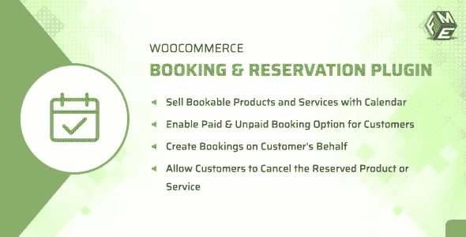
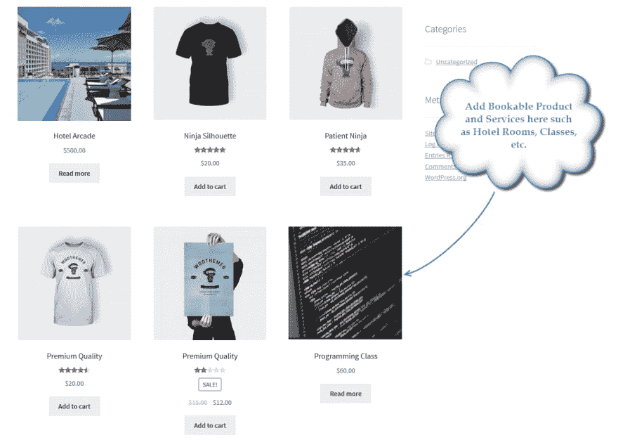
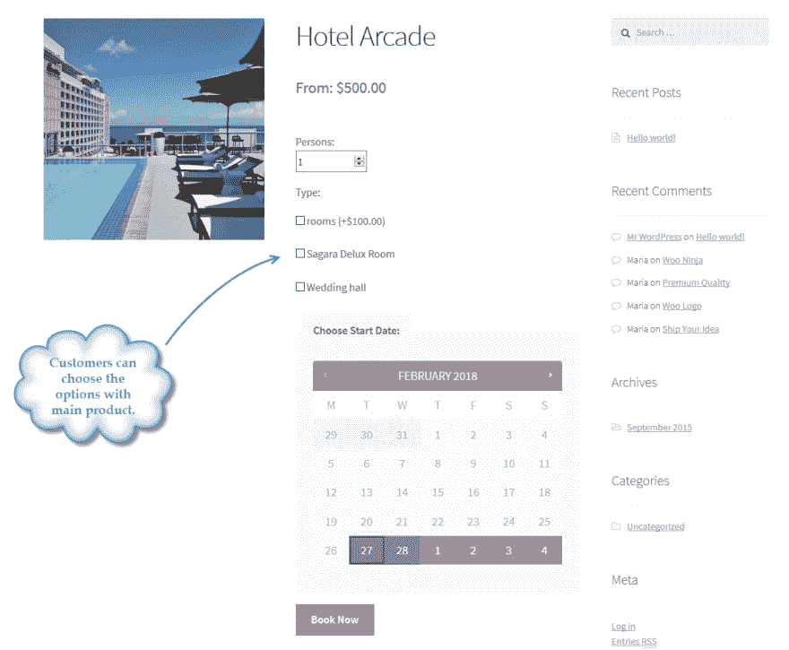

# FMEAddons 的 WooCommerce 预订插件

> 原文：<https://dev.to/fmeaddons/woocommerce-booking-plugin-by-fmeaddons--51jm>

 
WooCommerce 预订插件是一个强大的工具，它可以帮助您允许客户在您的电子商店上预订可预订的产品，如酒店房间、租车等。顾客既可以通过付款预订产品或服务，也可以不付款。 **[WooCommerce 预订插件](https://codecanyon.net/item/woocommerce-booking-reservation-plugin/21394051)** 允许您允许客户取消预订，您可以为其定义时间段。您还可以创建各种选项来启用主要产品，例如您可以提供互联网或按摩设施的房间。这个插件的价格只有 39 美元，并附带免费支持和升级。

**截图:**

[T2】](https://res.cloudinary.com/practicaldev/image/fetch/s--wUEnJnCI--/c_limit%2Cf_auto%2Cfl_progressive%2Cq_auto%2Cw_880/https://thepracticaldev.s3.amazonaws.com/i/50z8rjiy1nmhz0010b19.png)

[T2】](https://res.cloudinary.com/practicaldev/image/fetch/s--6FjNXX5j--/c_limit%2Cf_auto%2Cfl_progressive%2Cq_auto%2Cw_880/https://thepracticaldev.s3.amazonaws.com/i/qnp4sc12x105umi2tg6o.png)