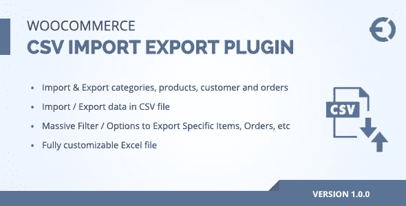
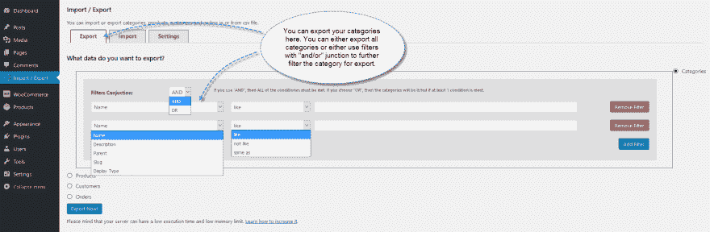
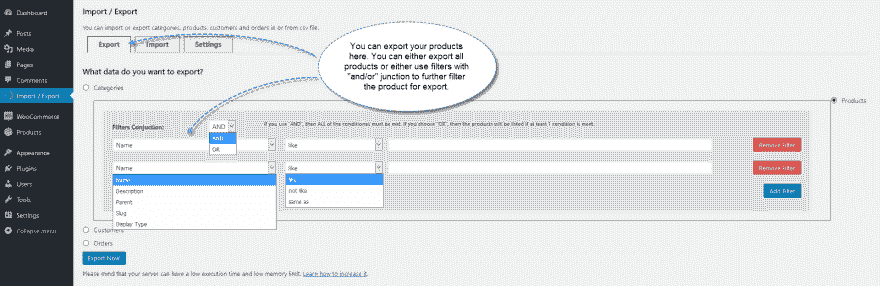
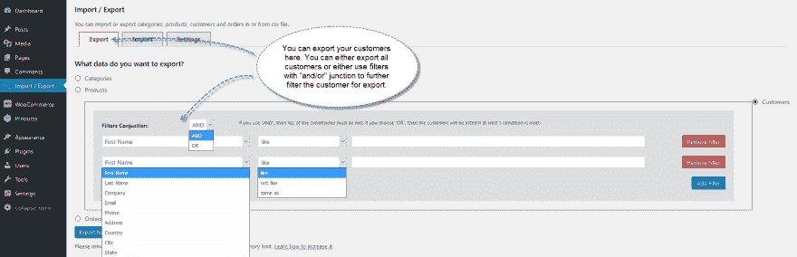
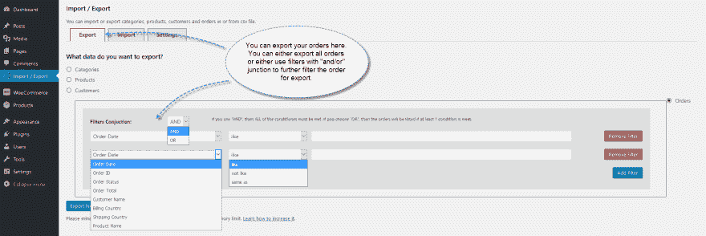

# WooCommerce CSV 导入插件

> 原文：<https://dev.to/carolynhall123/woocommerce-csv-import-plugin--41bd>

 
WooCommerce CSV 导入插件是一个用于导入和导出产品、类别、订单和客户列表的有用数据。您可以使用过滤器导出数据，这有助于您从电子商店导出特定数据。 **[WooCommerce CSV 导入](https://codecanyon.net/item/woocommerce-csv-import-export-plugin/21204381)** 插件使用 PHP excel 库下载 excel 文件中的数据。这个插件分部分导出数据，以避免服务器问题，并设置每个部分中导入和导出数据的最大条目数。这个插件只花了你 24 美元，并提供免费支持和升级。

**截图:**

[T2】](https://res.cloudinary.com/practicaldev/image/fetch/s--65JP9sk7--/c_limit%2Cf_auto%2Cfl_progressive%2Cq_auto%2Cw_880/https://thepracticaldev.s3.amazonaws.com/i/h4o9lfor3vwdzh87q57r.png)

[T2】](https://res.cloudinary.com/practicaldev/image/fetch/s--GlcJBpZX--/c_limit%2Cf_auto%2Cfl_progressive%2Cq_auto%2Cw_880/https://thepracticaldev.s3.amazonaws.com/i/ioqcswa5cb5iqwa8azhq.png)

[T2】](https://res.cloudinary.com/practicaldev/image/fetch/s--mXQWvhys--/c_limit%2Cf_auto%2Cfl_progressive%2Cq_auto%2Cw_880/https://thepracticaldev.s3.amazonaws.com/i/zrh20cyr1cofwpfj4w29.png)

[T2】](https://res.cloudinary.com/practicaldev/image/fetch/s--Q4oTdzSN--/c_limit%2Cf_auto%2Cfl_progressive%2Cq_auto%2Cw_880/https://thepracticaldev.s3.amazonaws.com/i/52g5wpl99ay6svvmnh6s.png)