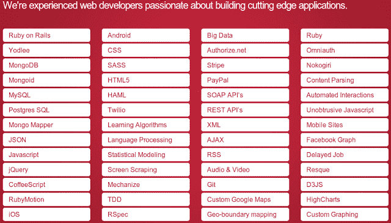

# 作为一名软件工程师，在一家开发公司做项目，而不是产品公司

> 原文：<https://dev.to/geshan/working-as-a-software-engineer-for-a-dev-shop-with-projects-vs-a-product-company--2d3m>

我的编程生涯始于一名软件工程师/开发人员，来自一家开发商店(我找不到合适的术语，称它为开发商店、网络代理、软件公司或网络公司，任何对你有意义的东西。为了生存和发展而承担项目的机构/公司)。那是一个人少的小网络商店，然而，我接触到了 PHP 的开源 web 开发 MVC 框架，并且学到了很多专业 web 和软件开发是如何进行的。

 ](https://res.cloudinary.com/practicaldev/image/fetch/s--pnAcZWuy--/c_limit%2Cf_auto%2Cfl_progressive%2Cq_auto%2Cw_880/https://cdn-images-1.medium.com/max/2000/0%2ATFj7KplsNP5zLPHg.png) *图片来源:[brazencareelist 博客](http://blog.brazencareerist.com/2011/07/14/so-you-want-to-work-at-a-startup-heres-how-you-do-it/)*

在那之后的创业运动中，我们给了[我们的公司](http://www.younginnovations.com.np/)一个实体存在，并全心全意地建设它，我在那里总共工作了 2 年多，参与了许多项目。这是一次奇妙的学习经历，我可以看到自己的成长。然后我去读了我的[硕士](http://www.han.nl/opleidingen/master/en/information-systems-design/)，之后加入了[迪拜的一家公司](http://www.namshi.com/)，这是一家产品公司(公司和产品是一样的，没有项目，它关心的只是产品——不多也不少)。我已经在这家公司工作一年多了。我认为自己很幸运能与初创企业合作，他们教会你很多其他东西，不仅仅是编码和解决技术问题的硬技能。

这不是一个关于我在哪里工作的故事，相反，这是我作为一名开发人员或其他名称的工作过程中所学到的东西与至少涉及一些编码的角色的比较。无论是初创公司还是老牌公司，是两个人的小公司还是拥有数百名开发人员的公司，你需要区分的主要问题是——公司是接手客户项目并交付它们，还是开发自己的产品以在市场中生存。以下是在这两种类型的公司工作时你会发现的一些不同之处。

## 为开发店工作

当你在一家开发店工作时，你通常会经历下面提到的事情:

*   当你重新开始时，你可以决定一种新的做事方式，从软件架构到设计和数据建模。这是一个干净的石板，你画这幅画，但在一个团队中自然。

*   一天之内，你要做 2-3 个项目，为项目 A 编写一个特性，解决项目 B 中的一个 bug，为项目 c 部署(通常是一个 [git](http://www.git-scm.com/) push 和 pull 或 upload 文件)

*   在一个新项目中，你可以重新开始选择你的框架(也许这次你想用 [Symfony](http://www.symfony.com/) 2 而不是 [Zend](http://framework.zend.com/) ，用 [Angular.js](http://angularjs.org/) 而不是 [Jquery](http://www.jquery.com/) )。如果你处于决策的位置，你可以做，这也将取决于客户想要什么，如果她/他有发言权，以及公司的政策。

*   多个项目可能使用多个框架甚至语言(如上所述),然后你需要处理所有这些。

*   有时，即使你是一名开发人员，你也要做一些系统管理员(sysadmin)的工作，为项目 a 设置域、域名服务器和空间分配。

*   其他时候，前端家伙+设计师不可用，你写了 3 行 CSS 来修复客户端 x 的图像溢出。).同样的事情，你应该有时打开照相馆，移动图像 5 像素的权利。(这在很大程度上取决于团队的规模和职责，在初创企业中会有这种情况)

*   一个项目管理方法会多次出现在纸上，团队之间的协作(主要是前端和后端)有时会成为一个挑战。甚至发布管理也是一个神话；).

*   你会遇到很多人说出他们的需求，根据是网站还是网络应用程序(我指的是网络软件)，有时很难给努力定价。

*   在管理层面，公司可能缺乏清晰的愿景和目标(除非投资者为公司提供资金，否则第一个问题是如果它是一家初创公司，如何维持公司)。

[T2】](https://res.cloudinary.com/practicaldev/image/fetch/s--Qv3SFFfA--/c_limit%2Cf_auto%2Cfl_progressive%2Cq_auto%2Cw_880/https://cdn-images-1.medium.com/max/2000/0%2Ac_gTtcnr4my4PuHm.png)

图片:说明一个单独的开发商店可以做什么。

## 为一家产品公司工作

当你为一家产品公司工作时，事情就完全不同了，公司就是产品，还有像脸书、推特等公司。该公司在市场上销售多种产品来维持和发展。最大的软件公司就是这种类型，如甲骨文、SAP 等。该公司没有网络项目(主要是网站和网络应用程序/软件)交付给客户，它通常只有一个或多个产品。你在产品公司工作的经历如下:

*   你被提供了一个已经构建好的软件，你需要时间去理解它是如何构建的，然后你可以在软件中编写新的特性或者解决其中的错误。

*   作为开发人员，没有办法完全改变软件设计、数据模型或软件堆栈，因为通常它已经在运行。(甚至可能是一些遗产，每个人都害怕如果你乱动它就会破碎。)

*   你所有的想法、解决方案和精力通常都集中在一个产品上，你甚至可以致力于性能、优化和增强整个产品的事情。

*   开发的框架、语言和指导方针是固定的，作为开发人员，您无法决定是否要使用 Angular Js 而不是 Jquery。(你不会因为一时兴起就改 1000 行 Jquery。)

*   一般来说，你不会弄脏你的手与系统管理员或设计师和前端的东西，这通常是一个没有去的领土。

*   项目管理方法是系统的一部分，如果没有问题跟踪系统，你就走不远。发布管理、部署和源代码版本控制(就像我们最喜欢的 git)是任何产品公司的支柱，因为产品通常都很大，许多开发人员都参与其中。

*   产品经理或项目经理给出需求，这可能是公司运转的中枢。

*   在管理层面上，目标和愿景是明确的。该公司可能不是一个软件公司，但如何维持并不取决于你做了多少项目和交付，所以它非常关注产品。

[T2】](https://res.cloudinary.com/practicaldev/image/fetch/s--ah8f_knY--/c_limit%2Cf_auto%2Cfl_progressive%2Cq_auto%2Cw_880/https://cdn-images-1.medium.com/max/2000/0%2AHQfLQFUM3vcQBJCt.jpg)

图片:软件产品公司领域的一些大人物

我现在不在一家纯软件公司工作，但毫无疑问，它不是一家开发公司，而是一家产品公司。如果你在找实习或换工作，一定要考虑好你想加入的公司是开发商店还是产品公司。这是你想做什么的个人决定，但现在你被告知在开发店和产品公司对你的期望。

> 总之，我认为在一家产品公司工作比在一家开发店工作更好，因为这是一家产品公司的结构化和管理的工作方式。

* * *

最初发表于[geshan.com.np](http://geshan.com.np/blog/2013/06/working-for-dev-shop-with-projects-vs/)。