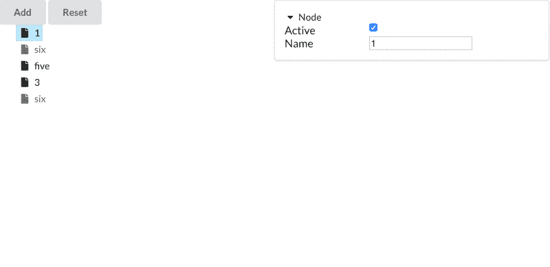

# 工作检查员组件

> 原文：<https://dev.to/progrium/working-inspector-component-517o>

在完成 Apple Go 绑定生成和移植 panel UI 套件之后，我意识到我需要回到这个大项目的主要关键路径上。所以我回到了 treeview 和 inspector UI 原型。

检查器由几个属性集组成，这些属性集是您可以更改并映射到单个对象的一组命名字段。以前，PropertySet 会迭代字段并放置 PropertyFields，它基本上是显示字段名和输入的检查器的一行。

我决定删除 PropertyField 并将大部分 HTML 放入 PropertySet。问题是我需要根据字段的类型包含不同的输入，比如字符串的文本框，布尔值的复选框等等。这使我找到了解决如何放置放入变量中的预制 HTML 位的方法。JSX 只是让你将一个变量嵌入到其他 HTML 中，以便在这个变量中插入任何元素。Vue 对动态组件使用一个名为 component 的标签，尽管只是组件，而不是 HTML 片段。

我开始在 vtemplate 中实现 component 标记，并意识到我需要放置的不仅仅是组件，所以我现在将其重命名为 node。使用节点元素，您可以从变量中插入预定义的组件或 HTML。node 上的所有其他属性都放在组件或外部 HTML 元素上。

然后我把这个扔了。最后，我为输入创建了一个名为 PropertyInput 的组件，它没有使用模板，而是使用 vecty functional API 根据给定的值类型创建不同的输入元素。我实现了基本类型，比如字符串、布尔、整数和浮点。

在研究引用和切片等高级类型之前，我让它在它所来自的对象上设置数据。它会冒泡一个 OnChange 回调来持久化节点树。所以现在是工作督察。当您修改节点的属性(如 name 和 active)时，它甚至会更新树。

[T2】](https://res.cloudinary.com/practicaldev/image/fetch/s--0E6BC6aY--/c_limit%2Cf_auto%2Cfl_progressive%2Cq_66%2Cw_880/http://g.recordit.co/wzGUZwgUb1.gif)

当我回到这里时，我将开始研究它需要支持的高级类型。引用会很有趣，因为我希望它们可以像 Unity 一样通过拖放来设置。您可以将一个节点从 treeview 拖到 inspector 字段来设置它。
[https://www.youtube.com/embed/KSrLNXUjGSc](https://www.youtube.com/embed/KSrLNXUjGSc)T2】