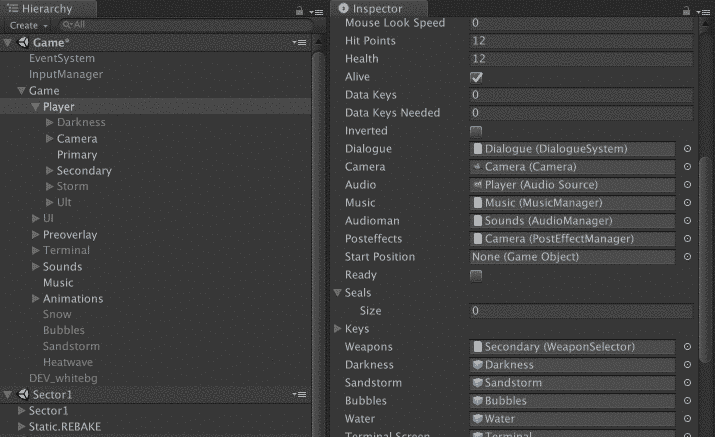

# 使用拖放操作处理引用

> 原文：<https://dev.to/progrium/working-references-with-drag-and-drop-4ohn>

今天向前迈进的乐趣，即使它没有太多的演示。增加了对从任何组件指向树中其他节点的指针的支持。目标是继续从 [Unity](https://unity3d.com) 借用这个节点和组件数据模型。树中有节点，节点上有组件。在我的例子中，组件可以是任何 Go 结构，理想情况下没有任何特殊之处。应该允许带有指针的字段引用另一个节点的组件。

[T2】](https://res.cloudinary.com/practicaldev/image/fetch/s--rDUh-8E6--/c_limit%2Cf_auto%2Cfl_progressive%2Cq_66%2Cw_880/http://g.recordit.co/Kbnb4X0ms4.gif)

与 Unity 一样，在 Inspector 中进行引用只需要将一个节点拖到字段中，它就会找到合适的组件并设置指向它的指针。首先，我只是试图获得指向其他节点的指针，然后我可以让它在以后查找特定的组件。

我从拖放开始。HTML5 有一个拖放 API，很高兴终于有了(我知道我们已经有一段时间了)。首先，我添加了一个单独的拖放演示来适应 API。然后我必须弄清楚如何与 jsTree 拖放插件集成。结果是不使用 HTML5 拖放，但它有一个与之集成的选项。我让 jsTree 节点可以拖动到我的演示拖放区，并传递节点 ID。

根据 ID，给定根节点，我可以找到树中的特定节点。然而，我没有从我需要的地方到根节点的引用。由于根节点位于 TreeView 组件中，而 TreeView 组件是 Inspector 元素的同级，因此无法绑定其父节点所拥有的引用。相反，我向下传递了一个查找回调，结果是给出了对根节点的引用。

从这里开始很容易。当 drop 事件发生时，我获取节点 ID，使用根节点获取对实际节点的引用，并为其设置字段。当输入呈现时，它查找节点并获取其友好名称作为输入值。当您可以引用组件而不是节点时，这就变得更加复杂了，但这将是相同的交互和行为。

我遇到的一个奇怪的问题是，我无法从 Go 的拖拽事件中获取数据。这就是拖动时传递节点 ID 的方式。我想可能有什么东西在做浅层复制或者`dataTransfer`出于某种原因只是有魔力。我将不得不做更多的调查，但是我只能分配一些用 JavaScript 编写的处理程序，这些处理程序将`dataTransfer`数据写入数据属性。然后它在 Go 中触发一个不同的事件，从数据属性中读取数据。

[T2】](https://res.cloudinary.com/practicaldev/image/fetch/s--CuINfIGU--/c_limit%2Cf_auto%2Cfl_progressive%2Cq_66%2Cw_880/http://g.recordit.co/5dbEFoTUdf.gif)

那么它工作正常吗？！嗯，是的。酪一个新问题。当我们序列化数据时，Go 的 JSON 封送拆收器跟随指针并序列化它们的值。所以任何对树的另一部分的引用都会复制子树。并且将该字段设置为其所在的节点将导致调用堆栈溢出死机。

不过，我有个计划。因为我们已经必须包装组件来序列化它们的类型，所以我们可以遍历组件值来查找对树中节点的引用，并将它们的 ID 存储在组件包装器中。然后在解组时，我们查找它们，并使用反射将它们设置在正确的位置。但那是下次的任务。

[https://www.youtube.com/embed/-5_ZOELDdIA](https://www.youtube.com/embed/-5_ZOELDdIA)