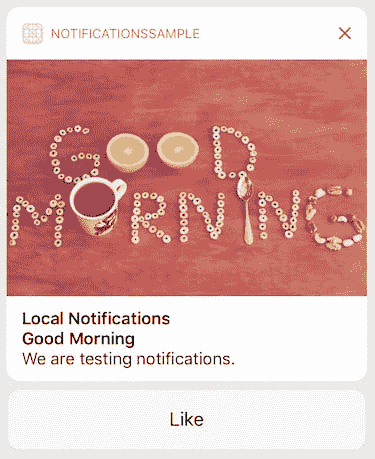
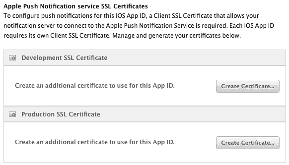
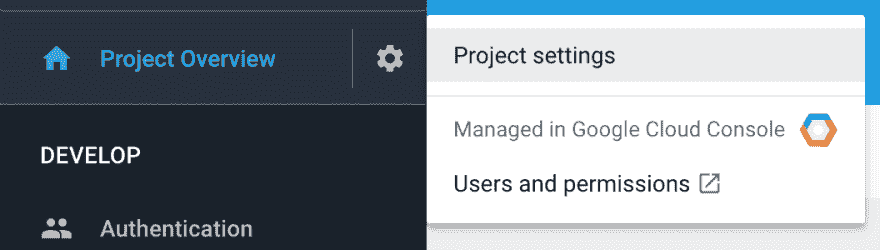
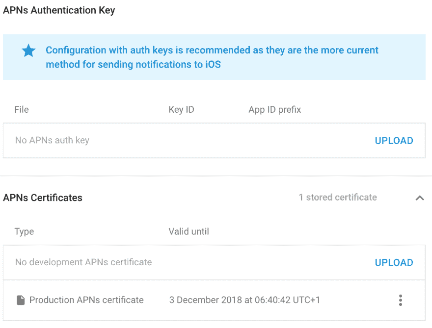
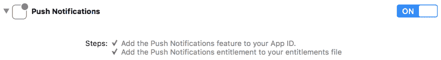
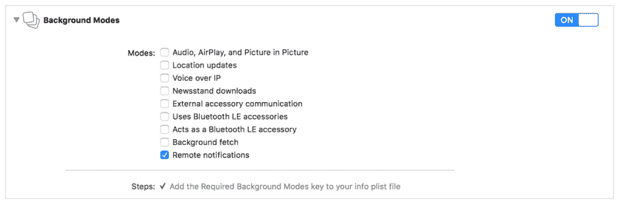

# 使用 iOS 推送通知

> 原文：<https://dev.to/brightdevs/working-with-ios-push-notifications--1a73>

推送通知，也称为远程通知，是移动应用程序的一个非常有用的功能。它们可用于向用户发送营销信息，通过提供个性化内容、实施聊天甚至触发某些后台操作来提高用户参与度。而真正有用的是，用户不必让自己的 app 一直开着。

听起来很棒，不是吗？是的，但有必要了解推送通知是如何工作的，并学习如何正确设置它们以避免一些不必要的麻烦。

## iOS 10 大新奇事物

iOS 10 除了短文本消息、播放通知声音以及在应用程序图标上设置徽章号码之外，还扩展了 iOS 推送通知功能，包括:

*   **媒体附件**(图片、gif、音频、视频)，
*   使用 **3D 触摸**扩展详细视图，
*   **通知动作**允许用户立即采取行动。

在[下面的例子](https://medium.com/@prianka.kariat/ios-10-notifications-with-attachments-and-much-more-169a7405ddaf)中，有一个 iOS 10 推送通知，附带图片和“喜欢”动作按钮。

[T2】](https://res.cloudinary.com/practicaldev/image/fetch/s--UYiUeeos--/c_limit%2Cf_auto%2Cfl_progressive%2Cq_auto%2Cw_880/https://thepracticaldev.s3.amazonaws.com/i/awxt7tvys2n6bcnsyv3j.jpeg)

这使得开发人员可以提高推送通知的质量，并从这一多功能特性中获得更多。

## 服务器

代表`Apple Push Notification service`的(APN)发送推送通知，定向到一个或多个已注册到 APN 的特定设备。为了实现这一点，我们需要建立一个服务器来收集移动设备令牌并使用它们通过 APN 发送推送通知。这听起来可能很复杂，但是不要担心，有很多现成的解决方案可以使用，甚至是免费的。

让我们来看看同时支持 iOS 和 Android 的最受欢迎的服务:

*   [**Firebase 云消息**谷歌](https://firebase.google.com)
*   [**推杆**](https://pusher.com)
*   

 **这些服务还提供其他功能，如分析、A/B 测试、崩溃报告、实时数据库甚至认证，但你不必使用其中任何一项。

请注意，使用第三方服务也有不利的一面，比如:

*   如果你决定切换到**你自己的服务器**，你将需要与你使用的服务通信，而不是直接与 APNs 通信，或者你将不得不重新配置你的移动应用。
*   您必须意识到，您的数据是通过您无法控制的服务器发送的，因此这可能会影响您的数据保护策略。
*   有些服务是免费的，直到你达到某个限制，例如，Mixpanel 只允许你免费创建最多 1000 个用户档案的 T2。如果你的应用变得流行，它可能会很贵。
*   当服务被关闭时，您只有有限的时间来迁移到另一个提供商。这种情况已经发生在脸书维护的一个非常受欢迎的移动开发者平台 **Parse** 上，该平台于 2017 年 1 月被[关闭。这个项目现在是](http://blog.parse.com/announcements/moving-on)[开源](http://docs.parseplatform.org)，你可以在你自己的机器上安装它，但是你不能再开箱即用了。

## 火基

在这篇文章中，我们将使用 [`Firebase Cloud Messaging`](https://firebase.google.com) (FCM)。这是一个有趣的解决方案，尤其是在 I/O 2016 上谷歌将 Firebase 变成了一个统一的移动平台，它已经取代了`Google Cloud Platform`成为 Android 上处理推送通知的默认解决方案。这意味着我们可以使用相同的服务在两个平台上发送推送通知，同时使用 Android 上的默认实现。

FCM 继承了 GCM 的核心基础设施，但是简化了客户端开发。GCM 仍然受支持，但是所有新的客户端特性将只在 FCM 上可用。`Firebase Cloud Messaging`使用`Apple Push Notification service`向您的 iOS 应用程序发送信息。

## 证书

首先，我们需要生成`APNs SSL Certificate`或`APNs Authentication Key`来允许我们的通知服务器(Firebase)连接到 APN。

推荐使用授权密钥配置，因为它们是向 iOS 发送通知的更流行的方法，但它们可能会有问题，因为它们更大。当我想使用云形成配置将 Base64 编码的 auth key 上传到 AWS 时，就发生了这种情况。

#### 在应用标识符中启用推送通知服务:

1.  登录[苹果开发者中心](https://developer.apple.com)。

2.  打开**证件，身份证&档案**。

3.  打开左侧窗格中的应用标识:**标识**->-**应用标识**。

4.  找到您的应用程序标识符并**编辑**其服务。

5.  启用**推送通知**。

    [T2】](https://res.cloudinary.com/practicaldev/image/fetch/s--V7Omhjb8--/c_limit%2Cf_auto%2Cfl_progressive%2Cq_auto%2Cw_880/https://thepracticaldev.s3.amazonaws.com/i/alxpmqx4e735gll7ykwz.png)

#### 生成`APNs SSL Certificate`[苹果开发者中心](https://developer.apple.com):

1.  选择**创建证书...**用于开发或/和生产。

    [T2】](https://res.cloudinary.com/practicaldev/image/fetch/s--VOH5GYb_--/c_limit%2Cf_auto%2Cfl_progressive%2Cq_auto%2Cw_880/https://thepracticaldev.s3.amazonaws.com/i/55dxf3p73u3bpxh43x3t.png)

    **注意:**如果你希望推送通知在通过 TestFlight 发布的应用中工作，你需要使用**生产 SSL 证书**。

2.  阅读说明，**继续**，上传您从**钥匙链**导出的**证书签名请求** (CSR 文件)。

3.  **下载**证书，按**完成**按钮完成流程。

在[苹果开发者中心](https://developer.apple.com)生成`APNs Authentication Key`:

1.  打开**键**->-**左窗格上的所有**。

2.  点击(+)号创建新密钥。

3.  填写**按键描述**，选择 **APNs** 按键服务**继续**。

4.  下载密钥，确保妥善保管，并按下 **Done** 按钮完成该过程。

现在我们需要将生成的密钥或证书上传到 **Firebase** 。

1.  登录 [Firebase 控制台](https://console.firebase.google.com)并选择您的项目。如果你还没有它，创建一个新的项目。

2.  从左窗格打开您的**项目设置**。

    [T2】](https://res.cloudinary.com/practicaldev/image/fetch/s--OvwnuzOG--/c_limit%2Cf_auto%2Cfl_progressive%2Cq_auto%2Cw_880/https://thepracticaldev.s3.amazonaws.com/i/1kt8k37q41zwu79pzyc3.png)

3.  打开**云消息**标签页。

4.  在 **iOS 应用程序配置下**上传您的密钥或证书。

    [T2】](https://res.cloudinary.com/practicaldev/image/fetch/s--kvZOLbgM--/c_limit%2Cf_auto%2Cfl_progressive%2Cq_auto%2Cw_880/https://thepracticaldev.s3.amazonaws.com/i/m9j76g03e1ugi3k9q6s5.png)

    注意不能同时使用`APNs auth key`和`APNs certificate`。

## 项目配置

设置证书后，我们可以配置 Xcode 项目:

1.  打开项目设置。

2.  打开**功能**选项卡。

3.  启用**推送通知**。

    [T2】](https://res.cloudinary.com/practicaldev/image/fetch/s--xdLRncy8--/c_limit%2Cf_auto%2Cfl_progressive%2Cq_auto%2Cw_880/https://thepracticaldev.s3.amazonaws.com/i/9pexwsp26765rp85wfah.png)

    将自动创建或更新权利文件。如果您在上一章中跳过了将推送通知服务添加到您的应用程序标识符，您将会遇到一个错误。

完成 Xcode 配置后，请确保项目构建无误。如果您遇到任何签名问题，您可能需要刷新预置描述文件，甚至重启 Xcode。然而，我建议使用[浪子匹配](https://docs.fastlane.tools/actions/match/)来共享代码签名身份或[浪子叹息](https://docs.fastlane.tools/actions/sigh)来下载或修复预置描述文件。自动化代码签名将在未来为您节省大量时间。

无需重复说明如何将 Firebase SDK 与 iOS 项目集成，只需按照[本教程](https://firebase.google.com/docs/ios/setup)操作即可。你需要安装`Firebase/Core`和`Firebase/Messaging`库。

如果您有更多的构建配置来处理多种环境，您可能会发现使用存储在不同的`GoogleService-Info.plist`文件中的不同 Firebase 配置是有问题的，因为您不能在那里使用用户定义的构建设置。但是不要担心，你可以按照[这篇伟大的 StackOverflow 帖子](https://stackoverflow.com/q/34067120/1570496)来解决这个问题，方法是在构建时复制一个适当的配置文件。

## 权限

请记住，您可以要求用户只允许接收一次通知**。出于这个原因，你不应该在应用程序启动后就这样做(尽管很多应用程序都这样做)。这也是一个好主意，首先在一个单独的屏幕上介绍用户，并解释为什么你会发送任何通知。您还应该让用户不经许可就选择退出，以保留以后成功完成该过程的机会。**

 **如果用户有禁止的通知，那么你唯一能做的就是让他知道为什么值得启用它们，并指示如何去做(这只能从设备设置中实现)。

注意，从 iOS 10 开始你应该使用`UNUserNotificationCenter`对象:

```
if #available(iOS 10.0, *) {
    UNUserNotificationCenter.current().delegate = self

    let authOptions: UNAuthorizationOptions = [.alert, .badge, .sound]
    UNUserNotificationCenter.current().requestAuthorization(options: authOptions, completionHandler: { _, _ in })
} else {
    let settings: UIUserNotificationSettings = UIUserNotificationSettings(types: [.alert, .badge, .sound], categories: nil)
    application.registerUserNotificationSettings(settings)
} 
```

Enter fullscreen mode Exit fullscreen mode

## 设备令牌

APNs 设备令牌允许您将通知消息指向应用程序的特定实例。它很少改变，但你不能假设它不会发生。在以下情况下，令牌可能会更改:

*   用户重新安装应用程序

*   用户在新设备上恢复应用程序

*   用户清除应用程序数据。

如果您手动处理推送通知，您需要自己上传和刷新设备令牌，因此您必须实现服务器逻辑来存储令牌并确定发送的令牌是否是新的。如果您正在使用 Firebase SDK，并且没有禁用**方法 swizzing**(更改现有选择器实现的过程)，那么您不必这样做——Firebase 会为您处理它。

手动处理设备令牌时，您需要记住设备令牌不是字符串。需要解码的是 32 字节的不透明数据。你可以用下面的方法来做:

```
func application(_ application: UIApplication, didRegisterForRemoteNotificationsWithDeviceToken deviceToken: Data) {
    let token = deviceToken.map { String(format: "%02.2hhx", $0) }.joined()
    print(token)
} 
```

Enter fullscreen mode Exit fullscreen mode

## 测试

测试推送通知可能会很麻烦，因为你**不能在 iOS 模拟器**上这样做，你需要确保它在每个构建配置上都能正确工作。你可以从 [Firebase 控制台](https://console.firebase.google.com)给自己发送推送通知(左侧窗格上的增长- >通知- >新消息)，但你必须面向所有用户，除非你定义了一些细分或[主题](https://firebase.google.com/docs/cloud-messaging/ios/topic-messaging)。另一种定向通知的方法是提供 FCM 注册令牌，您可以在`FIRMessaging`委托的`messaging:didReceiveRegistrationToken`回调中收集该令牌。此函数将在每次令牌刷新后和每次应用程序启动时调用。

还有一个非常有用的命令行工具叫做[休斯顿](https://github.com/nomad/houston)，它可以让你用一个简单的命令直接发送推送通知给 APNs:

```
apn push "device-token" -c /path/to/cert.pem -m "Hello from the command line! " 
```

Enter fullscreen mode Exit fullscreen mode

`PEM`(隐私增强邮件)是一种容器格式，可以包括公共证书或整个证书链，包括公钥、私钥和根证书。您可以从[苹果开发者中心](https://developer.apple.com)下载`.cer`文件，将此格式转换为`.pem`:

1.  打开钥匙串中的证书(只需打开一个文件)。

2.  右键单击证书(不是下面的密钥)并选择**导出**选项。

3.  以`.p12`格式保存证书。

4.  运行此命令将`.p12`格式转换为`.pem` :

```
openssl pkcs12 -in cert.p12 -out cert.pem -nodes -clcerts 
```

Enter fullscreen mode Exit fullscreen mode

## 无声通知

iOS 7 中引入了后台更新通知，通常称为静默通知，以提供一种唤醒应用程序的方式，以便它可以在后台刷新数据。这对于改善用户体验和防止用户启动应用程序时显示过时信息非常有用。

由于静默通知意味着在后台刷新数据，APN 将其视为低优先级，如果通知总数过多，可能会限制其发送。这些限制是动态的，可以根据情况而变化，但您每小时发送的通知不应超过几条。

为了支持后台更新通知，请确保有效负载的`aps`字典包含值为`1`的`content-available`键。您还需要在项目设置中启用**远程通知**后台模式(功能- >后台模式):

[T2】](https://res.cloudinary.com/practicaldev/image/fetch/s--ra_-sthe--/c_limit%2Cf_auto%2Cfl_progressive%2Cq_auto%2Cw_880/https://thepracticaldev.s3.amazonaws.com/i/ymelfraj4qrsje3d1a2p.png)

#### iOS 11 问题

iOS 11 带来了很多新功能，但也带来了一些问题。其中之一是**静默通知在 iOS 11.0 - 11.0.3** 上不起作用，仅在 iOS 11.1 中得到修复。由于 iOS 11 的高采用率，它已经成为许多应用程序的主要问题。

[T2】](https://res.cloudinary.com/practicaldev/image/fetch/s--WgyWITmN--/c_limit%2Cf_auto%2Cfl_progressive%2Cq_auto%2Cw_880/https://thepracticaldev.s3.amazonaws.com/i/ccbi5gkp3veauzvy9ov4.jpg)

## 天空是极限

推送通知是一个非常有用的特性，是许多应用程序的基础。随着时间的推移，我们可以在应用程序中使用通知的函数范围也在不断扩大，因此值得关注这个主题。推送通知可以以多种方式使用，因此您需要考虑如何在您的应用程序中使用它们，而不一定是用于简单的消息传递。

最初发布于 [brightinventions.pl](https://brightinventions.pl/blog/)

作者 Mateusz Klimczak,《推动事物前进》@光明的发明

[推特](https://twitter.com/Klimczak_M)，[邮件](//mateusz.klimczak@brightinventions.pl)****