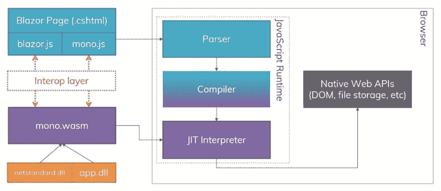
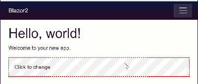

# 使用 Blazor JavaScript 互操作

> 原文：<https://dev.to/bnevilleoneill/working-with-the-blazor-javascript-interop-52op>

[T2】](https://res.cloudinary.com/practicaldev/image/fetch/s--nQ3ZaG7---/c_limit%2Cf_auto%2Cfl_progressive%2Cq_auto%2Cw_880/https://cdn-images-1.medium.com/max/1024/1%2A9VnQHM6JhrXhm6otyaMVmQ.png)

在本文中，我们将研究 Blazor，一个基于。使用 WebAssembly 在浏览器中运行的. NET。我们将了解 Blazor 如何处理 JavaScript 调用，为什么它是必要的，以及如何使用它。

随着 WebAssembly(缩写为 Wasm)的发展势头越来越猛，了解当前的功能非常重要。WebAssembly 无法直接访问浏览器的 DOM API，但是它可以调用 JavaScript。由于这个缺点，JavaScript 仍然是 web 开发的一部分。

[T2】](https://logrocket.com/signup/)

### **Blazor、Mono 和 WebAssembly**

WebAssembly (Wasm)是一种二进制指令格式，旨在为 C#等高级语言提供编译目标。最近，微软开始试验 WebAssembly 来实现。NET 到使用 Mono 运行时的浏览器。Mono 提供了基本的管道。NET 库(.dll)在 WebAssembly 上运行。

[](https://res.cloudinary.com/practicaldev/image/fetch/s--80OTanSn--/c_limit%2Cf_auto%2Cfl_progressive%2Cq_auto%2Cw_880/https://cdn-images-1.medium.com/max/1024/1%2AVdBE4STMMqP_9g7EKZsEJw.jpeg)

<figcaption>Blazor&浏览器关系框图</figcaption>

Blazor 具有组件架构、路由、虚拟 DOM 和 JavaScript 互操作性(interop) API。通过 JavaScript interop，Blazor 应用程序可以从。来自 JavaScript 代码的. NET 和 C#方法。

从调用 JavaScript。NET 使用了 *IJSRuntime* 抽象。通过调用 *JSRuntime 来解析 IJSRuntime 的当前实例。电流*。从这个实例中，我们可以调用 *InvokeAsync* 方法，将第一个参数作为标识符传递给我们想要调用的相应 JavaScript 函数，这个函数必须在*窗口*的全局范围内可用。额外的参数可以传递给 JavaScript 函数，只要它们是 JSON 可序列化的，以及返回类型 *Task* 。

```
using Microsoft.JSInterop;
public class ExampleJsInterop
{
  public static Task<T> MethodName(TArgs args)
  {
    // Implemented in exampleJsInterop.js
    return JSRuntime.Current.InvokeAsync<T>("scope.jsMethod", args);
  }
} 
```

### JavaScript 互操作

由于 Blazor 是基于 Mono 和 WebAssembly 构建的，因此不能直接访问浏览器的 DOM API，所以当它需要 DOM 访问时，必须通过 JavaScript 进行调用。在堆栈中包含 JavaScript 不仅在必要性方面是有益的，而且在灵活性方面也是有益的。

**向后兼容性**

在堆栈中包含 JavaScript 使得 Blazor 应用程序能够利用现有的 JavaScript 库。这包括 UI 库，如用于简单图表组件的 [Bootstrap](https://github.com/chanan/BlazorStrap) 、 [Toastr.js](https://github.com/sotsera/sotsera.blazor.toaster) 、toast 通知库和 [Chart.js](http://www.chartjs.org/) 。

此外，全功能的商业 UI 库，如[剑道 UI](https://www.telerik.com/kendo-ui) 有可能被移植到 Blazor。这些“端口”本质上提供了一个 C# API 表面，用于与底层 JavaScript 进行交互，同时为用户提供了一个迁移路径。

**介意差距**

因为 Blazor 是新的和实验性的，所以当 WebAssembly 本身有缺点时，或者因为 Blazor 框架还不成熟时，interop 允许开发人员依靠 JavaScript。

例如，如果我们想使用一个标准的 window *prompt()* 方法，Blazor 中没有本地支持来做这件事。但是，可以使用 JavaScript interop 创建一个简单的 API 来添加对该功能的支持。

我们首先用我们希望从应用程序中调用的方法创建一个 JavaScript 文件。

对于 Blazor 可见的函数，我们需要将其添加到*窗口*的范围内。作为最佳实践，可以使用模块模式添加额外的名称空间，这可以保护我们的方法不与*窗口*范围内的其他代码冲突。在我们的名称空间中，我们定义了一个函数来调用本机窗口 *prompt()* 方法。

```
window.myNamespace = {
    showPrompt: function (message) {
    return prompt(message, 'Type anything here');
  },
    anotherFunction: function(args) { 
    // do stuff 
  }
}; 
```

接下来，我们需要使用 *JSRuntime 从 C#内部调用 JavaScript *showPrompt* 函数。Current.InvokeAsync* 方法。一个 C#函数 *PromptAsync* 提供了一个很好的抽象，可以在 Blazor 应用程序中使用。使用抽象的开发人员不需要理解底层的 JavaScript 实现。

```
using Microsoft.JSInterop;

public class PromptInterop
{
    /// <summary>
    /// Invokes a browser prompt and returns the user's input.
    /// </summary>
    public static Task<string> PromptAsync(string message) {
        return JSRuntime.Current.InvokeAsync<string>("myNamespace.showPrompt",message);
    }
} 
```

因为 Blazor 的 UI 进程能够在独立于应用程序的线程上运行，所以默认情况下应该使用 InvokeAsync。

然而，如果需要同步调用 JavaScript 方法，我们可以通过将 *JSRuntime* 向下转换为 *IJSInProcessRuntime* 来提供该功能。除了 *PromptAsync* 之外，添加*提示*方法可以在异步行为不可用时提供一个替代的 API。

```
using Microsoft.JSInterop;

public class PromptInterop
{
    /// <summary>
    /// Invokes a browser prompt and returns the user's input.
    /// </summary>
    public static Task<string> PromptAsync(string message) {
        return JSRuntime.Current.InvokeAsync<string>("myNamespace.showPrompt",message);
    }

    /// <summary>
    /// Syncronously invokes a browser prompt and returns the user's input. Use for in-process-senarios only.
    /// </summary>
    public static string Prompt(string message) {
        return ((IJSInProcessRuntime)JSRuntime.Current).Invoke<string>("myNamespace.showPrompt",message);
    }
} 
```

*ShowPrompt* 方法现在可以在应用程序中使用了。通过调用方法并等待结果，我们可以从 Blazor 组件中调用 *PromptAsync* 。

在下面的例子中，我们将在用户点击组件时触发浏览器提示。当提示关闭时，结果返回到组件的*消息*字段，该字段被数据绑定并呈现给组件。为了确保数据绑定发生时新值得到更新，我们将调用 *StateHasChanged* 来指示 Blazor 重新呈现组件。

```
<div onclick="@HandleClick" class="my-component">
    @Message
</div>

@functions {
    string Message = "Click to change";
    async void HandleClick()
    {
        Message = await PromptInterop.PromptAsync("Type a message");
        StateHasChanged();
    }
} 
```

[](https://res.cloudinary.com/practicaldev/image/fetch/s--dFWkES95--/c_limit%2Cf_auto%2Cfl_progressive%2Cq_66%2Cw_880/https://cdn-images-1.medium.com/max/400/1%2AaVDRr5sTO7oOnrX1YmnRVg.gif)

<figcaption>Blazor JavaScript interop 提供浏览器提示</figcaption>

### 结论

虽然 Blazor 和 WebAssembly 缺乏直接访问浏览器的 DOM API 的能力，但 JavaScript interop 提供了一种填补这一空白的方法。互操作使得将现有的 JavaScript 库迁移到 Blazor 成为可能。通过 interop，开发人员可以围绕浏览器特性创建抽象，提供 C#方法来在应用程序级别添加功能。

随着 Blazor 越来越受欢迎，有理由认为一个互操作库的生态系统将会出现。随着更多互操作库的出现，Blazor 开发人员可能会花更少的时间编写 JavaScript，而花更多的时间编写 C#。

* * *

### Plug: [LogRocket](https://logrocket.com/signup/) ，一款适用于网络应用的 DVR

[](https://logrocket.com/signup/)

<figcaption>[https://logrocket.com/signup/](https://logrocket.com/signup/)</figcaption>

LogRocket 是一个前端日志工具，可以让你回放问题，就像它们发生在你自己的浏览器中一样。LogRocket 不需要猜测错误发生的原因，也不需要向用户询问截图和日志转储，而是让您重放会话以快速了解哪里出错了。它可以与任何应用程序完美配合，不管是什么框架，并且有插件可以记录来自 Redux、Vuex 和@ngrx/store 的额外上下文。

除了记录 Redux 操作和状态，LogRocket 还记录控制台日志、JavaScript 错误、堆栈跟踪、带有头+正文的网络请求/响应、浏览器元数据和自定义日志。它还使用 DOM 来记录页面上的 HTML 和 CSS，甚至为最复杂的单页面应用程序重新创建像素级完美视频。

免费试用。

* * *

帖子[使用 Blazor JavaScript Interop](https://blog.logrocket.com/working-with-the-blazor-javascript-interop-3c2a8d0eb56c/) 首先出现在 [LogRocket 博客](https://blog.logrocket.com)上。