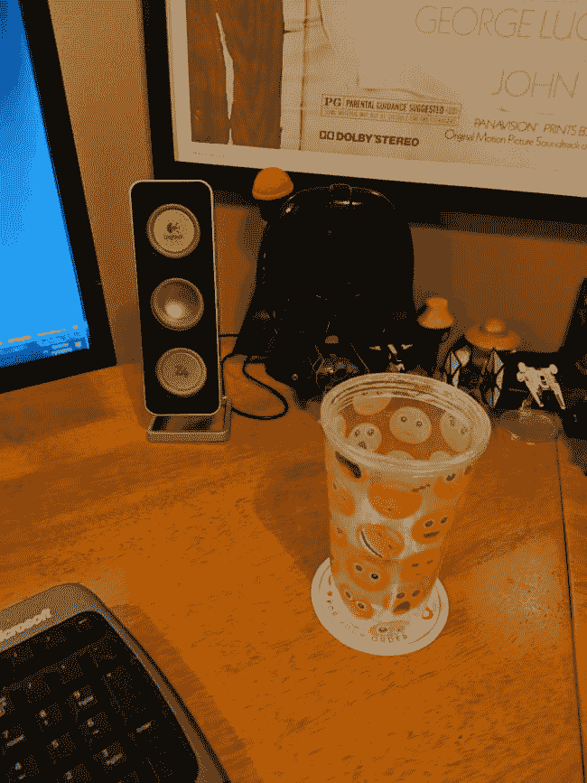
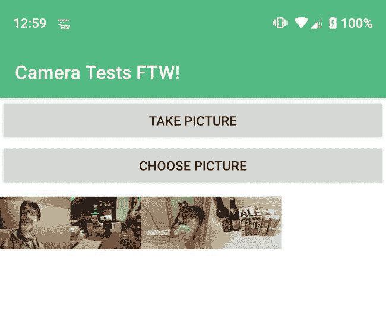

# 在 NativeScript Vue 应用程序中使用摄像机

> 原文：<https://dev.to/raymondcamden/working-with-the-camera-in-a-nativescript-vue-app-1ng7>

到目前为止，我进入 NativeScript Vue 的旅程还算愉快。开发体验*真的*做得很好，使用 Vue 和 NativeScript 感觉很自然。这个特定的主题(使用相机)是我唯一一次真正感到沮丧，正如我现在已经发表了 6000 篇帖子(是的，这是第 6000 篇博文)一样，当我对一些事情感到沮丧时，我会尽最大努力以帮助他人的方式写下来。在我继续讲下去之前，我想指出我从 [NativeScript Slack](http://tinyurl.com/nativeScriptSlack) 组的人那里得到了很大的帮助。最近， [@bundyo](https://dev.to/bundyo) ，帮助我完成了这个演示，也帮助了我的[上一篇文章](https://dev.to/raymondcamden/using-nativescript-dataform-with-vuejs---some-tips-4db0)。最后，我想指出的是，我正在开发的客户端只需要支持 Android，所以我只用 Android 测试了这一点。就 iOS 会有哪些不同的做法而言，我只关心一个部分，我会尽力指出这一点，以便人们知道要注意什么。

这篇文章的目标实际上比标题所暗示的要多一点。是的，我想在 NativeScript 中测试相机，但我也想测试文件上传到服务器。在这两种情况下，我都遇到了相当大的困难。这有点令人惊讶，因为“相机图片/上传演示”在 Cordova 中相当琐碎。我仍然对我的解决方案不是 100%满意，但是如果这是我在 NativeScript 中不得不处理的最糟糕的事情，我仍然对它非常满意。好了，背景故事讲够了，我们开始吧。

### 用相机工作

让我们立即从第一个“问题”开始——与 Cordova 相机插件不同， [NativeScript 相机](https://github.com/NativeScript/nativescript-camera)插件只支持相机，不支持图库。这没什么大不了的，因为还有其他插件可以做到这一点(你很快就会看到我选择的那个)，但是你会想知道的。

没什么大不了的——但是当我第一次开始看文档时，我遇到了一些问题。文档中提到使用摄像头需要权限，并显示以下 API:

> Android 和 iOS 版本的较新 API 级别要求明确的权限，以便应用程序能够访问相机并能够将照片保存到设备中。一旦用户授予权限，就可以使用相机模块。
> 
> `camera.requestPermissions();`

这是微不足道的——但是文档从来没有真正解释这个 API 是如何工作的，结果是什么，等等。最初显示在文档中:

```
camera.requestPermissions(); 
```

Enter fullscreen mode Exit fullscreen mode

这意味着可以在调用相机 API 的其余部分之前使用一个阻塞请求。文件也没有提到应用程序使用后的一般行为。

根据我的测试，API 实际上会返回一个承诺。这是非常重要的信息，但似乎没有记录在案。

另一条至关重要的信息是，你必须将这条信息添加到 AndroidManfest.xml:

```
<uses-permission android:name="android.permission.CAMERA"/> 
```

Enter fullscreen mode Exit fullscreen mode

因为错过了这个，我损失了大概两个小时的时间。从字面上看，在许可部分的文档中有一行是有帮助的。

现在，让我们看一个简单的例子。

```
<template>
    <Page>
        <ActionBar title="Camera Tests FTW!"/>
        <StackLayout>
            <Button text="Take Picture" @tap="takePicture" />
            <Image :src="img" width="75" height="75" />
        </StackLayout>
    </Page>
</template>

<script>
import * as camera from "nativescript-camera";

export default {
    data() {
        return {
            img:''
        }
    },
    methods:{
        takePicture() {
            camera.requestPermissions()
            .then(() => {
                camera.takePicture({ width: 300, height: 300, keepAspectRatio: true, saveToGallery:true })
                .then(imageAsset => {
                    this.img = imageAsset;
                })
                .catch(e => {
                    console.log('error:', e);
                });
            })
            .catch(e => {
                console.log('Error requesting permission');
            });
        }
    }
}
</script> 
```

Enter fullscreen mode Exit fullscreen mode

让我们首先考虑布局，所有两个项目。我有一个按钮和一个图像元素，最初是空白的。简单明了。代码，特别是`takePicture()`是至关重要的部分。您可以首先看到我对`requestPermissions()`的调用，然后在结果中我尝试拍照。这里传递的所有选项都是可选的，我强烈建议测试时不要用`saveToGallery:true`而用*T4，否则你的照片卷会被一大堆测试图片填满。考虑这个美丽的例子。*

[T2】](https://res.cloudinary.com/practicaldev/image/fetch/s--Ft0mHNZD--/c_limit%2Cf_auto%2Cfl_progressive%2Cq_auto%2Cw_880/https://static.raymondcamden.cimg/2018/11/nsc1.jpg)

那还不错。再一次，由于 doc 问题，它是*痛苦的*,但是一旦我过去了，它是所有的彩虹、独角兽和小猫。让我们更上一层楼吧！

### 在图库中添加支持

在我的应用程序中，我需要让用户拍摄一张新照片或从他们的图库中选择。正如我上面所说的，虽然这是 Cordova 的主摄像头插件，但它不包含在 NativeScript 的摄像头插件中。别担心——有一个插件可以做到这一点: [NativeScript 图像拾取器](https://github.com/NativeScript/nativescript-imagepicker)。这有一个简单易用的 API，可以让你做一些事情，比如允许一个或多个选择。我对此没有任何问题。我更新了我的演示程序，添加了第二个按钮，然后将结果定义为一组图像。

```
<template>
    <Page>
        <ActionBar title="Camera Tests FTW!"/>
        <StackLayout>
            <Button text="Take Picture" @tap="takePicture" />
            <Button text="Choose Picture" @tap="selectPicture" />
            <WrapLayout>
                <Image v-for="img in images" :src="img.src" width="75" height="75" />
            </WrapLayout>
        </StackLayout>
    </Page>
</template>

<script>
import * as camera from "nativescript-camera";
import * as imagepicker from "nativescript-imagepicker";

import { Image } from "tns-core-modules/ui/image";

export default {
    data() {
        return {
            images:[]
        }
    },
    methods:{
        selectPicture() {

            let context = imagepicker.create({
                mode: 'multiple' 
            });

            context.authorize()
            .then(function() {
                return context.present();
            })
            .then(selection => {
                selection.forEach(selected => {

                    console.log(JSON.stringify(selected));

                    let img = new Image();
                    img.src = selected;
                    this.images.push(img);
                });
            }).catch(function (e) {
                console.log('error in selectPicture', e);
            });

        },
        takePicture() {
            camera.requestPermissions()
            .then(() => {
                camera.takePicture({ width: 300, height: 300, keepAspectRatio: true, saveToGallery:false })
                .then(imageAsset => {
                    let img = new Image();
                    img.src = imageAsset;
                    this.images.push(img);
                    console.log('ive got '+this.images.length+' images now.');
                })
                .catch(e => {
                    console.log('error:', e);
                });
            })
            .catch(e => {
                console.log('Error requesting permission');
            });
        }
    }
}
</script> 
```

Enter fullscreen mode Exit fullscreen mode

这是一个快速截屏——图像可能太小，甚至无法辨认它们是什么——但我拍了两张照片，并从我的图库中选了两张。

[T2】](https://res.cloudinary.com/practicaldev/image/fetch/s--bzyp4lFn--/c_limit%2Cf_auto%2Cfl_progressive%2Cq_auto%2Cw_880/https://static.raymondcamden.cimg/2018/11/nsc2b.jpg)

呜！其他一切都会很完美！

### 上传文件到地狱我指的是服务器

好吧…那么…这就是事情急转直下的地方。非常暗。

> 我的灵魂冰冷。我害怕看到新的一天——充满空虚的一天。[pic.twitter.com/9W3bGxDbRz](https://t.co/9W3bGxDbRz)
> 
> —黑色金属猫(@ evilbmcats)[2018 年 11 月 13 日](https://twitter.com/evilbmcats/status/1062491550066782210?ref_src=twsrc%5Etfw)

所以，过去我在 Cordova 中使用了 FileTransfer 插件。现在我可能会使用[获取 API](https://developer.mozilla.org/en-US/docs/Web/API/Fetch_API) 来代替。但是，我看到很多人推荐[native script-background-http](https://github.com/NativeScript/nativescript-background-http)插件。我发现这个插件的文档非常糟糕，我在使用它的时候遇到了很多问题。公平地说，我相当确定我一半的问题是关于我如何测试的，但总的来说，这是一次相当糟糕的经历。我会强烈考虑返回 Fetch()，但据我所知，它不能从文件名流式传输，必须先读入内存，这是我想避免的。

我立即关注了文档的多部分上传方面，这是一个代码示例:

```
import * as bghttp from "nativescript-background-http";
var session = bghttp.session("image-upload");

.....
var request = {
        url: url,
        method: "POST",
        headers: {
            "Content-Type": "application/octet-stream",
            "File-Name": name
        },
        description: description
    };

    if (should_fail) {
        request.headers["Should-Fail"] = true;
    }

let task: bghttp.Task;
var params = [
            { name: "test", value: "value" },
            { name: "fileToUpload", filename: file, mimeType: 'image/jpeg' }
        ];
task = session.multipartUpload(params, request); 
```

Enter fullscreen mode Exit fullscreen mode

我的问题是(我提交了 [#184](https://github.com/NativeScript/nativescript-background-http/issues/184) 和 [#185](https://github.com/NativeScript/nativescript-background-http/issues/185) )试图弄清楚 a)什么是会话，以及 b)你如何知道上传何时完成。这些例子很有帮助，但是老实说，我希望自述文件包含更多的信息。具体来说，上面的`task`对象将发出事件，您可以监听这些事件来跟踪进度。这些事件从来没有按照传递给它们的内容进行记录。此外，我从来没有弄清楚插件中的会话是什么。

想到这些，我开始尝试上传图片。我第一次尝试点击 [Postman Echo](https://docs.postman-echo.com/) ，这是 Postman 背后的人提供的一个很棒的免费服务。但是，我一直得到一个错误，想不出为什么。然后我使用[强大的](https://www.npmjs.com/package/formidable)切换到一个本地节点服务器，并通过 [ngrok](https://ngrok.com/) 代理它。我忘记了 ngrok 的部分，但记得我的手机需要一种方式来访问我的台式机。

据我所见，下面的代码运行良好。内容类型标题与官方文档不同，但似乎更有意义。(再次感谢 [@bundyo](https://dev.to/bundyo) 。)此外，这段代码在完成时实际上并不做任何事情。它可能会使你不能拾取更多的图片，然后清除数组，但这只是我正在进行的更大项目的原型。

```
upload() {
    if(this.images.length === 0) return;

    let session = bghttp.session("image-upload");
    let request = {
        url: 'https://b3ababb0.ngrok.io',
        method: 'POST',
        headers: {
            "Content-Type": "multipart/form-data"
        }
    };

    var params = [
        { name: "test", value: "value" }
    ];

    let counter = 0;
    this.images.forEach(i => {
        params.push(
            {
                name:'image' + (++counter),
                filename: i.src.android, 
                mimeType:'image/jpeg'
            }
        );

    });

    let task = session.multipartUpload(params, request);

    task.on('error', e => {
        console.log('error', e);
    });

    task.on('complete', e => {
        console.log('complete', JSON.stringify(e));
    });

}, 
```

Enter fullscreen mode Exit fullscreen mode

这一部分尤其重要(也可能是错误的):

```
i.src.android 
```

Enter fullscreen mode Exit fullscreen mode

这来自用于驱动来自任一来源的图片列表的 ImageSource 实例。是的，也有一个`i.src.ios`键，但我不相信它能在 iOS 中工作。

基本上就是这样。在我的测试中，我仍然注意到一些错误，所以我不是 100%确信这是可靠的，但这足以让我写博客和分享-显然，如果人们看到任何愚蠢/危险/等等，请说出来。