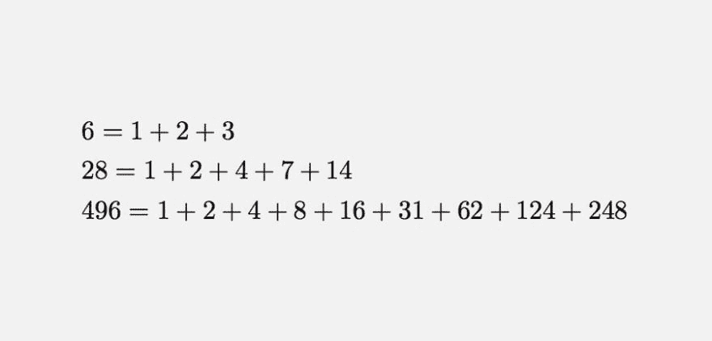

# 写一个脚本来寻找“完全数”

> 原文：<https://dev.to/peter/write-a-script-to-find-perfect-numbers-48nn>

灵感来自[这条推文](https://twitter.com/fermatslibrary/status/1045294993747976192) :

> 费马的库@ fermatslibrary一个完全数是一个整数，等于它的适当的正整数因子之和(6=3+2+1)。是否存在奇数完全数是数学中已知的最古老的公开问题。下面是 3 个最小的完全数2018 年 9 月 27 日下午 12:52

写一个脚本来寻找“完全数”这是最长 19 位数的数字列表😈：

> 6, 28, 496, 8138, 33550336, 8589869056, 137438691328, 2305843008139952128

期待看到大家的解决方案！