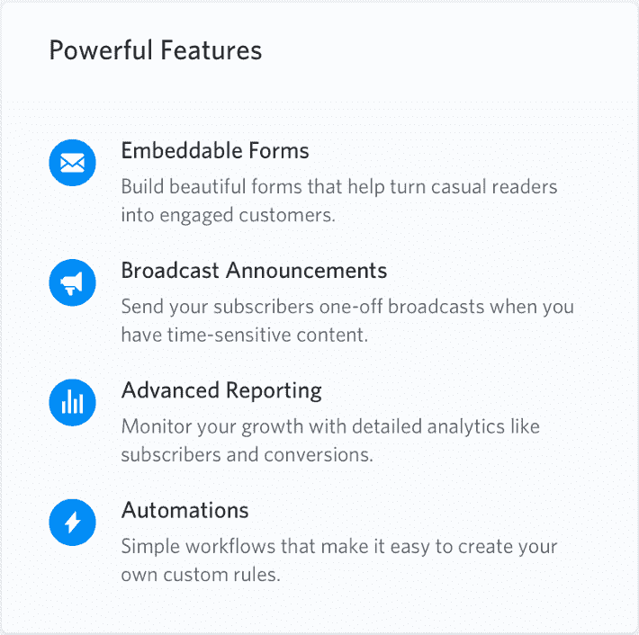

# 撰写重要的替代文本

> 原文：<https://dev.to/lkopacz/writing-alternative-text-that-matters-3f1p>

如果我问任何人，可访问性对他们来说意味着什么，通常他们能识别的第一件事就是“添加替代文本！”你所要做的就是给你的图片添加 alt 标签，让你的网站更容易访问，对吗？我喜欢减少可访问性错误的热情，但是我将要给你一个令人愤怒的回应。**看情况**。

添加替代文本可能意味着您不会在可访问性扫描中遇到关于缺少替代文本的恼人错误，但这并不一定意味着您的图像有更好的含义。有时候，一个空的 alt 标签实际上是一个更易访问的图像所需要的。你有没有想象出令人惊叹的表情符号和/或 gif？

[T2】](https://i.giphy.com/media/l0NhZ0aUSE8fXag12/giphy.gif)

这就是我在了解它的时候的感受，它让我意识到我给了别人多少关于修复 alt 文本的糟糕建议。希望这篇博文之后我问心无愧！我曾经认为每一张图片都必须有可供选择的文本，并没有花太多心思去写它。我很乐意给出我的一些建议，不仅可以帮助你避免易访问性错误，还可以更批判性和战略性地思考如何给视障用户最好的体验。

我有一些策略来开始写更好的替代文本，我通常会问自己以下问题。

## 有装饰性吗？

我希望任何人在开始钻研 CMS 的多媒体资料之前，首先考虑的都不是技术问题。这是战略性的。那张图片的目的是什么？如果我们为视觉正常的用户拿走了图像，我们还能得到我们需要的信息吗？我首先提到这一点的原因是因为在开始之前，这是一个相对简单的自问问题。让我们从一个很多组织网站都有的实际例子开始——传记页面。

假设我们的网站上有一个“团队”页面，我们可以点击一个链接，将我们导向该人的页面，以阅读更多信息。我们点击进入首席执行官的页面，那里有该公司首席执行官的头像。很多时候，首席执行官的照片不会影响你的可访问性测试，因为你会在替代文本中看到一些东西，比如“首席执行官约翰·保罗的照片”对于像这样的头像，这种类型的信息对那些有视觉障碍的人来说是非常无用和多余的。所有关于 CEO 的重要信息可能就在他的照片旁边。这将使这张照片具有装饰性，因此空的 alt= " "就足够了。

另一个我可以想到替代文本为空的时候是当我们使用图像图标的时候。注意，当我说图像图标时，我并不是指使用像字体牛逼这样的图标字体。以下面的例子为例:

[](https://res.cloudinary.com/practicaldev/image/fetch/s---wpCZMD2--/c_limit%2Cf_auto%2Cfl_progressive%2Cq_auto%2Cw_880/v1/./https://www.a11ywithlindsey.com/static/powerful-features-icon-example-53dd8f0d8b4b6cb7da69b4a384387652-edb60.png) 
来源:[重构 UI](https://medium.com/refactoring-ui/7-practical-tips-for-cheating-at-design-40c736799886)

在这种情况下，我们不使用这些图像图标来传达任何意义。这只是为了*修饰*在“强大功能”列表中的每一个列表项。它增加了一些设计的活力，但并没有真正增加任何视觉障碍用户可能会错过的语法价值。

从同理心的角度来看，当你把非空的替代文本放在装饰性的图片上时，它对有视觉障碍的用户有什么作用？如果我处在他们的位置，我想了解强大的功能是什么，我想我会对听到的对我没有任何价值的图片感到恼火。这通常是我在思考一件东西是否具有装饰性时问自己的问题。

## 这个形象是什么语境？

在考虑描述符之前，有时我们需要先问一个问题:形式还是功能？有时候最容易想到的是“这是链接还是按钮，或者这是内容？”当然，这并没有涵盖你所有的基础，但是问问你自己它是否*做了一些事情*比如去另一个页面或者*描述了一些事情*给我们的内容增加了上下文通常是一个好的开始。

### 做事的形象

首先，我们来看一个**做了某件事**的例子。这里就拿下面这段代码来说。这是一个脸书图标，指向该组织的脸书页面。目前，它没有任何替代文本。

```
<a href="https://www.facebook.com/DrupalGovCon">
  
</a> 
```

有时很容易在这里添加描述图像的替代文本。像这样:

```
<a href="https://www.facebook.com/DrupalGovCon">
  
</a> 
```

问题是，描述它并不能真正有助于给这幅图像添加内容。使用屏幕阅读器的人可以根据整个站点的所有其他上下文，对链接的走向进行逻辑猜测。但是，我不想让我的用户去猜测，我想让他们知道！如果你点击这张图片，它会转到脸书德鲁巴戈夫孔网页。让我们让最终用户非常清楚，不管视觉能力如何，这个链接指向哪里:

```
<a href="https://www.facebook.com/DrupalGovCon">
  
</a> 
```

### 形容事物的图像

现在我们来看一个**描述某物**的例子。我真的很喜欢关注美食博主(虽然我通常讨厌他们的页面加载时间太长，哈哈)，看看他们有什么食谱。诚然，这不是我关注的美食博客，但我谷歌了“最佳核仁巧克力饼食谱”，这是我找到的第一个食谱。神圣的鳄梨色拉酱，这些核仁巧克力饼从图片上看是不是很棒！

[](https://res.cloudinary.com/practicaldev/image/fetch/s--jZgIbmyl--/c_limit%2Cf_auto%2Cfl_progressive%2Cq_auto%2Cw_880/https://www.a11ywithlindsey.com/static/Best-Fudgiest-Brownies-IMAGE-1001-8116aa33c5f1db6bcca6a67f62897427-8bd51.jpg) 
来源:[咖啡厅美食](https://cafedelites.com/worlds-best-fudgiest-brownies/)

你将如何创建这个图像的替代文本？这是一个非常有趣的发挥创造力的时间！因为这是一个美食博客，你可能会想用一种听起来很开胃的方式来描述它，让你觉得“我不在乎是否减少糖的摄入量，我必须现在就做那些布朗尼！”

下面是我做的:

```
 
```

## 你的内容策略是什么？

我们是在为嵌入到文案中的图片写替代文字吗？这是设计师特意想要传达我们品牌的形象吗？我们需要考虑谁参与这些决定，因为我们希望谁参与编写我们的备选案文。

类似于美食博客，假设你正在和一个图书出版商合作，他正在推广一本新的食谱。假设营销部门花了很多时间通过焦点小组、调查等方式研究他们的目标受众。然后，他们在营销计划上投入了大量的精力，并认为视觉效果对他们的营销非常重要。他们与一名摄影师合作，拍摄了美味食谱的新图像。难道你不想用辅助技术来体现这些照片的目的吗？我们可能想像电视烹饪节目主持人一样描述食谱:“辛辣的意大利香肠和胡椒，以及大量的平叶欧芹和百里香。”

> 难道你不想用辅助技术来体现这些照片的目的吗？

这就是为什么策略比技术方面更重要。这意味着你*应该*与你的营销策略团队合作撰写替代文本。这也应该是为什么设计应该参与品牌形象，为什么他们把它们放在那里。如果这些团队不存在，至少我们考虑了图像存在的目的。我最喜欢的例子是右边的例子，来自 [WebAim 关于 Alt Text](https://webaim.org/techniques/alttext/#context) 的文档。有一幅乔治·华盛顿在战斗中的图像，但是如果我们在一个关于历史的网站上或者如果我们在一个关于艺术的网站上，同样的图像会有非常不同的可选文本。

## 别想多了

如果你在这方面有困难，当你写替代文本时，试着采用这三个策略。它减少了你过度思考的机会(坦白地说，我是这方面的女王)。撰写替代文本背后的策略与思考策略密切相关。请记住，这是一项正在进行的工作。您的替代文本可以随着时间的推移进行调整和改进:)。

我希望你喜欢了解我的替代文本的方法！如果您有任何问题，请随时通过 [Twitter](https://twitter.com/littlekope0903) 联系我。