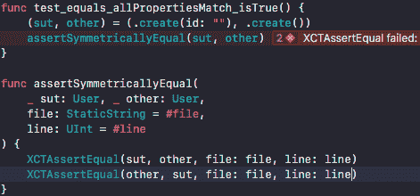

# 用 Swift 编写更好的单元测试:第二部分

> 原文：<https://dev.to/clue/writing-better-unit-tests-in-swift-part-two-4pdo>

*用自定义断言验证您的代码*

[T2】](https://res.cloudinary.com/practicaldev/image/fetch/s--CpCoGxLJ--/c_limit%2Cf_auto%2Cfl_progressive%2Cq_auto%2Cw_880/https://cdn-images-1.medium.com/max/1024/1%2AzKuWcfqLosfVWjD_vPxieA%402x.png)

### 问题

在本系列的第一部分中，我定义了我认为的“好的”单元测试。这是我最终得出的定义:

> 如果我们同意一个单元测试(或者，真的，任何测试)是由一些*设置*，我们正在测试的*动作*，以及关于那个动作的效果的*断言*组成的，那么我会说，简单地说，一个“好的”单元测试是使这三个组成部分都清楚的测试。

你可能还记得，我们用类似这样的测试完成了那篇文章:

```
var sut, other: User!

func test\_equals\_allPropertiesMatch\_isTrue() {
 (sut, other) = (.create(), .create())
 XCTAssertEqual(sut, other)
 XCTAssertEqual(other, sut)
}

func test\_equals\_nameDiffers\_isFalse() {
 (sut, other) = (.create(name: "Jo"), .create())
 XCTAssertNotEqual(sut, other)
 XCTAssertNotEqual(other, sut)
} 
```

我们压缩了设置，以便测试主体只包含对测试场景重要的信息。例如，当重要的是两个用户对象的名称不同时，我们只在设置中包含该信息。

这极大地提高了测试的整体可读性。但是我们还能做更多。

很可能你看了上面的测试后会想“设置没问题，但是为什么你有两个断言呢？”很棒的问题！我很高兴你注意到了。

记住，上面的测试覆盖了用户类型上的==函数。不要让你背上一大堆数学负担，等式是一个“T0”等价关系的例子，关于等价关系的一个重要的事情是对称的概念。简单地说，如果我有两个某种类型的实例 a 和 b，就不应该出现 a == b 为真而 b == a 为假的情况。如果这是可能的，那么我们对平等的定义就是有缺陷的。所以验证我们自定义的==是对称的是有意义的。

但是简单地看一下我们的两个断言，就完全不清楚这是什么意图。这些测试只能证明一件事。有可能，随着时间的推移和兴趣的增加，其他工程师会发现为什么我们增加了第二个断言，但是我们肯定可以做得更好。

但是…怎么做？

### 解

让我们从做我们能想到的最简单的事情开始。我们有两行代码，我们希望只有一行代码。解决办法？一个函数！

```
func assertSymmetricallyEqual(\_ sut: User, \_ other: User) {
 XCTAssertEqual(sut, other)
 XCTAssertEqual(other, sut)
} 
```

(注意:我们在这里着重于测试相等性，但是你可以对不相等性做完全相同的事情)。

现在我们的测试变成了:

```
var sut, other: User!

func test\_equals\_allPropertiesMatch\_isTrue() {
 (sut, other) = (.create(), .create())
 assertSymmetricallyEqual(sut, other)
} 
```

如果我们运行这个测试，它通过了，一切都好。但是当断言失败时，Xcode 会在错误的位置显示失败。

[](https://res.cloudinary.com/practicaldev/image/fetch/s--flpI1x1E--/c_limit%2Cf_auto%2Cfl_progressive%2Cq_auto%2Cw_880/https://cdn-images-1.medium.com/max/452/1%2ALOEtYibl8_EdWNsDk9Nl3A.png) 

<figcaption>注意:我不得不更改设置来强制中断测试。</figcaption>

显然这是不可接受的。如果我们试图快速诊断失败的测试，我们希望能够准确地看到失败的内容和位置。更重要的是，如果两个或三个测试使用相同的断言函数都失败了，那么我们将很难将失败分离出来。

幸运的是，XCTAssertEqual [文档](https://developer.apple.com/documentation/xctest/2142776-xctassertequal)提供了一个解决方案。在这里我们可以看到函数的 Swift 声明，如下所示:

```
func XCTAssertEqual\<T\>(
 \_ expression1: @autoclosure () throws -\> T, 
 \_ expression2: @autoclosure () throws -\> T, 
 \_ message: @autoclosure () -\> String = default, 
**file: StaticString = #file,   
 line: UInt = #line** ) where T : Equatable 
```

我把最重要的两行加粗了。

由于 XCTAssertEqual 是 Swift 中的一个函数(而不是 Objective-C 中的一个宏)，所以有一个小技巧可以让 Xcode 在正确的位置呈现故障。当我们调用 XCTAssertEqual 时，Swift 编译器将调用它的文件(#file)和调用它的行(#line)作为默认参数添加到调用中。

因为我们对 XCTAssertEqual 的调用没有发生在我们希望看到失败的行上，所以我们需要付出一点额外的努力来让一切正常工作。本质上，我们需要告诉 XCTAssertEqual 显示失败的正确文件和行。这应该是调用我们的自定义 assert 方法的#file 和#line。因此，按照苹果文档中的例子，我们最终得到了这个结果:

```
func assertSymmetricallyEqual(
 \_ sut: User, \_ other: User,
 **file: StaticString = #file,  
 line: UInt = #line**  
) {
 XCTAssertEqual(sut, other, **file: file, line: line** )
 XCTAssertEqual(other, sut, **file: file, line: line** )
} 
```

对方法的更改已用粗体标出。

再次运行测试，我们得到以下结果:

[T2】](https://res.cloudinary.com/practicaldev/image/fetch/s--pPBvwVlj--/c_limit%2Cf_auto%2Cfl_progressive%2Cq_auto%2Cw_880/https://cdn-images-1.medium.com/max/471/1%2AQ0DBTd6g5o3C9Y_lDa-qQQ.png)

好吧！这正是我们要找的。现在，失败恰恰出现在我们需要看到它们的地方。🙌

### 重构

我们上面所做的很好，但是一旦我们想要断言不止一个类型满足对称等式，我们就会发现自己是一张通往复制城的单程票。🏘🏘🏘🏘

解决办法？为此，我们可以参考之前的[文档](https://developer.apple.com/documentation/xctest/2142776-xctassertequal)。Swift 的 XCTAssertEqual 方法在一些 T:equable 上是通用的——所以让我们对我们的 assertSymmetricallyEqual 做完全相同的事情。

```
func assertSymmetricallyEqual **\<T: Equatable\>** (
 \_ sut: **T** , \_ other: **T** ,
file: StaticString = #file,  
 line: UInt = #line  
) {
 XCTAssertEqual(sut, other, file: file, line: line)
 XCTAssertEqual(other, sut, file: file, line: line)
} 
```

更改再次用粗体标出。看看那个！几乎没有！

现在我们有了一个很好的、可重用的自定义断言，它确认一个等价类型的两个实例是相等的。活着是多么美好的时光啊！

### 奖金

在 Clue，我们实际上已经将这种模式向前推进了一小步。我们有一个内部框架，用于不同模块所需的测试助手。该框架包含以下结构:

```
public struct Assert\<T\> {
 private let subject: T?

 init(\_ subject: T?) {
 self.subject = subject
 }
} 
```

“好吧，太好了，”我听到你哭了，“但这绝对没有任何作用。”你是对的！因为真正神奇的事情发生在对这种类型的扩展中:

```
extension Assert where T: Equatable {
 public func symmetricallyEqual(
 to other: T, 
 file: StaticString = #file, 
 line: UInt = #line
 ) {
 XCTAssertEqual(subject, other, file: file, line: line)
 XCTAssertEqual(other, subject, file: file, line: line)
 }
} 
```

而当我们需要调用这个方法时，它看起来是这样的:

```
Assert(sut).symmetricallyEqual(to: other) 
```

漂亮！

另外，作为特殊对待，这里有一个我们如何将这种模式扩展到其他类型的断言的例子。这是我个人最喜欢的自定义断言函数，它让我们断言发生了特定的错误:

```
extension Assert where T: Error & Equatable {
 public func isThrownIn(
 \_ expression: @autoclosure () throws -\> (),
 file: StaticString = #file,
 line: UInt = #line
 ) {
 XCTAssertThrowsError(
 try expression(), file: file, line: line
 ) {
 XCTAssertEqual(
 subject, $0 as? T, 
 file: file, line: line
 )
 }
 }
} 
```

(我不得不将缩进提高到有点荒谬的程度，以使其适合中等大小的代码块。不好意思！)

然后我们可以如下使用它:

```
Assert(Errors.someError).isThrownIn(try someMethodThatThrows()) 
```

哦！✨

* * *