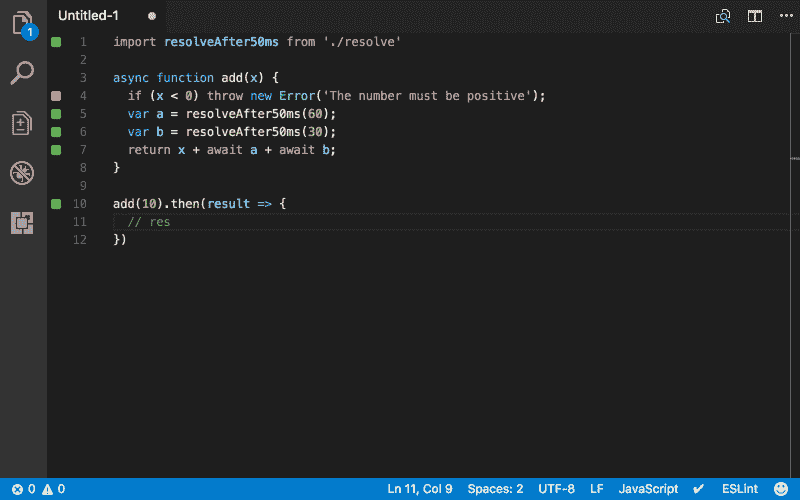

# 在 Quokka.js 中编写干净的无错误代码

> 原文：<https://dev.to/_robynedgar/writing-clean-bug-free-code-in-quokkajs-28ad>

*供稿[马特·马丁](https://www.linkedin.com/in/matt-martin-4b831b119/)*

你有没有想过能够边写 Javascript 边测试？我们在 Hifyre 的开发人员不断尝试通过识别简化过程的工具来提高工作效率。Quokka.js 允许您在所选编辑器的范围内进行快速原型制作。

那是什么意思？让我们展示给你看。

[T2】](https://res.cloudinary.com/practicaldev/image/fetch/s--k4voDipB--/c_limit%2Cf_auto%2Cfl_progressive%2Cq_66%2Cw_880/https://cdn-images-1.medium.com/max/800/1%2AukcsChGYEreBhhAksiYceA.gif)

如果你对 linters 很熟悉，Quokka.js 有很多相似之处。linter 用于识别潜在的 bug，甚至是难以维护的代码。像这样的工具最好的一点是，它们安装在您已经在使用的编码环境中，因此您不必将任何额外的步骤集成到您的原型工作流中。您的测试与编码同时发生。

Quokka.js 与标准 linter 的不同之处在于实时反馈功能。使用实时反馈，您可以随时看到结果。当你编码时，这代表了许多潜在的机会。例如，假设您想要试验一个新的库或函数——使用 Quokka.js 将允许您运行并测试该库的输出，而不必构建测试环境。更好的是，所有结果都是内联报告的，所以结果与生成它们的代码一起报告。另一个实时反馈有用的例子是时间测试。加上简单的/ *？。* /跟随运行一个函数的代码行，你可以计时这个函数执行的时间。当试图决定编写代码的最佳方式时，这很方便。

[T2】](https://res.cloudinary.com/practicaldev/image/fetch/s--h9JOMueH--/c_limit%2Cf_auto%2Cfl_progressive%2Cq_66%2Cw_880/https://cdn-images-1.medium.com/max/800/1%2Am-yQbA3eNATBdihUYyo5mA.gif)

此外，在编码环境中获得实时反馈意味着您仍然可以访问所有的代码文件和导入。您不必担心为测试环境进行配置。您可以在编辑器中测试代码片段。与 linters 不同的是，Quokka.js 提供实时日志记录、实时代码覆盖、实时注释和项目文件导入。

### 还有其他类似的工具吗？

答案是，不尽然。也有 linters，但它们做的远不如 Quokka.js 多。或者，Quokka.js 的创建者也有一个叫 Wallaby.js 的工具，但这两个工具之间有很多不同之处。Wallaby.js 是一个更强大的测试跑步者。而 Quokka.js 是为了成为一个游乐场或沙盒环境而构建的。此外，Quokka.js 有一个免费的社区选项，允许用户构建自己的插件。这意味着您可以扩充 Quokka.js 的特性，以满足您的需求，并创造无限的可能性。

* * *

我们在招人！你是全栈开发者吗？[我们想从你这里得到](https://hifyre.bamboohr.com/jobs/)。