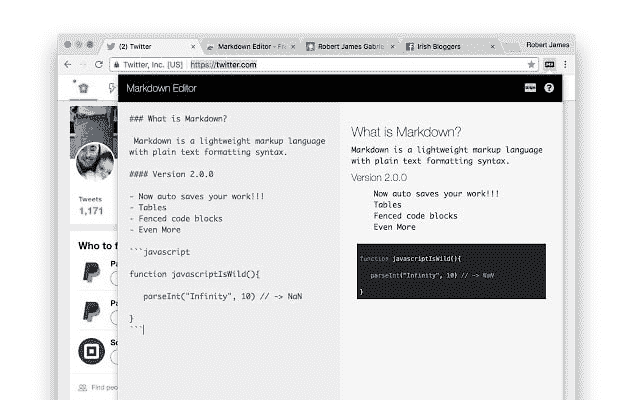

# 编写 Github readme 和 markdown 更容易

> 原文：<https://dev.to/robertjgabriel/writing-github-readmes-and-markdown-easier--d75>

[T2】](https://res.cloudinary.com/practicaldev/image/fetch/s--tpNZFO1m--/c_limit%2Cf_auto%2Cfl_progressive%2Cq_auto%2Cw_880/https://thepracticaldev.s3.amazonaws.com/i/vhpahbpfpkosbufmrnpx.jpg)

如果你和我一样是开发者。你喜欢用减价的方式写作。所以我创建了这个插件，它可以让你不用离开浏览器就能写 markdown，支持所有流行的编码语言，在你打字的时候就能看到它。即使是像 dev.to 这样的地方，不用点击预览就可以看到你输入的内容。使用 vue.js 和 gulp 制作

再也不要离开浏览器了！！！
方便编写 Github 自述文件。
不离开网络浏览器测试 markdown。

现在它将保存您的工作！

支持以下代码片段语言

*   java 描述语言
*   超文本标记语言
*   结构化查询语言
*   红宝石
*   计算机编程语言
*   服务器端编程语言（Professional Hypertext Preprocessor 的缩写）
*   Perl 语言
*   目标-C
*   JSON
*   Java 语言(一种计算机语言，尤用于创建网站)
*   超文本传送协议
*   半铸钢ˌ钢性铸铁(Cast Semi-Steel)
*   C#
*   C++
*   咖啡脚本
*   尝试
*   街头流氓
*   HTML，XML
*   结构化查询语言
*   外壳会话

如有任何要求，请发送电子邮件至[robert_gabriel@outlook.com](mailto:robert_gabriel@outlook.com)

你可以在这里下载免费的[，在这里](https://chrome.google.com/webstore/detail/markdown-editor-free/dkpldbigkfcgpamifjimiejipmodkigk)下载高级的