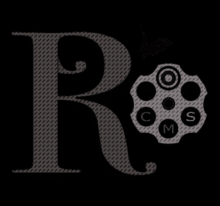
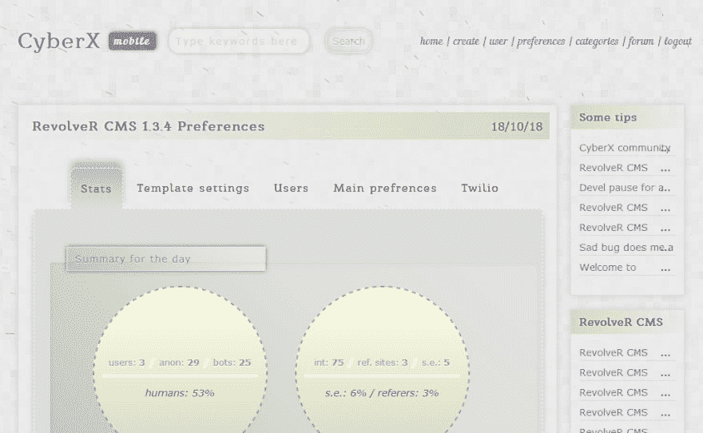

# 写左轮 CMS 只是为了好玩

> 原文：<https://dev.to/xshiftx/writing-revolver-cms-just-for-fun-5efo>

RevolveR CMS 是一个快速、简单和功能强大的内容管理系统，基于 PHP 7 语言，使用 MySQL 数据库和文件缓存，旨在创建新闻网站、博客和论坛，仅用于 6 个月的编码。

[T2】](https://res.cloudinary.com/practicaldev/image/fetch/s--hRdNEG4P--/c_limit%2Cf_auto%2Cfl_progressive%2Cq_auto%2Cw_880/https://thepracticaldev.s3.amazonaws.com/i/36mmj8l34s3x7jgi6jvn.png)

左轮 CMS 是安全和移动友好的系统，具有完美的搜索引擎优化兼容性。它有完整的动态加载页面支持，谷歌和 Yandex 涡轮网页解决方案。

在一种情况下，我不喜欢使用任何第三方组件，自己编写所有代码(包括数据库包装器 X 和前端库[旋转器使用 ES7 解决方案](https://github.com/xShiftx/RevolveR)，所以这个 CMS 不打算与比 IE Edge 更老的浏览器一起使用)。

我是被 Drupal 8 的缓慢实现和非常困难的简单来源推动实现的。我想使用 CMS 快速和简单，并希望它为我和其他人免费支付。

几天来我一直在看 WP 和其他 CMSes，让我们写下我自己的情况。事情就是这样:

1).没有依赖性和服务器要求(最低 PHP 模块要求)。

2).速度快，重量轻，简单。

3).基于结构查询的自数据库引擎。

4).ES 7 JavaScript 编码的自我前端库左轮手枪。

5).动态表单和界面的完全获取支持。

6).支持用户帐户。

7).支持用户积分。

8).全人类，安全和强大的路由器(内容链接)。

9).自行开发的非常简单的验证码安全前端加密。

10).支持多种类别的内容创建。

11.)评论支持。

12).上传支持。

13).搜索引擎友好。

14).自我内容编辑器。

15).友好的安装程序。

16).私信支持。

17).电子邮件通知支持。

18).Twilio 短信通知支持

19).简单的论坛。

20).角色支持。

21).内部搜索引擎优化统计和 tics 计数器，提供用户更喜欢哪些页面的详细信息。

性能是左轮 CMS 的强项:

1).干净网站需要 0.5 Mb 内存；
2)。只需对数据库进行一次查询即可呈现缓存的网站；

[T2】](https://res.cloudinary.com/practicaldev/image/fetch/s--pH3N_6M5--/c_limit%2Cf_auto%2Cfl_progressive%2Cq_auto%2Cw_880/https://thepracticaldev.s3.amazonaws.com/i/81sofsyxyfktc2ujxccw.PNG)

一个冬天的时间，我计划做一些核心重建，并添加一个电子商务商店模块。

要求:任何 Linux Apache，PHP 7，MySQL 网站托管。我不建议把它安装到 Windows 主机上，因为所有的开发都是在 Mac OS + MAMP 下完成的。

欢迎所有的批评家。

[来源 github](https://github.com/xShiftx/RevolveR_CMS)
[Devel 网站和 demo](https://cyberx.pro)