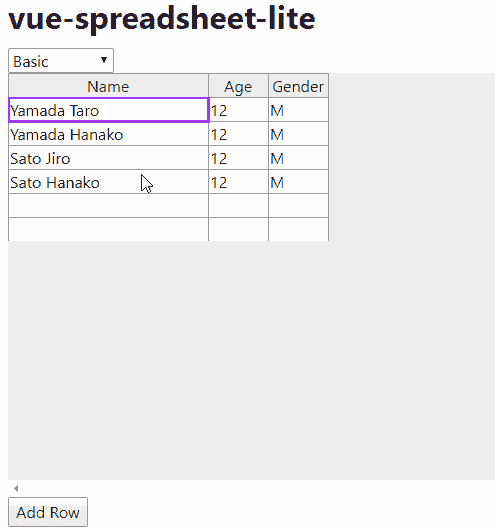
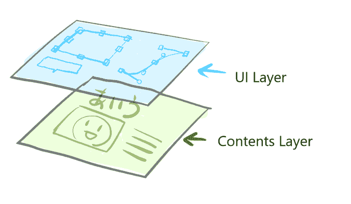
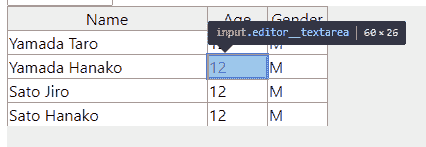

# 用 SVG 和 Vue.js 编写电子表格

> 原文：<https://dev.to/hashrock/writing-spreadsheet-with-svg-and-vuejs--23ed>

[T2】](https://res.cloudinary.com/practicaldev/image/fetch/s--9a6iiart--/c_limit%2Cf_auto%2Cfl_progressive%2Cq_66%2Cw_880/https://thepracticaldev.s3.amazonaws.com/i/8i1spuqz2xqpvxz2v754.gif)

我喜欢[手握式](https://handsontable.com/)，但我想从头开始写自己的。

# 演示

从这里开始尝试:

*   [https://anydown-example-vue-spreadsheet-lite.netlify.com/](https://anydown-example-vue-spreadsheet-lite.netlify.com/)

回购:

*   [https://github.com/anydown/vue-spreadsheet-lite](https://github.com/anydown/vue-spreadsheet-lite)

# 如何实现

有太多的事情需要实施。我不能都做。

## 选择界面

[T2】](https://res.cloudinary.com/practicaldev/image/fetch/s--mAf83gYR--/c_limit%2Cf_auto%2Cfl_progressive%2Cq_auto%2Cw_880/https://thepracticaldev.s3.amazonaws.com/i/e87e609dmxc2j4vqrl5f.png)

因为 svg 规范目前没有 z-index，所以我决定将 UI 和内容层分成两个 SVG 元素。

UI 层具有可视元素，如边框或选择矩形。他们必须永远在上面。

## 就地编辑

[T2】](https://res.cloudinary.com/practicaldev/image/fetch/s--1RTBW9Nn--/c_limit%2Cf_auto%2Cfl_progressive%2Cq_auto%2Cw_880/https://thepracticaldev.s3.amazonaws.com/i/mn4wvm36hpote2t0z75o.png)

选定的单元格中有隐藏的文本字段。首先，它的不透明度设置为 0。单击单元格时，不透明度变为 1。

这个隐藏的文本字段总是捕获按键输入来处理输入法。这对使用汉字的用户来说很重要。

## SVG

SVG 对于实现复杂的 GUI 非常有用。它只是 DOM，可以和 Vue 的 ViewModel 绑定。特别是，我喜欢用 computed 处理 SVG。

```
<template>
  <div class="grid" @mouseup="onMouseUpSvg()" @mousemove="headerResizeMove">
    
      <g v-for="(col, ci) in headerObj" :key="ci" :transform="translateCol(ci)" @mousedown="startColumnSelect(ci)" @mousemove="changeColumnSelect(ci)" @mouseup="endColumnSelect">
        <rect class="col-header" x=0 y=0 :width="widthAt(ci)" :height="rowHeight">
        </rect>
        <text class="col-header__text" text-anchor="middle" :x="widthAt(ci) / 2" y=12 :width="widthAt(ci)" :height="rowHeight">{{col.name}}</text>
        <rect class="col-header__resize" :class="{'active': ci === headerResizeAt}" :x="widthAt(ci) - 5" :y=0 :width="5" :height="rowHeight" @mousedown.stop="headerResizeStart(ci)"></rect>
      </g>
    

    <div ref="wrapper" style="height: 400px; overflow: scroll; position:relative;">
      
        <g v-for="(row, ri) in data" :key="ri" :transform="translateRow(ri)">
          <g v-for="(col, ci) in row" :key="ci" :transform="translateCol(ci)" @mousedown="onMouseDownCell(ci, ri)" @mousemove="onMouseMoveCell(ci, ri)">
            <rect x=0 y=0 :width="widthAt(ci)" :height="rowHeight">
            </rect>
            <text x=2 y=12 :width="widthAt(ci)" :height="rowHeight">{{col}}</text>
          </g>
        </g>
        <rect :transform="selectionTransform" class="selection" x=0 y=0 :width="selectionSize.w" :height="selectionCount.h * rowHeight"></rect>
      
      <div class="editor__frame" :style="editorStyleObj">
        <input ref="hiddenInput"  @mousedown="onMouseDownCell(selection.c, selection.r)" class="editor__textarea" v-model="editingText" @blur="onBlur" :class="{'editor--visible': editing}" autofocus />
      </div>
    </div>
  </div>
</template> 
```

这是一个单文件模板，只有 413 行。如果我用 canvas 或者 div 来实现这个，我想它的 LOC 会翻倍。

## 与毕丽捆绑

毕丽是分发 sfc 的有用工具。

我用`vue create`创建了这个项目，但是它的默认`.babelrc`似乎阻止了用毕丽构建。

根据[本期](https://github.com/egoist/bili/issues/89)，我应该用这个:

```
bili --plugin vue --no-babel.babelrc 
```

**更新 03-14-2018**

这个问题今天已经解决了，我们不再需要`--no-babel.babelrc`。感谢[利己主义者](https://github.com/egoist)！

然后我可以把它发布给 npm。

[https://www.npmjs.com/package/@anydown/vue-spreadsheet-lite](https://www.npmjs.com/package/@anydown/vue-spreadsheet-lite)

# 结论

用 SVG 写 GUI 太好玩了！