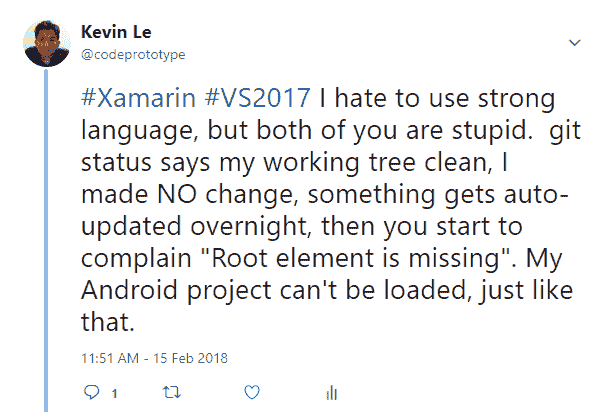
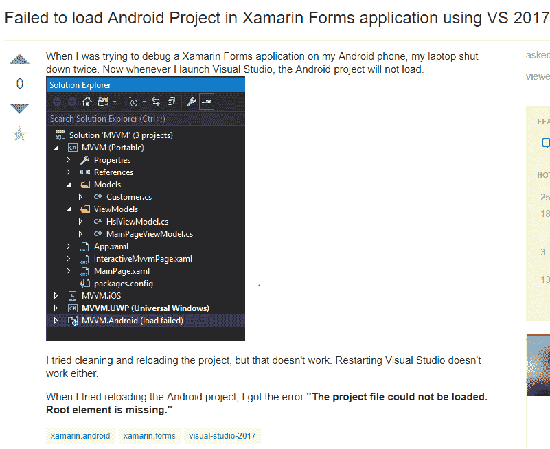
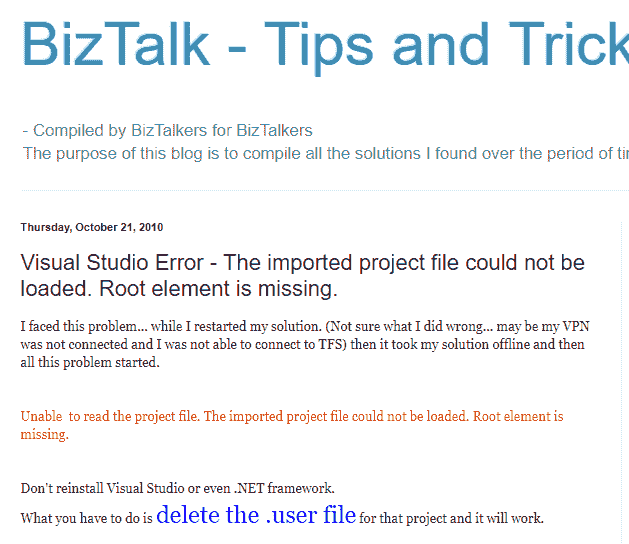

# Xamarin 表单应用程序无法加载 Android 项目。缺少根元素。

> 原文：<https://dev.to/codeprototype/xamarin-form-application-failed-to-load-android-project-root-element-missing--27o0>

因为我负责移动客户端、web 应用程序和服务器端节点，所以我在它们之间来回切换。我上一次接触移动代码(使用 Xamarin Forms 实现)是在上周。那时我创建了一个档案，并提交给了 Google Play 和苹果应用商店。两个都被接受了。

我的 Windows 10 几天前自动更新了。然后今天早上，我试图打开我的 VS2017 解决方案，我得到了 VS 2017 无法加载 Android 项目的错误。“缺少根元素”。我试过 Xamarin 工作室。同样的事情发生了。好的，重启电脑。还是失败了。

所以还是很有耐心，我谷歌了一下。有人建议。csproj 缺少根元素。好的，但是如果我没有接触文件，它怎么会丢失一个根元素。做一个`git status`确认什么都没有改变。反正我开了，`cntrl-A`，`cntrl-C`，去 https://www.xmlvalidation.com，`cntrl-V`。已验证 XML，未发现错误。

我开始变得沮丧，只是喊道:

[T2】](https://res.cloudinary.com/practicaldev/image/fetch/s--hfnMZoYz--/c_limit%2Cf_auto%2Cfl_progressive%2Cq_auto%2Cw_880/https://thepracticaldev.s3.amazonaws.com/i/yv2g23es3zbdstd2m4qi.png)

顺便说一句，这不是我第一次被 Xamarin 烧伤。这只是我第一次决定记录。

我又搜索了一些。似乎有人遇到了同样的问题，并在 StackOverflow 上发布了[同样的问题。不幸的是没有答案。](https://stackoverflow.com/questions/44871798/failed-to-load-android-project-in-xamarin-forms-application-using-vs-2017?rq=1)

[T2】](https://res.cloudinary.com/practicaldev/image/fetch/s--kKQKtFnQ--/c_limit%2Cf_auto%2Cfl_progressive%2Cq_auto%2Cw_880/https://thepracticaldev.s3.amazonaws.com/i/k4aympvqkqvytckwd45x.png)

谷歌了一下。试过了。还是没有成功。重复一遍。我拒绝做的一件事是卸载并重新安装 VS2017。谁知道那要花多少时间。

直到我发现了这篇 [BizTalk 提示和技巧文章](http://msbiztalk.blogspot.com/2010/10/visual-studio-error-imported-project.html)。

[T2】](https://res.cloudinary.com/practicaldev/image/fetch/s--WGEzZe-e--/c_limit%2Cf_auto%2Cfl_progressive%2Cq_auto%2Cw_880/https://thepracticaldev.s3.amazonaws.com/i/x08xpf2bn4g6begvtol7.png)

长话短说，我重命名了`.Droid.csproj.user`，有效地愚弄了 VS2017，使我删除了它，并重新加载了 Android 项目。作品。

总之，2010 年 BizTalk 上的一篇文章，在 VS2017 诞生之前，在 2018 年解决了 VS2017 Xamarin 的一个错误。去想想。

为 Xamarin 辩护，当它起作用时，它的作用很大。直到任何更新，无论是 Xamarin 更新，VS 更新，。NET update 或 Windows update。

好了，让我来回答一下 8 个月前提出的 StackOverflow 问题，但仍然没有答案。感谢 BizTalk 博客帖子。