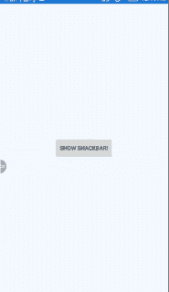
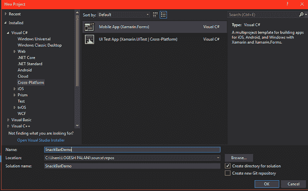
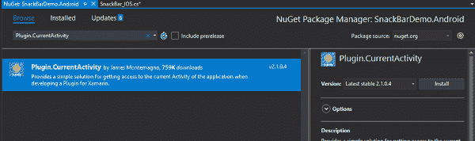

# Xamarin。Forms -如何一步步使用 DependencyService 制作 SnackBar

> 原文：<https://dev.to/logeshpalani98/xamarin-forms-how-to-make-snackbar-using-dependencyservice-step-by-step-19b0>

**简介**

这篇文章演示了如何使用 Xamarin 中的 DependencyService 在 Android 应用程序中制作 SnackBar。表单应用程序。它只支持 Android 设备，不能支持 IOS 应用。

**NuGet 包-搜索 Xamarin。安卓**

*   插件。电流活动性

**Xamarin。安卓输出**

|  |
| Xamarin。机器人|

**先决条件**

*   [Visual Studio 2017](https://www.visualstudio.com/)
*   这个示例项目只针对 Android 和经过测试的 Android 设备

开始吧！

**第一步**

你可以创建一个新的 Xamarin。通过进入文件> >新建> > Visual C# > >跨平台> >跨平台 App (Xamarin。表单或 Xamarin。Native)并给出解决方案名称，然后单击 OK。

(例如-项目名称- SnackBarDemo)

|  |
|图 1 新增项目

**第二步**

项目创建后，在 Xamarin 中声明一个 DependencyService 接口。窗体 PCL 项目，我们可以从我们的 PCL 项目中调用这个接口。为此，转到解决方案资源管理器>>单击 SnackBarDemo(PCL)项目>>右键单击并选择添加>>，然后在弹出窗口中选择新项目> >，向下滚动并选择接口> >将名称命名为 SnackInterface，然后单击确定。下面是这个接口的代码。

**C#代码**

**第三步**

现在，我们要在 MainPage 中设计一个带有点击事件的按钮。Xaml 页面。为此，进入解决方案浏览器>>SnackBarDmeo(PCL)>>点击打开主页。Xaml 并添加以下代码。

**Xaml 代码**

**第四步**

下一步将在 PCL 项目中实现 DependencyService 接口。为此，请转到解决方案资源管理器> > SnackBarDemo(PCL)> >单击打开 MainPage.xaml.cs 并添加以下代码。

**C#代码**

**第五步**

然后，将下面的 NuGet 包添加到我们的 Xamarin 中。安卓项目。

*   插件。电流活动性

|  |
|图 2 Nuget 包|

为此，请打开解决方案资源管理器并选择您的 Xamarin。Andriod 项目解决方案。右键单击并选择“管理 nuget 包”。在弹出窗口中，导航“浏览”选项卡并浏览“插件”。CurrentActivity”并选择下面的 nuget 包，然后安装它。

**第六步**

接下来，我们用 Xamarin 实现接口。安卓项目。为此，请转到解决方案资源管理器>>选择 SnackbarDemo。Android 项目，右键单击并选择添加，然后选择新项目。在弹出窗口中，选择 class 并将其命名为 SnackBar_Android.cs，然后添加以下程序集和代码。

**C#代码**

**第七步**

现在，添加另一个名为 MainApplication 的类，下面是代码。在这段代码中，定义覆盖 OnCreate 方法并调用“Init”方法。

**C#代码**

**第 8 步**

最后，进入“构建”菜单，点击“配置管理器”。在这里，配置您的启动项目。单击“F5”或开始构建并运行您的应用程序。

几秒钟后，应用程序将开始在 Android 模拟器或仿真器上运行，我们将看到应用程序成功工作。

|  |
|【输出】

最终结果将如下所示。

* * *

完整的源代码可以在这里找到[。](https://github.com/logeshpalani98/SnackBar)