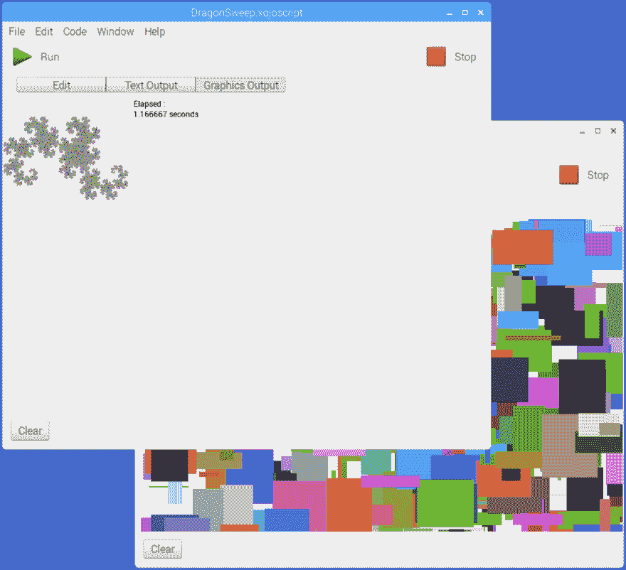
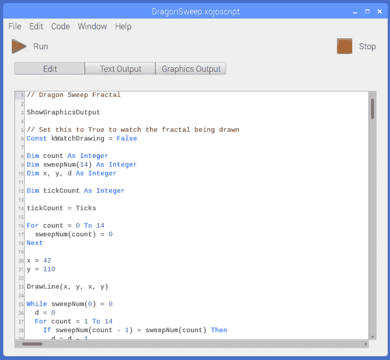
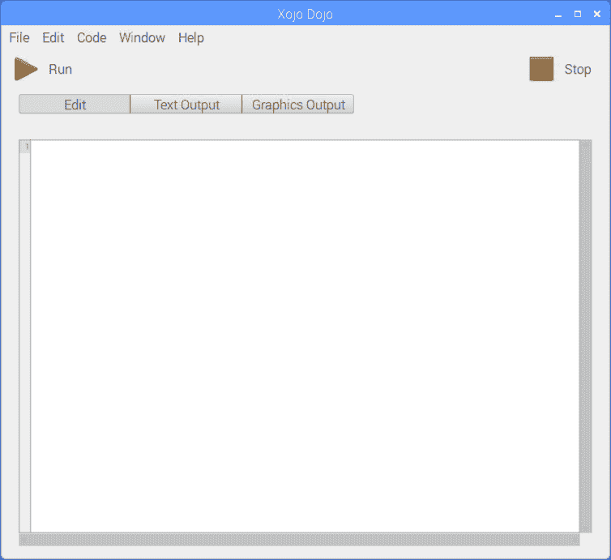

# xojo Dojo——编程树莓 Pi 的免费而简单的方法

> 原文：<https://dev.to/lefebvre/xojo-dojo---free-and-easy-way-to-program-raspberry-pi-44ga>

Xojo Dojo 是一个在 Raspberry Pi 上开始编程的免费且简单的方法。有了 Xojo Dojo，你可以使用 Xojo 编程语言，以及一些其他特殊的命令来制作简单的 Pi 程序，这些程序可以使用文本、图形和 GPIO。

[下载 Xojo 道场](http://cdn.xojo.com/Documentation/XojoDojo-a1.zip)

[T2】](https://res.cloudinary.com/practicaldev/image/fetch/s--o6cx4-qh--/c_limit%2Cf_auto%2Cfl_progressive%2Cq_auto%2Cw_880/https://dzf8vqv24eqhg.cloudfront.net/userfiles/1539/2321/ckfindimg/XojoDojo.png)

[T2】](https://res.cloudinary.com/practicaldev/image/fetch/s--eXY3CVs6--/c_limit%2Cf_auto%2Cfl_progressive%2Cq_auto%2Cw_880/https://dzf8vqv24eqhg.cloudfront.net/userfiles/1539/2321/ckfindimg/XojoDojoDragonCode.png)

## 开始使用

将 Xojo Dojo 下载到您的 Raspberry Pi 并解压缩。转到 XojoDojo 文件夹，双击 XojoDojo 可执行文件。

**如果该文件未被标记为可执行文件，您可能需要通过右键单击该文件并选择“属性”来手动执行此操作。切换到权限选项卡，在访问控制部分，确保可执行文件设置为“任何人”。单击确定。**

当 Xojo Dojo 启动时，它会显示一个代码编辑器的空窗口。

[T2】](https://res.cloudinary.com/practicaldev/image/fetch/s--SPFchfk6--/c_limit%2Cf_auto%2Cfl_progressive%2Cq_auto%2Cw_880/https://dzf8vqv24eqhg.cloudfront.net/userfiles/1539/2321/ckfindimg/XojoDojoMain.png)

你可以输入一些代码开始。例如，这个简单的代码显示文本:

```
Print "Hello, World!" 
```

Enter fullscreen mode Exit fullscreen mode

键入代码，然后单击工具栏中的运行。Xojo Dojo 将切换到 Text 选项卡，您将看到输出“Hello，World！”。

Xojo Dojo 包括几个示例项目，向您展示它的一些命令和功能。要查看示例项目，请在“文件”菜单中单击“打开”,然后转到 XojoDojo 文件夹中的“脚本”文件夹。以下是包含的示例:

*   **Bounce** :一个图形演示程序，它画了一个球，当它在屏幕上反弹时会留下一条彩色的轨迹。按下工具栏上的停止按钮，停止演示。
*   一个图形演示程序，在屏幕上画出 1000 个不同大小的彩色盒子。
*   **BubbleSort** :冒泡排序算法的实现。
*   **骰子滚动**:模拟两个骰子滚动一定的次数，然后告诉你每个骰子的总数出现的频率。
*   **DragonSweep** :绘制分形“龙”的图形演示。基于来自 Compute 的 IBM PCjr BASIC 程序！杂志 1986 年 3 月。
*   **GPIOAlarm** :使用 GPIO 将压电扬声器连接到您的 Pi，这个程序使它听起来像一个闹钟。[查看接线图](https://medium.com/r/?url=http%3A%2F%2Fdeveloper.xojo.com%2Frpi-using-a-buzzer)。
*   **GPIOButtonLED** :用一个 a 按钮和 LED 用 GPIO 连线到你的 Pi，这个程序在按钮被按下的时候点亮 LED。[查看接线图](https://medium.com/r/?url=http%3A%2F%2Fdeveloper.xojo.com%2Fbutton-led-circuit)。
*   **GPIOLEDBlink** :用 GPIO 把 LED 接到你的 Pi 上，这个程序让 LED 闪烁。[查看接线图](http://developer.xojo.com/creating-an-led-circuit)。
*   **GPIOTune** :使用 GPIO 将压电扬声器连接到您的 Pi，该程序播放一首短曲子。[查看接线图](https://medium.com/r/?url=http%3A%2F%2Fdeveloper.xojo.com%2Frpi-using-a-buzzer)。
*   **GuessTheNumber** :试着猜一个程序挑选的数字。
*   **HelloWorld** :文本的简单显示。
*   **LongLoop** :输出文本的长时间运行的循环。
*   **MazePattern** :显示一个看起来像迷宫的文本输出(但不是迷宫)。基于 10 版 Commodore 64 BASIC 程序。
*   **奥林匹克**:绘制奥林匹克五环。
*   **ShowPicture** :提示您选择硬盘上的图片并显示。
*   **筛子**:计算 80 年代流行的标杆程序厄拉多塞的筛子。
*   **正弦波**:显示基于文本的正弦波。

## Xojo 道场命令

Xojo Dojo 使用 XojoScript，因此可以使用属于 Xojo 的所有语言命令。Xojo Dojo 不能使用任何 Xojo 框架。

Xojo Dojo 有自己可以使用的定制命令集，如下所述。

### cleargraphicstput

清除图形输出屏幕。

### clear textoutoutput

清除文本输出屏幕。

### 画线(x1 为整数，y1 为整数，x2 为整数，y2 为整数)

从位置 x1，y1 到位置 x2，y2 绘制一条直线。

### DrawOval(x 为整数，y 为整数，w 为整数，h 为整数)

在 x，y 位置绘制一个椭圆，使用 w 和高度 h。要绘制一个圆，使 w 和 h 相同。

### DrawPicture(x 为整数，y 为整数，picturePath 为字符串)

在指定路径的 x，y 位置画图。

### DrawRect(x 为整数，y 为整数，w 为整数，h 为整数)

使用宽度 w 和高度 h 在 x，y 位置绘制一个矩形。

### 拉带(s 为字符串，x 为整数，y 为整数，w 为整数= 0，condense 为 Boolean = False)

在图形屏幕上的 x，y 位置绘制一个字符串 s。可以选择指定一个宽度，以及如果字符串不适合时是否压缩。

### EndOfLine 为字符串

用于字符串的行尾字符。

### EndTimer 为 Double

停止由 StartTimer 启动的计时器，返回经过时间的毫秒数。

### FillOval(x 为整数，y 为整数，w 为整数，h 为整数)

在 x，y 位置绘制一个实心椭圆，使用 w 和高度 h。要绘制一个圆，使 w 和 h 相同。使用 ForeColor 命令更改填充颜色。

### FillRect(x 为整数，y 为整数，w 为整数，h 为整数)

使用宽度 w 和高度 h 在 x，y 位置绘制填充矩形矩形，使用 ForeColor 命令更改填充颜色。

### 前景色(指定 c 为颜色)

设置用于绘制和填充命令的颜色。

### GPIODigitalRead(pin 为整数)为整数

从 GPIO 引脚读取值。

### GPIODigitalWrite(引脚为整数，模式为整数)

向 GPIO 引脚写入一个值。

### GPIOPinMode(引脚为整数，模式为整数)

将 GPIO 引脚设置为输入或输出。

初始化 GPIO。 [WiringPi 库](http://wiringpi.com)必须安装在 Pi 上。

### GPIOSoftToneCreate(pin 为整数)为整数

为大头针设置音调。

### GPIOSoftToneWrite(pin 为整数，freq 为整数)

向 pin 发送声音。

### GPIO_INPUT

与 GPIO DigitalRead 和 DigitalWrite 命令一起使用，表示一个引脚用于输入。

### GPIO_OFF

与 GPIO DigitalRead 和 DigitalWrite 命令一起使用，表示引脚关闭。

### GPIO_ON

与 GPIO DigitalRead 和 DigitalWrite 命令一起使用，表示某个管脚已打开。

### [T1】GPIO _ OUTPUT](#gpiooutput)

与 GPIO DigitalRead 和 DigitalWrite 命令一起使用，表示一个引脚用于输出。

### random nt(start value 为整数，endValue 为整数)为整数

生成 startValue 和 endValue 之间的随机整数。

### 表现图形处理

切换到图形输出屏幕。

### 启动计时器

启动计时器。

### 用户取消为布尔型

当用户单击工具栏上的“停止”按钮时，返回 True。用它来结束长循环运行的程序。

### 等待(ms As Double = 10)

暂停程序执行。默认值为 10 毫秒，但是您可以指定自己的值。

## 了解更多关于 Xojo 和树莓派的信息

如果你想为 Raspberry Pi 制作功能齐全的应用程序，你可以尝试完整版的 Xojo。你也可以去看看免费的书:[用 Xojo 编程树莓 Pi](http://developer.xojo.com/pibook)和用户指南的[树莓 Pi 专题。](http://developer.xojo.com/userguide/raspberry-pi)