# 您的软件存在严重的安全漏洞，但您还不知道！

> 原文：<https://dev.to/julientopcu/you-have-critical-security-vulnerabilities-in-your-software-but-you-don-t-know-it-yet-4p3m>

先说一些数字<sup id="fnref-77-1">[1](#fn-77-1)</sup><sup id="fnref-77-2">T5】2</sup>:

> 44%的应用程序在开源组件中包含严重漏洞。
> 
> 88%的 Java 应用程序在一个组件中至少有一个漏洞。

挺吓人的！除非您对第三方的漏洞有一个跟踪过程，否则您的软件很可能存在严重的安全漏洞。

# 食物不是坏人！

还记得《异形》电影中的这个场景吗？你可以看到人们围着桌子吃饭，其中一个人感觉非常非常糟糕。他周围的人都不明白发生了什么事。突然一个婴儿形态的外星人刺穿了他的胸膛！很可怕，不是吗？

您应该看到隐藏的漏洞，就像潜伏在应用程序中的外星胚胎。而且出来的时候可能会很疼。

为了避免这种情况，您将在这里学习:

*   如何识别这些外星人并评估他们的危险性？
*   如何检测它们是否已经感染了你的依赖项，以及如何跟踪它们。

# 了解自己的性格…

[T2】](https://res.cloudinary.com/practicaldev/image/fetch/s--LWGIW0PX--/c_limit%2Cf_auto%2Cfl_progressive%2Cq_auto%2Cw_880/https://beyondxscratch.files.wordpress.com/2018/08/lineup.jpg%3Fw%3D1000)

所有公开已知的漏洞都在互联网上公布为**普通** **漏洞** **和** **暴露**也叫 CVE。这基本上是一个由 [MITRE Corporation](https://www.mitre.org/) 标准化的结构化报告，具有唯一的 ID，例如 [CVE-2014-0160](https://nvd.nist.gov/vuln/detail/CVE-2014-0160) 。

在这些报告中，您可以找到:

*   漏洞描述，其中还列出了受影响的组件及其易受攻击的版本。
*   它的批判性(我们将在后面讨论)和对被感染软件的影响——它对你的伤害有多严重。
*   提供漏洞更多详细信息的超链接列表，可以是发现漏洞的人员的分析和/或组件所有者的官方建议，其中可能包括修补程序。

美国政府将这些 CVE 编入 **[NIST 国家漏洞数据库](https://nvd.nist.gov/)** (完全公开)，并通过 SCAP 协议公开。SCAP 支持像 [OWASP 依赖检查](https://www.owasp.org/index.php/OWASP_Dependency_Check) & [OWASP 依赖跟踪](https://dependencytrack.org/)这样的安全工具来检测第三方内部的漏洞。

MITRE 公司还维护一个软件弱点类型的[字典](https://cwe.mitre.org/)(**常见弱点枚举)**，例如:

*   **[CWE-326](https://cwe.mitre.org/data/definitions/326.html) :** **不足** **加密** **强度**
*   **[CWE-321](https://cwe.mitre.org/data/definitions/321.html) :使用硬编码密码** **密钥**

在每份 CVE 报告中，您将会看到一个被漏洞利用的 CWE 弱点列表。它也被 [SASTs](https://www.gartner.com/it-glossary/static-application-security-testing-sast) 用来以一种标准的方式向你提供你的应用程序的弱点。对于每一个弱点，CWE 网站都为你提供了描述和一些说明性的例子。

报告漏洞很好，但是您怎么知道漏洞有多重要呢？

## 里氏震级

[T2】](https://res.cloudinary.com/practicaldev/image/fetch/s--lnS2uVE1--/c_limit%2Cf_auto%2Cfl_progressive%2Cq_auto%2Cw_880/https://beyondxscratch.files.wordpress.com/2018/09/green_man_x_thanos_3.png%3Fw%3D1000)

为了评价一个漏洞的批判性，我们有一种“里氏震级”命名为**普通** **漏洞** **计分** **系统**。first.org[提供的 CVSS 是一个开放的行业标准。](https://www.first.org/)

它使用一些标准来计算 0 到 10 之间的漏洞分数，例如我们是否需要通过身份验证才能利用漏洞，或者所披露的信息有多机密。其中 0 表示“那没什么”，10 表示“你有大麻烦了”。

一个 CVSS 计算器可以在网上买到。

# 战术背包

现在你对“如何识别那些外星人并评估他们的危险性”了如指掌。现在让我们看看如何使用 [OWASP 依赖检查](https://www.owasp.org/index.php/OWASP_Dependency_Check)、 [OWASP 依赖跟踪](https://dependencytrack.org/)和 Jenkins 来构建我们的第一个#DevSecOps 连续安全管道，以便检测那些外星人并追踪他们！

[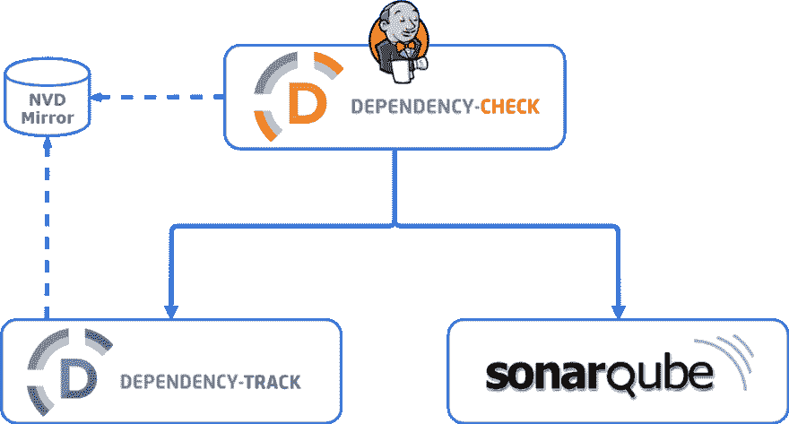T2】](https://res.cloudinary.com/practicaldev/image/fetch/s--lyxlOVEO--/c_limit%2Cf_auto%2Cfl_progressive%2Cq_auto%2Cw_880/https://beyondxscratch.files.wordpress.com/2018/08/dependencytrack.png%3Fw%3D1000)

> 所有这些工具都是开源软件，所以把它们放到 github 上吧！
> 
> [https://github.com/jeremylong/DependencyCheck](https://github.com/jeremylong/DependencyCheck)
> 
> [https://github.com/DependencyTrack/dependency-track](https://github.com/DependencyTrack/dependency-track)

依赖检查是一个专门用于分析你的依赖关系的工具。对于其中的每一个，它查询国家脆弱性数据库，以核实是否有一些 CVE 已被报告。依赖性检查目前支持 Java 和。NET 依赖项分析，并拥有针对 Python、Ruby、PHP 和 Node.js 应用程序的实验性分析器。这个工具有不同的形式:命令行、Ant 任务、Maven/Graddle 插件和 Jenkins 插件。为了构建我们的第一个持续安全管道，我们将在这里只关注 Jenkins 插件，它非常容易使用和设置。

DependencyCheck 报告可以发布到 SonarQube 或 Dependency-Track。我们还将关注 Dependency-Track，这是一个全新的工具，专门用于跟踪应用程序中检测到的漏洞。

# 引入依赖-跟踪

<figure>[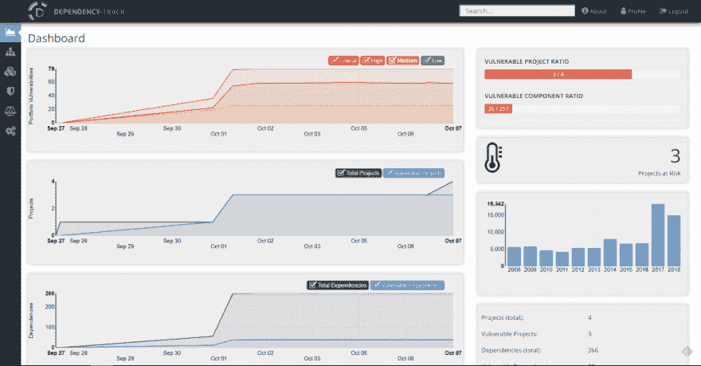](https://res.cloudinary.com/practicaldev/image/fetch/s--gS8K-BSe--/c_limit%2Cf_auto%2Cfl_progressive%2Cq_auto%2Cw_880/https://beyondxscratch.files.wordpress.com/2018/09/dt-overview.png%3Fw%3D1000) 

<figcaption id="caption-attachment-510">依赖-轨迹概述</figcaption>

</figure>

Dependency-Track 是一个[软件组合分析(SCA)](https://resources.whitesourcesoftware.com/blog-whitesource/software-composition-security-analysis) 工具。简而言之，它为您带来了您的应用程序组合使用的所有开源组件(漏洞和许可证)的可见性。这里我们将只关注他的漏洞管理系统。该系统集成了多个漏洞数据库，如用于基于 javascript 的项目的[国家漏洞数据库](https://nvd.nist.gov/)和 [NPM 公共咨询](https://www.npmjs.com/advisories)。Dependency-Track 的主页是一个总结整个投资组合的指标和分析趋势的全球网站。最让我们感兴趣的是`Projets`页面。

[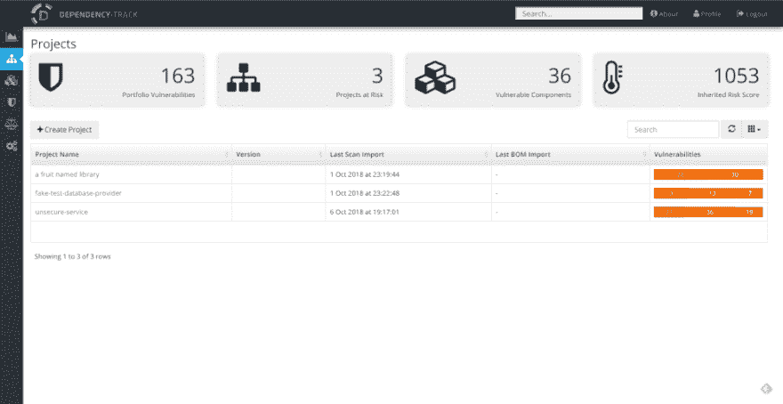T2】](https://res.cloudinary.com/practicaldev/image/fetch/s--rr1C9iB4--/c_limit%2Cf_auto%2Cfl_progressive%2Cq_auto%2Cw_880/https://beyondxscratch.files.wordpress.com/2018/09/dt-projects.png%3Fw%3D1000)

在这里，您可以找到您的投资组合的所有分析应用。对于其中的每一个，您都会得到所发现的潜在漏洞的汇总。红色表示重要的数字，橙色表示高的数字，黄色表示中等的数字。

让我们单击一个应用程序名称来发现其相关的控制面板。

[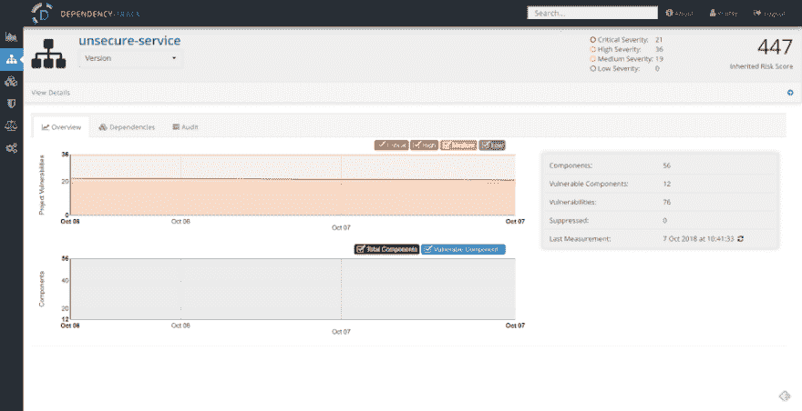T2】](https://res.cloudinary.com/practicaldev/image/fetch/s--TiGvjNZE--/c_limit%2Cf_auto%2Cfl_progressive%2Cq_auto%2Cw_880/https://beyondxscratch.files.wordpress.com/2018/09/dt-project-dashboard.png%3Fw%3D1000)

在这个专用于单个应用程序的页面上，您可以看到其所有的`Dependencies`视图和用于管理漏洞的`Audit`视图。当访问`Dependencies`标签时，你会得到你的软件中使用的所有库及其版本。

[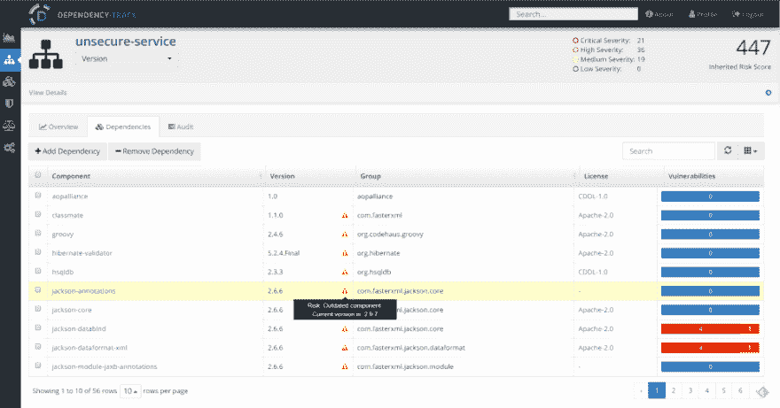T2】](https://res.cloudinary.com/practicaldev/image/fetch/s--tBLjC7xb--/c_limit%2Cf_auto%2Cfl_progressive%2Cq_auto%2Cw_880/https://beyondxscratch.files.wordpress.com/2018/09/dt-project-dependencies.png%3Fw%3D1000)

对于其中的每一个，应用程序中嵌入的版本都显示了已知漏洞的数量。这里一个很酷的特性是黄色的警告符号，当有新版本的依赖项可用时就会出现。正如你所注意到的，截图中被分析的项目是一个 maven 项目，Dependency-Track 正在查询 [maven central repository](https://search.maven.org) 来检索一个产品的最新发布版本。

战争的核心是观点。

[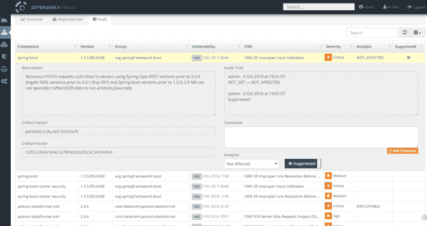T2】](https://res.cloudinary.com/practicaldev/image/fetch/s--hBmn9r9z--/c_limit%2Cf_auto%2Cfl_progressive%2Cq_auto%2Cw_880/https://beyondxscratch.files.wordpress.com/2018/09/dt-project-audit.png%3Fw%3D1000)

这里列出了您的依赖项版本的所有已知漏洞及其 CVE 标识符和严重性。您必须知道**这并不是因为某个组件上存在已知的漏洞，所以您实际上是易受攻击的**。您必须逐一检查，以确定该漏洞在您自己的案例中是否可被利用。

通过点击漏洞线，您就开始了审查过程。显示漏洞的描述，在您检查之后，您可以在`Analysis`中设置状态。您可以在这里选择[记录的分析状态。](https://docs.dependencytrack.org/triage/analysis-states/)

当您确定某个漏洞是误报或者不影响您的软件时，您可以通过单击抑制按钮[抑制](https://docs.dependencytrack.org/triage/suppression/)它。因此，在不同的仪表板中将不再考虑这一点。

在您的应用程序中，如果您将依赖项更新到正在修复漏洞的版本，依赖项检查将不再报告该漏洞，并且该漏洞将从依赖项跟踪中消失。

如果您单击漏洞的 CVE 标识符，也可以获得关于漏洞的更多信息。

[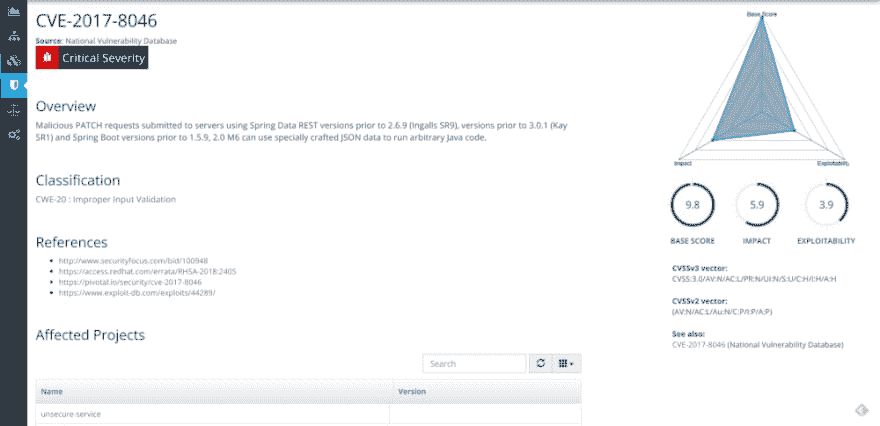T2】](https://res.cloudinary.com/practicaldev/image/fetch/s--t6H2N1RR--/c_limit%2Cf_auto%2Cfl_progressive%2Cq_auto%2Cw_880/https://beyondxscratch.files.wordpress.com/2018/09/dt-cve.png%3Fw%3D1000)

这主要是 CVE 报告的信息。CVSS 分数显示为右侧的`Base Score`。

Dependency-Track 还在`Components`选项卡中提供了整个投资组合中使用的所有依赖关系的汇总视图。

[T2】](https://res.cloudinary.com/practicaldev/image/fetch/s--_TYF00dw--/c_limit%2Cf_auto%2Cfl_progressive%2Cq_auto%2Cw_880/https://beyondxscratch.files.wordpress.com/2018/09/dt-components.png%3Fw%3D1000)

这个视图的主要特点是能够检查整个投资组合的漏洞。当您想要抑制几个应用程序中报告的误报/未受影响的漏洞时，这非常有用。为此，单击依赖项的名称，转到`Vulnerabilites`选项卡并激活`Audit Mode`

[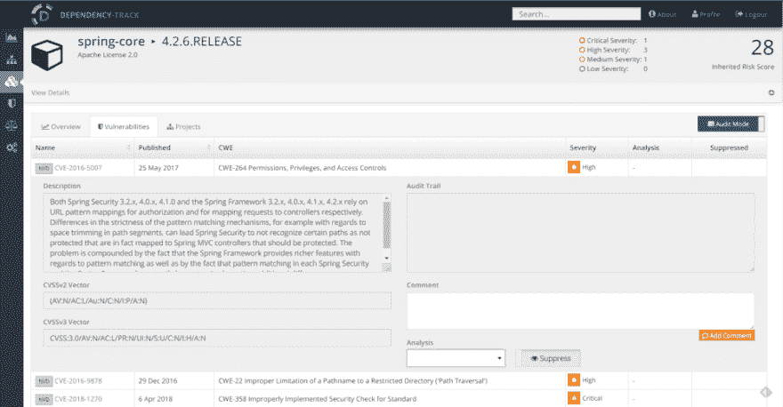T2】](https://res.cloudinary.com/practicaldev/image/fetch/s--cB3fZYjq--/c_limit%2Cf_auto%2Cfl_progressive%2Cq_auto%2Cw_880/https://beyondxscratch.files.wordpress.com/2018/09/dt-components-audit.png%3Fw%3D1000)

但是**小心你正在做的事情，以避免任何规模的假阴性**！请注意，您不能选择将要设置分析状态的项目，该状态将针对整个投资组合进行全局设置。`Projects`选项卡将显示所有发现该漏洞的项目。

Dependency-Track 定期更新 NVD 数据库的镜像。因此，如果报告了新的漏洞，它将自动更新软件的漏洞报告。显然，如果一个新的依赖项或者一个依赖项版本在你的代码库中发生了变化，Dependency-Track 不会知道。将需要新的依赖性检查分析来通知依赖性跟踪。

需要一些 ChatOps 功能吗？依赖跟踪可以[通知你最喜欢的聊天工具](https://docs.dependencytrack.org/integrations/notifications/)！

# 复习提示&招数

**假阳性？**您可能已经看到可以将漏洞设置为误报，但这怎么可能呢？有时候，CVE 报告对于受影响的组件不够精确。因此，由于您使用的是相关的数据库驱动程序，因此您的软件上可能会报告与数据库服务器相关的漏洞。

与漏洞作斗争。您将会看到，有时很难判断您的软件是否真的存在漏洞。您可以简单地将您的依赖项更新到漏洞已修复的版本，而不必在调查中投入大量精力。事实上，如果新版本不需要重写应用程序的大部分，这应该是默认的行为。依赖性越老，风险就越高。

* *已发现漏洞，但您获得的是受影响组件的最新版本。** 首先要做的是寻找漏洞的批判性和可利用性，这基本上是由 CVE 专用页面上的依赖跟踪给出的。

[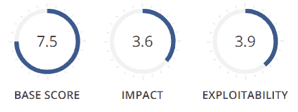T2】](https://res.cloudinary.com/practicaldev/image/fetch/s--UT7YcTmp--/c_limit%2Cf_auto%2Cfl_progressive%2Cq_auto%2Cw_880/https://beyondxscratch.files.wordpress.com/2018/09/dt-cvss.png%3Fw%3D1000)

如果漏洞得分低、影响小且难以利用，您可能会冒险等待组件的新版本。但是如果这很重要，你可以在 CVE 报告的链接中找到一个解决方法。

您还应该重新考虑使用那些不再维护或响应不足以纠正已知漏洞的框架。

# 迈出#DevSecOps 的第一步！

### T2】

在您的 Jenkins 实例中安装这个[插件](https://wiki.jenkins.io/display/JENKINS/OWASP+Dependency-Check+Plugin)。如果你还没有任何詹金斯，你可以使用 [docker](https://github.com/jenkinsci/docker/blob/master/README.md) 轻松设置一个。

> 默认情况下，依赖性检查将为每个 Jenkins 作业下载 NVD 数据库**的本地副本。这个过程可能很长(> 10 分钟)，所以建议配置一个专门的作业来下载和更新共享数据库。出于测试目的，您可以跳过共享数据库设置。**

在**Manage Jenkins**>**Configure System**>**Dependency-Check>Global Data Directory**中，设置一个所有作业共享的目录路径来存放数据库。

[T2】](https://res.cloudinary.com/practicaldev/image/fetch/s--p7UkTm6K--/c_limit%2Cf_auto%2Cfl_progressive%2Cq_auto%2Cw_880/https://beyondxscratch.files.wordpress.com/2018/08/dc-globalshareddir.png%3Fw%3D1000)

使用**一个自由格式的 jenkins 作业**设置一个专用的 NVD 数据库更新作业，并将其配置如下:

[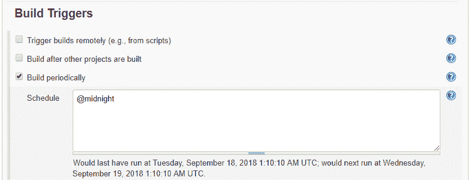T2】](https://res.cloudinary.com/practicaldev/image/fetch/s--HntvBMDj--/c_limit%2Cf_auto%2Cfl_progressive%2Cq_auto%2Cw_880/https://beyondxscratch.files.wordpress.com/2018/09/dc-nvd-update-trigger.png%3Fw%3D1000)

构建触发器将确保作业每天只在夜间启动一次。不需要更频繁地更新本地 NVD 数据库。现在添加一个新的构建步骤`Invoke Dependency-Check update only`。

[T2】](https://res.cloudinary.com/practicaldev/image/fetch/s--9Qk1XGIZ--/c_limit%2Cf_auto%2Cfl_progressive%2Cq_auto%2Cw_880/https://beyondxscratch.files.wordpress.com/2018/09/dc-nvd-update-build.png%3Fw%3D1000)

这个构建步骤将只更新本地 NVD 数据库。您不需要指定包含数据库转储的 _Data 目录，因为您之前已经对其进行了全局设置。

手动运行它以启动数据库。

由于这个原因，您拥有了一个本地 NVD 数据库实例，它可以在您的所有作业之间共享。

现在您可以创建您的第一个分析作业了！这里你只需要一个收集应用程序所有依赖项的作业，你可以使用`mvn dependency:copy-dependencies`直接下载它们，或者打开你的 Spring Boot jar。

更好的是:如果您使用的是基于 NPM 或 Maven 的应用程序，您不必指定任何内容。该插件将自动检测并扫描`package.json`或`pom.xml`文件。

假设您的所有依赖项都聚集在 **target/deps/lib/** 中，只需添加下面的* *构建后步骤** 来指定依赖项检查要扫描的路径。

[T2】](https://res.cloudinary.com/practicaldev/image/fetch/s--nPo_vkF4--/c_limit%2Cf_auto%2Cfl_progressive%2Cq_auto%2Cw_880/https://beyondxscratch.files.wordpress.com/2018/09/dc-postbuildstep.png%3Fw%3D1000)

> 注意:如果你正在构建一个 SpringBoot 应用，你可以解包你的 jar，你的依赖项将被捆绑在**BOOT-INF/lib/**(spring-BOOT-maven-plugin≥1.4)或者直接**lib/**(spring-BOOT-maven-plugin<1.4)中。
> 
> 作为替代，您可以使用[依赖检查-maven-plugin](https://jeremylong.github.io/DependencyCheck/dependency-check-maven/index.html) ，这需要更多一点的配置。额外的依赖检查集成在[这里](https://www.owasp.org/index.php/OWASP_Dependency_Check)可用。

在分析结束时，将生成*dependency-check-report . XML*。您可以通过添加下面的**构建后动作**来请求依赖检查插件在 jenkins 作业中发布它:

[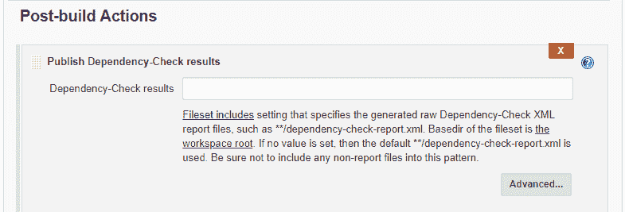T2】](https://res.cloudinary.com/practicaldev/image/fetch/s--aIPcj4C0--/c_limit%2Cf_auto%2Cfl_progressive%2Cq_auto%2Cw_880/https://beyondxscratch.files.wordpress.com/2018/09/dc-postbuildaction.png%3Fw%3D1000)

结果，你会得到一个新的菜单* *依赖检查你工作中的漏洞** 。您将能够在这里看到哪些依赖关系有已知的漏洞。

[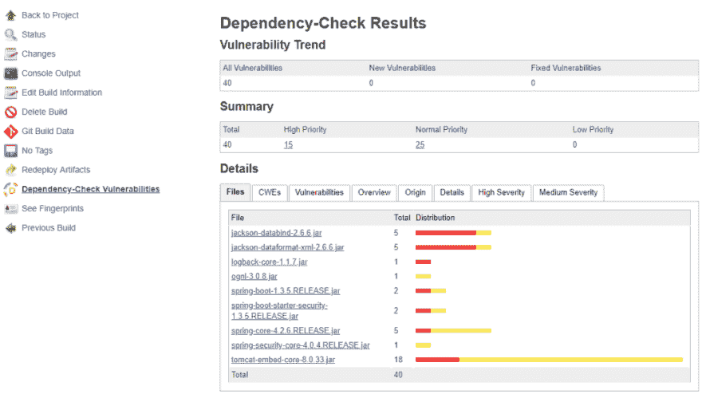T2】](https://res.cloudinary.com/practicaldev/image/fetch/s--hiADBw9z--/c_limit%2Cf_auto%2Cfl_progressive%2Cq_auto%2Cw_880/https://beyondxscratch.files.wordpress.com/2018/09/dc-published-report.png%3Fw%3D1000)

我们不会在这里挖掘太多，因为 Jenkins 视图是依赖跟踪提供的精简版。在詹金斯你只能探索报告的内容。通过依赖跟踪，您将能够对这些漏洞进行分类。

[T2】](https://res.cloudinary.com/practicaldev/image/fetch/s--_LZhuLo9--/c_limit%2Cf_auto%2Cfl_progressive%2Cq_auto%2Cw_880/https://beyondxscratch.files.wordpress.com/2018/08/dependency-track-logo-large.png%3Fw%3D351%26h%3D111)

Dependency-Track 提供了一个 docker 映像:

> 依赖跟踪容器**需要 4GB 的内存**，确保相应地配置 docker(默认为 2GB)。

```
docker pull owasp/dependency-track
docker volume create --name dependency-track 
​docker run -d -p 8080:8080 --name dependency-track -v dependency-track:/data owasp/dependency-track 
```

这个 docker 映像允许使用嵌入式 h2 数据库以独立模式运行 Dependency-Track。这对于测试来说非常方便，但是你**不应该将它**用于真正的持续安全管道。Dependency-Track 为生产模式提供了几个[数据库集成](https://docs.dependencytrack.org/getting-started/database-support/)。

Dependency-Track 还需要 NVD 数据库的本地副本。因此，在第一次运行时，数据库的初始下载可能需要一段时间。

你现在可以通过安装这个 [OWASP 依赖跟踪插件](https://wiki.jenkins.io/display/JENKINS/OWASP+Dependency-Track+Plugin)来集成 Jenkins 的依赖跟踪。

使用**[http://your-container-IP:8080](http://your-container-ip:8080)**连接到 Dependency-Track，并使用 **admin:admin** 登录。

要在 Dependency-Track 中创建一个新项目，单击左边的第二个图标，然后单击按钮`+ Create Project`。

[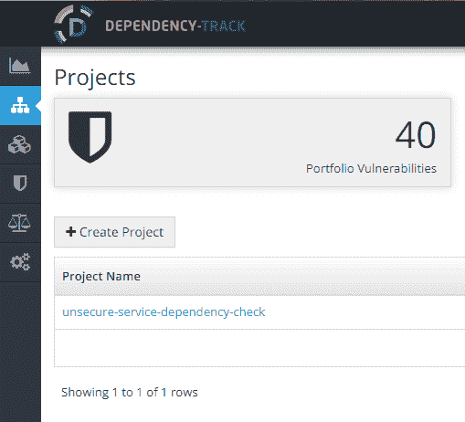T2】](https://res.cloudinary.com/practicaldev/image/fetch/s--xPvqXWJf--/c_limit%2Cf_auto%2Cfl_progressive%2Cq_auto%2Cw_880/https://beyondxscratch.files.wordpress.com/2018/09/dt-create-new-project.png%3Fw%3D1000)

应该会出现一个`Create Project`弹出窗口。作为项目名称，输入要分析的软件的名称；其他字段是可选的。

Jenkins 插件需要一个 API 密匙，要生成一个，进入**管理** **>访问管理>团队**页面(左边的齿轮图标)。在此页面中，您将能够管理依赖跟踪的用户及其权限。你也可以设置具有特定权限的用户团队，默认情况下，一个**自动化**团队被提供给需要与 Dependency-Track 交互的外部工具。

点击自动化团队，复制现有的 **API 键**(或者生成一个新的)。

[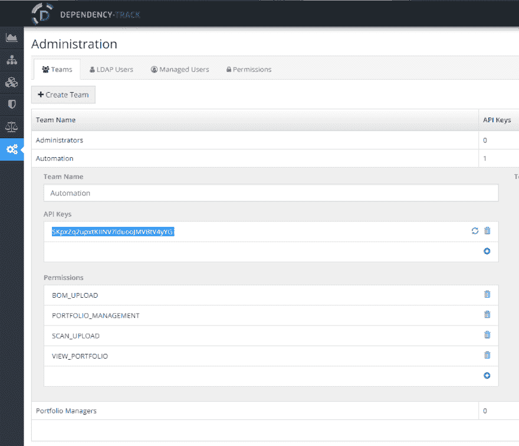T2】](https://res.cloudinary.com/practicaldev/image/fetch/s--fmeWEYYI--/c_limit%2Cf_auto%2Cfl_progressive%2Cq_auto%2Cw_880/https://beyondxscratch.files.wordpress.com/2018/09/dt-apikey1.png%3Fw%3D1000)

> 你将可以为每个团队生成 API 密匙，但不是所有的团队都有相同的权限。例如，在默认情况下，自动化团队提供足够的权限来上传一个扫描到 Dependency-Track (SCAN_UPLOAD)，这不是项目组合经理团队的情况。因此，这最后一个团队的 api 键不会启用扫描上传。

回到 Jenkins 并导航到**管理 Jenkins** > **配置系统** > **依赖跟踪**，在那里填写依赖跟踪的 URL 和 API 密钥。

[T2】](https://res.cloudinary.com/practicaldev/image/fetch/s--xGnWRh1M--/c_limit%2Cf_auto%2Cfl_progressive%2Cq_auto%2Cw_880/https://beyondxscratch.files.wordpress.com/2018/09/dt-url.png%3Fw%3D1000)

> 提示:如果您在 docker 容器中同时运行 Dependency-Track 和 Jenkins，请确保它们连接到同一个 docker 网络。
> 
> 要在两个 docker 容器之间创建网络，首先创建您的网络:
> 
> ```
> docker network create <network-name> 
> ```
> 
> 然后将您的容器连接到它
> 
> ```
> docker network connect <network-name> <container-name> 
> ```

现在更新您的依赖项检查作业，添加一个构建后操作，以便将漏洞报告发布到依赖项跟踪。

[T2】](https://res.cloudinary.com/practicaldev/image/fetch/s--uJygYL6L--/c_limit%2Cf_auto%2Cfl_progressive%2Cq_auto%2Cw_880/https://beyondxscratch.files.wordpress.com/2018/09/dt-publish-results.png%3Fw%3D1000)

在**依赖跟踪项目**中，选择您刚刚创建的项目的名称。

在**工件**内放置依赖检查报告的路径，通常是`dependency-check-report.xml`，并确保**工件类型**被设置为`Dependency-Check Scan Result (XML)`。

运行您的分析作业，并返回到 Dependency-Track 的项目视图。现在，您应该在`Vulnerabilities`列中看到报告的结果。

[T2】](https://res.cloudinary.com/practicaldev/image/fetch/s--0Ha60NdJ--/c_limit%2Cf_auto%2Cfl_progressive%2Cq_auto%2Cw_880/https://beyondxscratch.files.wordpress.com/2018/09/dt-project-summary.png%3Fw%3D1000)

Dependency-Track 还提供了 [NVD 镜像功能](https://docs.dependencytrack.org/datasources/nvd/)，这有助于优化依赖性检查数据库下载过程。

* *祝贺你！！！您刚刚建立了第一个持续安全管道#devSecOps FTW！** 现在你可以遵从 OWASP top 10<sup id="fnref-77-3">[3](#fn-77-3)</sup>[A9 的最佳实践之一——使用具有已知漏洞的组件](https://www.owasp.org/index.php/Top_10-2017_A9-Using_Components_with_Known_Vulnerabilities)。

[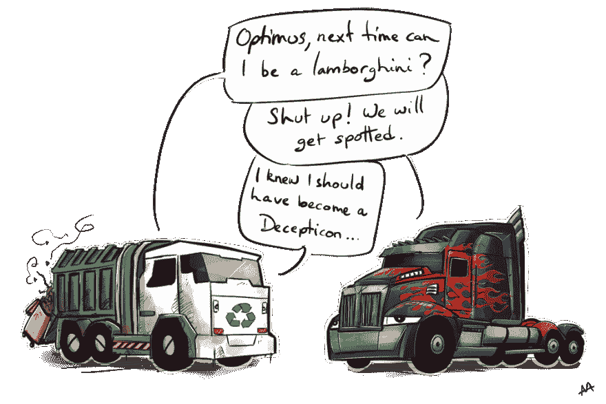T2】](https://res.cloudinary.com/practicaldev/image/fetch/s--OJJg9jeE--/c_limit%2Cf_auto%2Cfl_progressive%2Cq_auto%2Cw_880/https://beyondxscratch.files.wordpress.com/2018/09/optimus_x_garbage_border.png%3Fw%3D1000)

[](https://res.cloudinary.com/practicaldev/image/fetch/s--hQ6mmwow--/c_limit%2Cf_auto%2Cfl_progressive%2Cq_auto%2Cw_880/https://beyondxscratch.files.wordpress.com/2018/09/axel-e1538900952594.png%3Fw%3D368) 

特别感谢来自[higergroundz](https://highergroundz.wordpress.com/)的 Axel Ayigbede，他制作了这些插图！

* * *

1.  [https://info . vera code . com/state-of-software-security-2017-top-take aways-infograph-resource . html](https://info.veracode.com/state-of-software-security-2017-top-takeaways-infographic-resource.html)
2.  [https://www . vera code . com/security/open-source-component-risk](https://www.veracode.com/security/open-source-component-risk)T2】
3.  [https://www.owasp.org/index.php/Top_10-2017_Top_10](https://www.owasp.org/index.php/Top_10-2017_Top_10)T2】