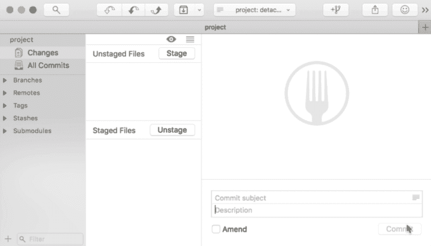
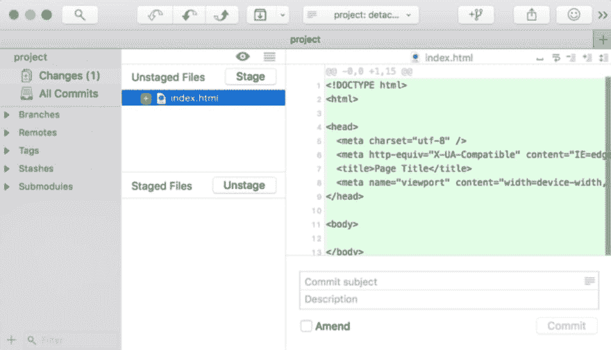
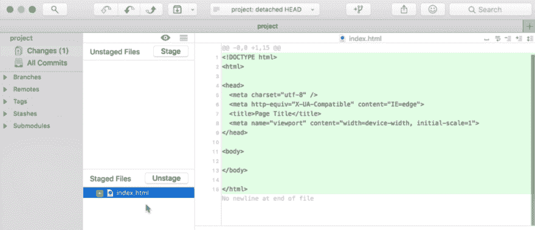
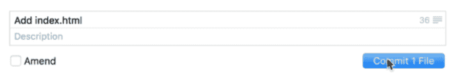
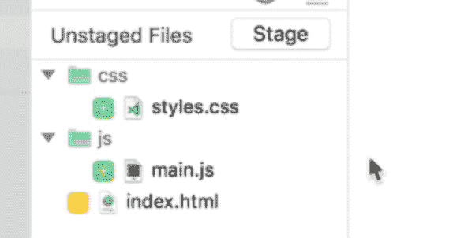
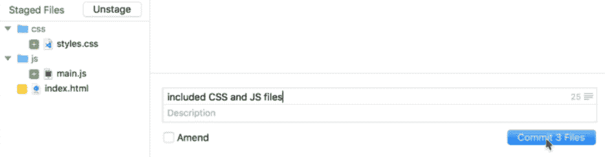

# 您的第一次 Git 提交

> 原文：<https://dev.to/zellwk/your-first-git-commit-4686>

[https://www.youtube.com/embed/nsORVjJTkeI](https://www.youtube.com/embed/nsORVjJTkeI)

注意:这是 Git 初学者系列的第二个视频。[在这里看第一个视频](https://zellwk.com/blog/setting-up-git)。

今天我们将讨论如何让你的第一个 Git 提交。

如果您从我们之前停止的地方打开 Fork，您将看到项目屏幕。如果你点击更改，屏幕将分成两部分。

在屏幕左侧，您会看到一个显示未转移文件的部分。在这一部分下面，您会看到另一个部分，上面写着暂存文件。

在右边，您会看到一个显示 Fork 图标的占位符。在底部，您会看到几个字段:

1.  提交消息字段
2.  描述字段
3.  ammend 复选框
4.  提交按钮

这个地方叫做**集结地**。您可以在这里决定要将哪些文件保存到 Git 中。

 

<figure>

<figcaption>集结地</figcaption>

</figure>

## 暂存一个文件

在保存任何内容之前，您需要在 Git 存储库中进行更改。

在像 VS Code 这样的文本编辑器中打开你的 Git 项目。创建一个名为`index.html`的文件，开始时给它一些 HTML。

保存该文件后，您将在临时区域看到该文件。它应该出现在转移区域的未转移文件部分。

 

<figure>

<figcaption>已经更改的文件会出现在未登台区</figcaption>

</figure>

**未暂存文件是指自您上次提交到 Git 存储库以来已经更改的文件。**

如果您想要提交一个文件(在本例中为`index.html`文件)，您可以单击该文件并单击 stage。此文件将从“未转移文件”部分移到“转移文件”部分。

已经暂存的  

<figure>

<figcaption>文件会出现在暂存区</figcaption>

</figure>

**当你在暂存文件段**中有一个文件时，你说的是**你想在提交**时保存那个文件。

如果您单击该文件，您将看到将保存到存储库中的代码行(绿色)。

## 创建提交

要创建提交，您可以在右下角写下提交消息，然后单击“创建提交”按钮。

 

<figure>

<figcaption>创建提交</figcaption>

</figure>

单击“提交”按钮后，暂存文件将从暂存区域消失。这是因为文件已保存；存储库中的文件不再有新的更改。

## 提交多个文件

您可以同时提交许多文件。为此，您需要更改许多文件。

在这个例子中，我向存储库添加了一个 CSS 文件和一个 JavaScript 文件。我还在`index.html`文件中添加了指向 CSS 和 JavaScript 文件的代码。

如果您现在回到 Fork，您应该会看到被更改的文件夹和文件。

 

<figure>

<figcaption>在暂存区</figcaption>

</figure>

可以看到所有被更改的文件和文件夹

要一次提交所有三个文件，请选择这些文件并单击 stage 按钮。然后，编写提交消息并提交文件。

 

<figure>

<figcaption>一次提交多个文件</figcaption>

</figure>

## 查看 Git 历史记录

如果您点击侧边栏中的所有提交，您将看到您到目前为止已经提交的内容。在一些 Git 客户机中，这被称为 Git 历史。

## 运动

尝试用 Fork 对您的 Git 存储库进行一些提交。在下一个视频中，我将向您展示如何推送到 git remote，以及如何从 git remote 拉取。

* * *

感谢阅读。这篇文章最初发表在我的博客上。如果你想要更多的文章来帮助你成为一个更好的前端开发者，请注册[我的时事通讯](https://zellwk.com)。