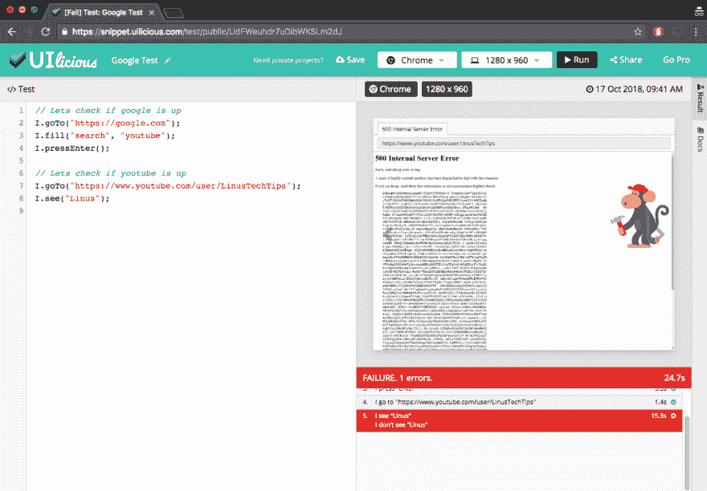
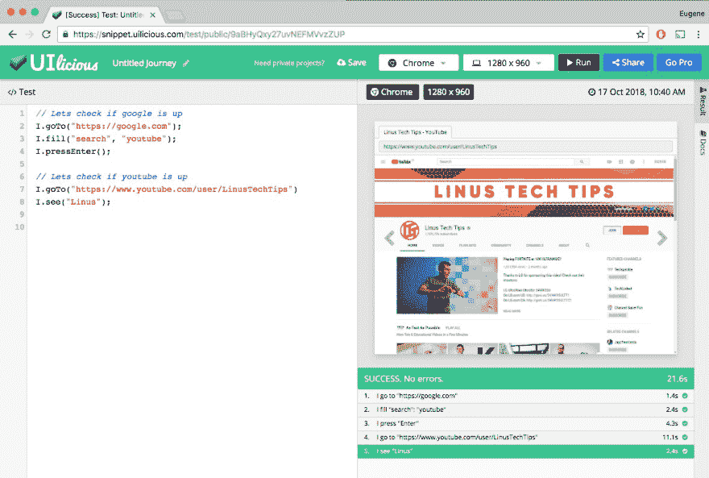

# 🙈“youtube.com”正在用 UI 测试向下证明它！

> 原文：<https://dev.to/uilicious/youtubecom-is-down---and-proving-it-with-testing-351>

我在工作中偷懒看 youtube，直到它开始让我失望。

我以为它是 wifi，直到我用一个公共的 UI 测试脚本检查了它。

[T2】](https://res.cloudinary.com/practicaldev/image/fetch/s--MqtT5Eo1--/c_limit%2Cf_auto%2Cfl_progressive%2Cq_auto%2Cw_880/https://thepracticaldev.s3.amazonaws.com/i/fl270dxdz6y0y3xguvo1.png)

在这里随意运行多次测试:[https://snippet . uilicious . com/test/public/rugwpjbwfx 1 qu 5 evhvnhzu](https://snippet.uilicious.com/test/public/RuGwPjbwFX1QU5EVhvNHZu)——希望这不会让我成为下一个😂

所以#hugops，为正赶着修复它的 SRE 工程师欢呼吧。毕竟，保持 24/7 全天候运转是一项艰巨的工作。

绝对绝对不要报警。

> 费城警察@费城警察是的，我们的 [@YouTube](https://twitter.com/YouTube) 也宕机了。不，请不要打 911 -我们不能解决它。2018 年 10 月 17 日上午 01:30866322526

这只是 youtube，还不是世界末日

**更新:太平洋时间 10 月 17 日 7:46**

> pico creator[@ pico creator](https://dev.to/picocreator)现实生活还挺好玩的:看来@youtube 又回来了[# hugops](https://twitter.com/hashtag/hugops)02:45AM-17 Oct 20180

~干杯