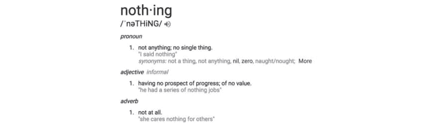
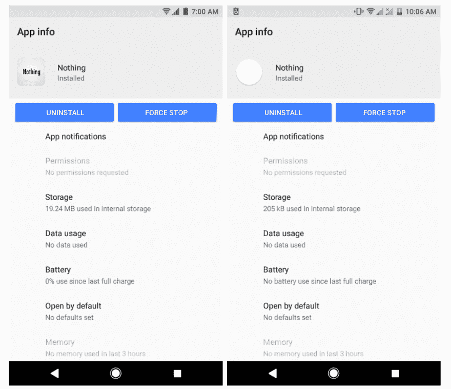
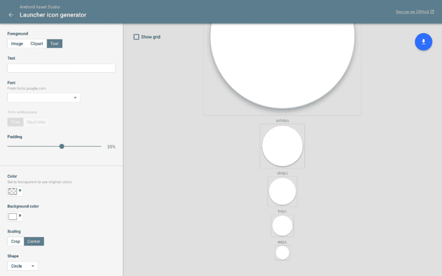
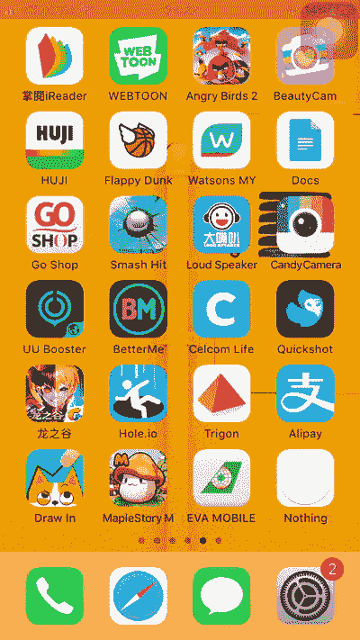
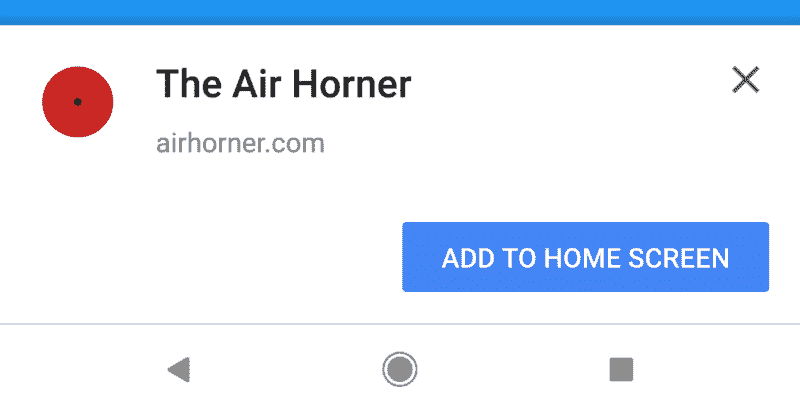
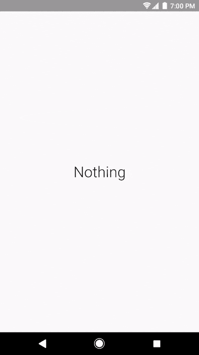
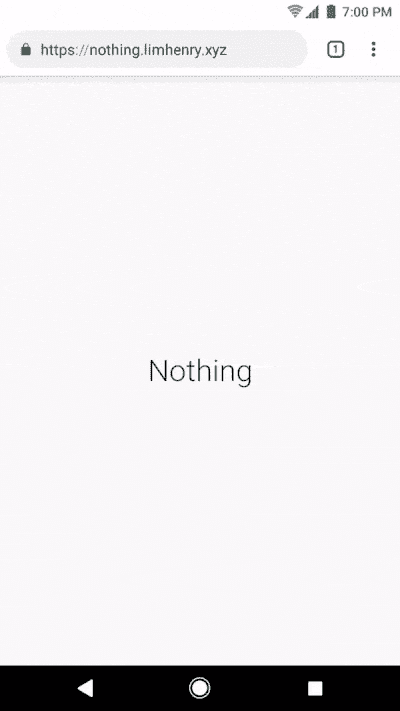
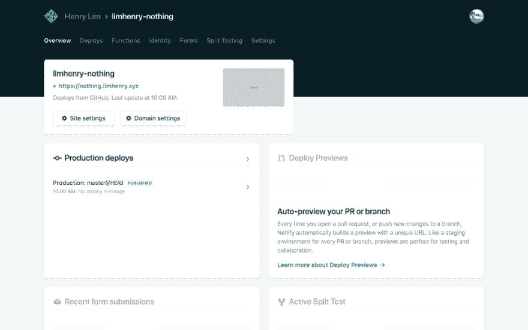
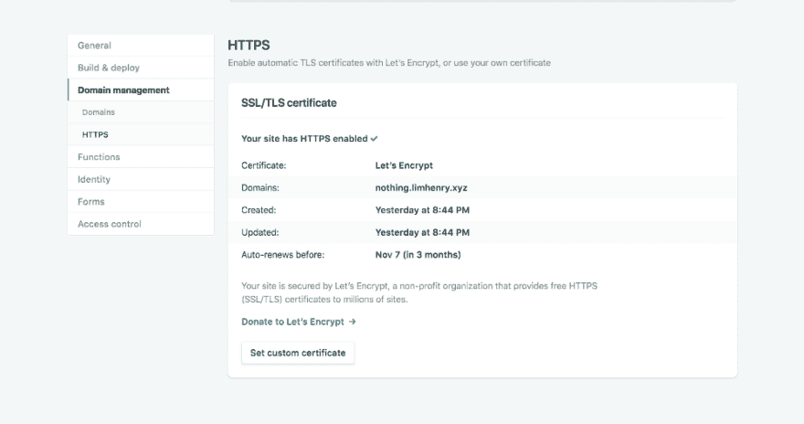
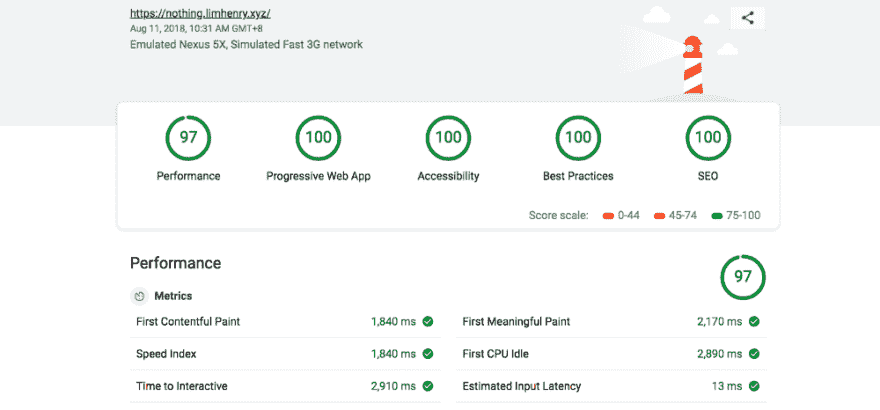

# 零到 15 分钟—在 15 分钟内构建一个零 PWA

> 原文：<https://dev.to/henrylim96/zero-to-15--building-a-nothing-pwa-in-15-minutes-258j>

### 什么都不是？

[T2】](https://res.cloudinary.com/practicaldev/image/fetch/s--bUU-AYtN--/c_limit%2Cf_auto%2Cfl_progressive%2Cq_auto%2Cw_880/https://cdn-images-1.medium.com/max/1000/1%2AXZkZE7VkNnfQ5q18LpMBow.jpeg)

“一无所有”安卓应用程序的最初版本由奇兰戈实验室开发，在谷歌 Play 商店有超过 100 万的下载量和 4.2 星的评分🎉。

除了有一个非常酷的复活节彩蛋(͡ ͜ʖ ͡)，无安卓应用基本上什么也不做。

然而，一无所有的 Android 应用程序的 APK 大小为 14MB，安装后使用了 19.24MB 的手机存储空间。所以这让我想，有没有什么方法可以让它变小？

[](https://res.cloudinary.com/practicaldev/image/fetch/s--wHnKBZlR--/c_limit%2Cf_auto%2Cfl_progressive%2Cq_auto%2Cw_880/https://i.imgur.com/q5w89SW.png) 
*(左)没事安卓 App: 19.24MB —(右)没事递进 Web App: 205KB*

解决办法很简单。我可以使用 HTML、CSS 和 JavaScript 重新构建整个系统。为了让它更上一层楼，我可以将它升级到一个[渐进式网络应用(PWA)](https://developers.google.com/web/progressive-web-apps/) ，这样用户就可以在没有互联网连接的情况下运行它，还可以将 PWA 添加到他们的主屏幕上。

### 👩🏻‍🎨图标设计

在我开始谈论代码之前，让我们为一无所有的 PWA 设计一个图标！我用来生成应用图标的工具叫做[启动器图标生成器](https://romannurik.github.io/AndroidAssetStudio/icons-launcher.html)。这是一个非常惊人的[开源](https://github.com/romannurik/AndroidAssetStudio)工具，由[罗曼·努里克](https://twitter.com/romannurik)开发。

[T2】](https://res.cloudinary.com/practicaldev/image/fetch/s--0lG5pqfo--/c_limit%2Cf_auto%2Cfl_progressive%2Cq_auto%2Cw_880/https://cdn-images-1.medium.com/max/1000/1%2AIlOsAMmxr7AUcq2K5maV9Q.png)

使用启动器图标生成器，我能够设计和生成应用程序图标(使用材料设计？)马上就没什么 PWA 了。生成器将自动生成不同大小的图标:48px、72px、96px、144px、192px 和 512px。

### **【pwacompath】**

现在我已经准备好了应用程序图标，下一步是创建一个 [Web 应用程序清单](https://developers.google.com/web/fundamentals/web-app-manifest/)。这样，Android 版 Chrome 在加载 PWA 时会自动显示一个闪屏。但是，有什么办法可以把这个闪屏功能带到其他老浏览器上呢？

PWACompat 是一个库，它将 Web 应用清单提供给不兼容的浏览器，以获得更好的渐进式 Web 应用。

这个库非常简单，只需添加 Web 应用程序清单文件和 PWACompat 脚本，就可以开始了！

```
<link rel="manifest" href="manifest.json" />
<script async src="https://cdn.jsdelivr.net/npm/pwacompat@2.0.6/pwacompat.min.js"
    integrity="sha384-GOaSLecPIMCJksN83HLuYf9FToOiQ2Df0+0ntv7ey8zjUHESXhthwvq9hXAZTifA"
    crossorigin="anonymous"></script> 
```

Enter fullscreen mode Exit fullscreen mode

[](https://res.cloudinary.com/practicaldev/image/fetch/s--EcJdvd69--/c_limit%2Cf_auto%2Cfl_progressive%2Cq_66%2Cw_880/https://cdn-images-1.medium.com/max/800/1%2AP4zvXn8iAjhAE9PYEEU9qQ.gif)
*Safari(iOS)上的闪屏*

塔达！就这样，我设法将闪屏带到了老版本的浏览器上。但是，PWACompat 能做的就这些吗？不要！它实际上可以做得更多！

PWACompat 还为清单中的所有图标(包括 favicon)创建 meta icon 标记，为各种浏览器创建 fallback meta 标记，描述 PWA 应该如何打开，并根据 web 应用程序清单设置主题颜色。

### 🏠添加到主屏幕

我从渐进式网络应用程序中得到的最喜欢的功能之一是添加到主屏幕(A2HS)。然而，从 Android 上的 Chrome 68 开始， [Chrome 将显示 A2HS 迷你信息栏，而不是大的 A2HS 横幅](https://developers.google.com/web/updates/2018/06/a2hs-updates):

[](https://res.cloudinary.com/practicaldev/image/fetch/s--ruMjH-d2--/c_limit%2Cf_auto%2Cfl_progressive%2Cq_auto%2Cw_880/https://cdn-images-1.medium.com/max/800/1%2A3GwP3kbKBFSedyTaI4NWZQ.png)
T4】😵撕旧 A2HS 横幅(Chrome 67 及之前)

尽管如此，A2HS 迷你信息栏是一个临时的解决方案，它将在未来的某一天从 Chrome 中移除。因此，我应该为一无所有的 PWA 提供一个更好的 A2HS UX。

[](https://res.cloudinary.com/practicaldev/image/fetch/s--AZrzh-jo--/c_limit%2Cf_auto%2Cfl_progressive%2Cq_auto%2Cw_880/https://i.imgur.com/6GwUIXc.png) 
*(左)安装按钮—(中)安装按钮+ A2HS 迷你信息栏—(右)
A2HS 对话框*

在这种情况下，如果浏览器支持添加到主屏幕功能，那么它将在页面顶部显示一个“安装”按钮。当用户点击安装按钮时，会触发 A2HS 对话框。

```
var installPromptEvent;
var btnInstall = document.querySelector('#install');

window.addEventListener('beforeinstallprompt', function (event) {
    event.preventDefault();
    installPromptEvent = event;
    btnInstall.removeAttribute('disabled');
});

btnInstall.addEventListener('click', function () {
    btnInstall.setAttribute('disabled', '');
    installPromptEvent.prompt();
    installPromptEvent.userChoice.then((choice) => {
        if (choice.outcome === 'accepted') {
            console.log('User accepted the A2HS prompt');
        } else {
            console.log('User dismissed the A2HS prompt');
        }
        installPromptEvent = null;
    });
}); 
```

Enter fullscreen mode Exit fullscreen mode

如果网站符合添加到主屏幕的标准，浏览器将触发一个`"beforeinstallprompt"`事件

### 🥚复活节彩色蛋

[](https://res.cloudinary.com/practicaldev/image/fetch/s--Davn8YwE--/c_limit%2Cf_auto%2Cfl_progressive%2Cq_auto%2Cw_880/https://cdn-images-1.medium.com/max/1000/1%2AePTthP8JcXDteH9p7G8gqQ.jpeg) 
*剧透预警！！！*

下面是虚无 PWA 的复活节彩蛋:Konami Code + [10 小时 YouTube 视频](https://twitter.com/Nick_Craver/status/720062942960623616)。

[](https://res.cloudinary.com/practicaldev/image/fetch/s--Q0TS7wvZ--/c_limit%2Cf_auto%2Cfl_progressive%2Cq_66%2Cw_880/https://cdn-images-1.medium.com/max/600/1%2A9f-Coe9dfwz_UmlsTUmHjA.gif) 
*👆🏻👆🏻*

一旦用户成功完成 Konami 代码，Nothing PWA 会将用户重定向到一个 [YouTube 视频](https://stackoverflow.com/admin.php)。

对于 Konami 代码，我使用这个库: [Konami-JS](http://snaptortoise.github.io/konami-js/) 。它是轻量级的，易于实现。此外，这个库也可以在手机上运行！唯一的缺点是，Konami 代码会变成“上，上，下，下，左，右，左，右，轻点，轻点”。

#### 禁用拉取刷新

然而，有一个小问题。当用户试图在手机上向下滑动页面时，它会触发“拉至刷新”动作。

[T2】](https://res.cloudinary.com/practicaldev/image/fetch/s--fRJyjpZo--/c_limit%2Cf_auto%2Cfl_progressive%2Cq_66%2Cw_880/https://cdn-images-1.medium.com/max/800/1%2AcDXJ33JdnhzIUfzy8R_14g.gif)

好消息是，我们可以用一行 CSS : `overscroll-behavior-y: contain`来禁用拉刷新动作[。](https://developers.google.com/web/updates/2017/11/overscroll-behavior)

### **☁️主持**

虚无 PWA 托管在 Netlify 上。Netlify 是一个自动化现代 web 项目的一体化平台。

我选择在 Netlify 上主持无 PWA 的原因是，它很容易设置。更不用说，Netlify 免费使用！

[](https://res.cloudinary.com/practicaldev/image/fetch/s--fxaPEa_I--/c_limit%2Cf_auto%2Cfl_progressive%2Cq_auto%2Cw_880/https://cdn-images-1.medium.com/max/1000/1%2AxLFM3ifLVb5X63Nj7XZHUw.png) 
*Netlify 仪表盘*

对于站点部署，有三种方法可供选择:通过命令行工具、手动部署或连续部署。

**命令行工具**

这基本上是部署站点最经典的方式。安装 [Netlify CLI](https://github.com/netlify/netlifyctl) ，登录到您的 Netlify 帐户，初始化项目，您就可以将站点部署到 Netlify 了。

```
> brew tap netlify/netlifyctl 
> brew install netlifyctl
> netlifyctl login
> netlifyctl init
> netlifyctl deploy 
```

Enter fullscreen mode Exit fullscreen mode

**手动部署**

这种方法基本上是任何想要部署他们站点的人最容易的方法:拖放。

[T2】](https://res.cloudinary.com/practicaldev/image/fetch/s--rOqr55pA--/c_limit%2Cf_auto%2Cfl_progressive%2Cq_auto%2Cw_880/https://cdn-images-1.medium.com/max/1000/1%2A8eB2dwalDXgHBHR4Pm83Iw.png)

这个功能太酷了，我希望 Firebase 可以实现这个功能。只需拖放您的项目文件夹，您就可以开始了！

**连续部署**

这是我目前在这个项目中使用的方法。一旦我的 GitHub 存储库链接到 Netlify，每当我将代码推送到 git 存储库，Netlify 就会自动构建并部署站点，就像神奇的🧙一样🏻‍.

#### 🔒HTTPS！

由于渐进式网络应用程序必须从一个安全的来源，我需要确保该网站已启用 HTTPS。好消息是，Netlify 为每个人提供免费 HTTPS，包括自定义域名。

[T2】](https://res.cloudinary.com/practicaldev/image/fetch/s--MTLZNWWq--/c_limit%2Cf_auto%2Cfl_progressive%2Cq_auto%2Cw_880/https://cdn-images-1.medium.com/max/1000/1%2Acu1Zs1B4ziZFkJVXj7lwTA.png)

此外，您还可以从 Netlify 仪表板启用强制 HTTPS ( [HTTP 严格传输安全](https://en.wikipedia.org/wiki/HTTP_Strict_Transport_Security)，HSTS)。这将确保该网站始终受到 HTTPS 的保护。

### 💡灯塔

Lighthouse 是一款开源的自动化工具，用于提高网页质量。你可以在任何网页上运行它，无论是公开的还是需要认证的。它对性能、可访问性、渐进式网络应用等进行审计。

[T2】](https://res.cloudinary.com/practicaldev/image/fetch/s--VLTXx99r--/c_limit%2Cf_auto%2Cfl_progressive%2Cq_auto%2Cw_880/https://cdn-images-1.medium.com/max/1000/1%2A85AX9Hs1Tty316wkADoifQ.png)

不错吧？我在性能上得了 97 分，在 PWA、可访问性、最佳实践和 SEO 上得了 100 分。🔥

可以在这里查看完整的灯塔报告:
[https://builder-dot-light house-ci . appspot . com/report . 1533954675085 . html](https://builder-dot-lighthouse-ci.appspot.com/report.1533954675085.html)

* * *

### 🎉现在试试吧

[](https://res.cloudinary.com/practicaldev/image/fetch/s--PN0KoqL1--/c_limit%2Cf_auto%2Cfl_progressive%2Cq_66%2Cw_880/https://cdn-images-1.medium.com/max/800/1%2AhA7rq9gWv2ea6UEIwMIDOw.gif)T3】🚀可以试试这里的 Nothing PWA:[Nothing . lim Henry . XYZ](https://nothing.limhenry.xyz/)

GitHub 上也有源代码: [nothing.limhenry.xyz](https://github.com/limhenry/nothing)