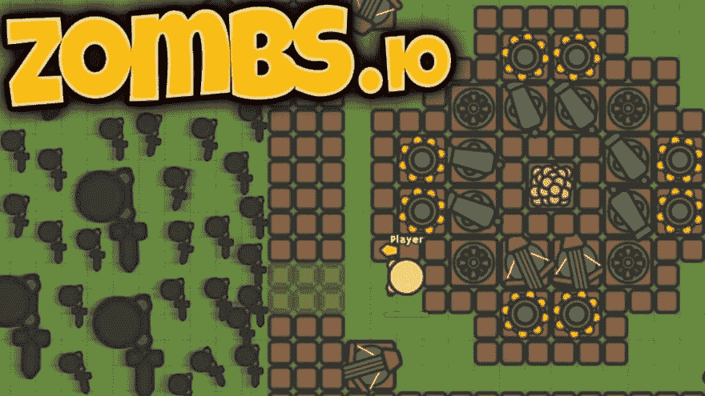

# 僵尸 iO 游戏

> 原文：<https://dev.to/inaramoza/zombs-io-game-29jc>

[T2】](https://res.cloudinary.com/practicaldev/image/fetch/s--IKhLJ3f7--/c_limit%2Cf_auto%2Cfl_progressive%2Cq_auto%2Cw_880/https://i.imgur.com/XQgaEoJ.jpg)

僵尸木卫一是关于僵尸的多人游戏，你周围的世界处于危险之中。你的任务是建立一个僵尸无法进入的基地。

在这里玩僵尸:[链接到游戏](http://vevegames.com/zombs-io)

保卫你的家园和生存尽可能长的时间进入排行榜。球员位置的实时统计显示在右上角，因此您可以轻松跟踪您的发展。

因为这个游戏是多人游戏，你可以和你的朋友选择同一个服务器，在同一个世界里玩。

[https://www.youtube.com/embed/SSVN6LFYOZA](https://www.youtube.com/embed/SSVN6LFYOZA)